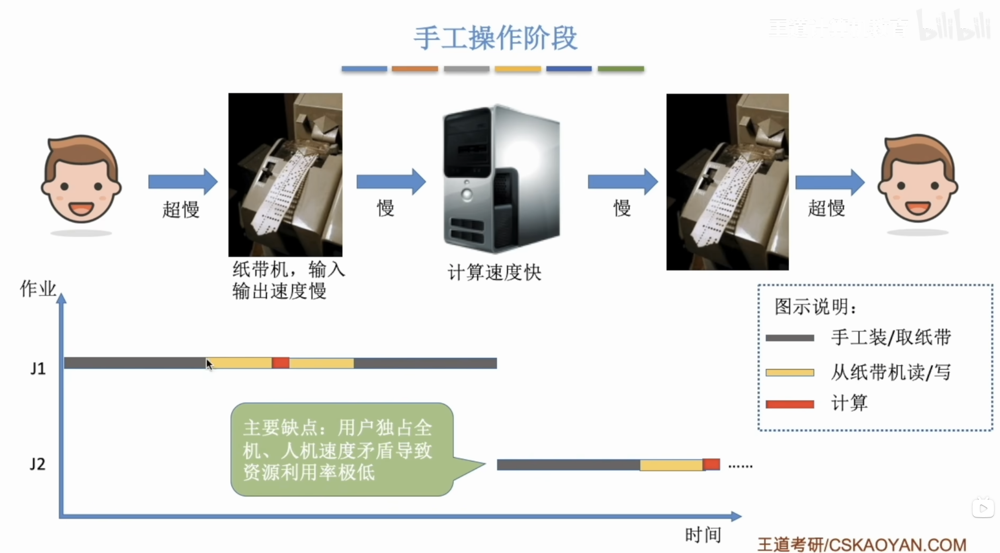
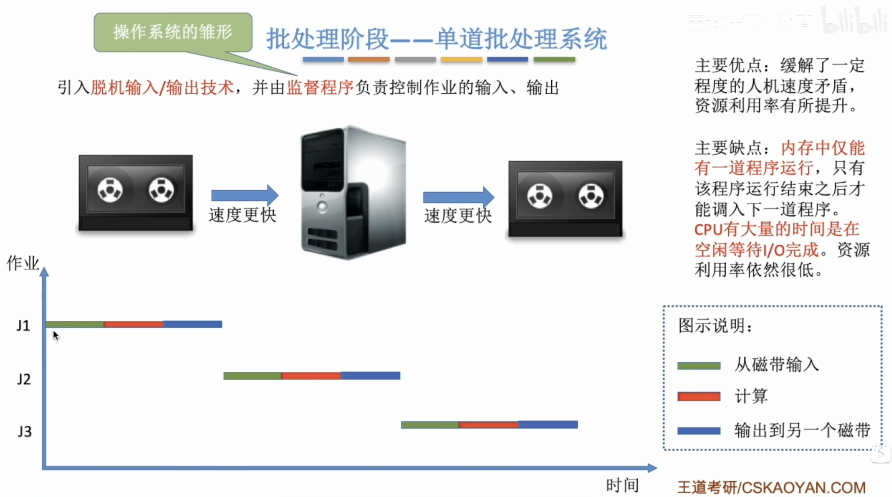
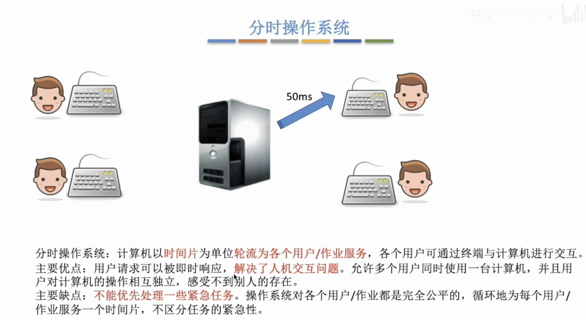
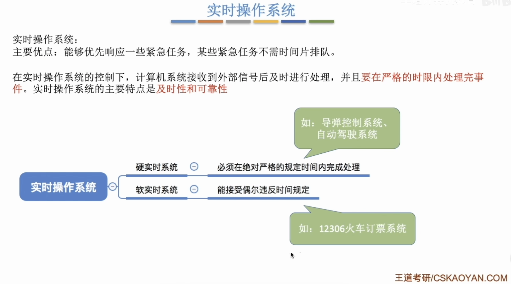
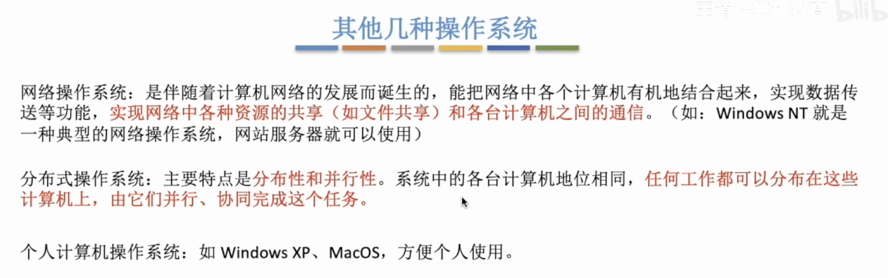

# 计算机系统概述

## 1.1 操作系统的基本概念

### 1.1.1 操作系统概念

- **操作系统**：操作系统是控制和管理计算机系统软/硬件资源、合理调度任务与分配资源，并为用户及其他软件提供统一接口与运行环境的最基本的系统软件。

**操作系统负责管理硬件资源，为应用程序提供运行环境，并充当硬件与用户之间的桥梁。**


### 1.1.2 操作系统的功能和目标

**操作系统四大核心功能**：

1. 处理机管理
2. 存储器管理
3. 设备管理
4. 文件管理

- **处理机管理**：在多道程序环境下，处理机的分配和运行都以进程为基本单位，因此处理机管理**本质上是对进程的管理。**

- **存储器管理**：存储器管理旨在**为多道程序提供良好的内存运行环境**，方便用户使用并提高内存利用率，主要功能包括内存分配与回收、地址映射、内存保护与共享，以及内存扩充等。

- **文件管理**：操作系统负责文件管理的部分称为文件系统，其功能包括文件存储空间的管理、目录管理、文件读/写操作及访问保护等。

- **设备管理**：设备管理的主要任务是**处理用户的I/O请求，屏蔽设备差异**，方便用户使用各类外设，并提高设备利用率，主要包括缓冲管理、设备分配、设备驱动处理和虚拟设备等功能。


**操作系统所提供的接口**

1. **用户接口**：

    - **联机用户接口**：面向交互式用户，实时交互式。
    - **脱机命令接口**：用于批处理系统，全部写好，一次性执行完。

2. **程序接口**：

    - **系统调用**：操作系统内核提供给用户程序的入口，运行在**内核态**。用户程序通过**陷入指令（trap）**进入内核，由内核代为实现。例如 `write()`、`read()`、`open()`、`fork()`。
    - **库函数**：运行在**用户态**的函数，由语言或第三方库提供。部分库函数封装了系统调用（如 `printf` 底层调用 `write`），部分纯粹在用户态完成计算（如 `strlen`、`sqrt`），**没有任何权限进入内核**。

例如：`printf("hello")` 是库函数，它帮用户完成格式化、缓冲等杂活，但最终必须调用系统调用 `write()` 才能把字符真正送到屏幕上。


**操作系统实现对计算机资源的扩充**

没有操作系统的机器叫裸机，它仅构成计算机的物质基础。操作系统可以将裸机扩展成**功能更强、使用更便捷的逻辑机器。**


### 1.1.3 操作系统的特征

1. **并发**：并发是指两个或多个事件在**同一时间间隔**内发生。

在操作系统中，**并发**是指一个处理机，把自己的时间周期分配给多个任务，交替处理多个任务。微观串行，宏观并行。

在操作系统中，**并行**是同一时间内同时发生，不再是微观串行。

2. **共享**：系统中的同一资源可以提供给内存中的多个进程共同使用。

    1. **互斥共享方式**：只有当一个进程使用完，其他进程才可以使用。例如：打印机、摄像头等

    2. **同时访问方式**：这类资源在宏观上支持多个进程并发访问。例如：磁盘（两个进程读取同一文档）。

**并发和共享是操作系统两个最基本的特征，二者互为前提：**

```text
1. 如果没有并发，共享也就没有存在的意义，共享就是为并发而生。
2. 没有共享，并发也无法实现。
```
3. **虚拟**：通过某种技术手段，将一个物理实体映射为多个**逻辑**上的对应物。

```text
1. 多道程序设计技术，多个进程共享一个处理机，实现宏观并行。
2. 虚拟存储器技术，可以将有限的物理存储扩展为更大的逻辑地址空间。
3. 虚拟设备技术，可以将某些独占型物理I/O设备（如打印机）转化为多台逻辑设备。
```


4. **异步**：由于系统资源受限，进程的执行并非连续进行的，随时可能被打断，所以以不可预知的速度推进。
>当系统完成A任务时，B任务可能来打断，导致A任务的处理时间延长，这种突如其来的打断无法预测，所以造成了所有的进程都是异步，而非同步。

```text
同步 = 所有事情踩同一个时钟，我知道你下一步什么时候动
异步 = 各踩各的时钟，我根本不知道你下一步什么时候动
```

### 1.1.4 习题


## 1.2 操作系统发展历程

### 1.2.1 手工操作阶段



主要缺点：用户独占全机、人机速度矛盾导致资源利用率极低。

### 1.2.2 批处理阶段



主要优点：缓解了一定程度的人机速度矛盾，资源利用率有所提升。
主要缺点：**内存中仅能有一道程序运行**，只有该程序运行结束之后才能调入下一道程序。**CPU大量时间是在等待I/O完成**。资源利用率依然很低。

### 1.2.3 分时操作系统



主要优点：用户请求可以被即时响应，**解决了人机交互问题**。允许多个用户同时使用同一台计算机。
主要缺点：不能优先处理一些紧急任务。

### 1.2.4 实时操作系统



主要优点：能够优先响应紧急任务。硬实时系统必须严格按照规定时间完成处理，软实时系统可以结束违反时间约定。

### 1.2.5 网络操作系统和分布式操作系统和微机操作系统（个人电脑操作系统）




