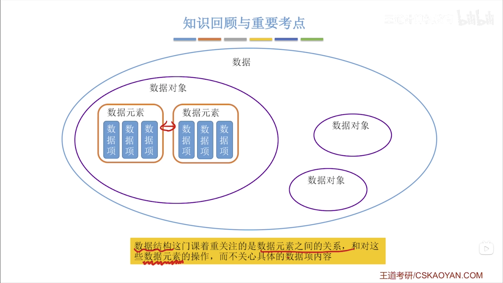

# 数据结构与算法

## 0. 数据结构复习建议

### 0.1 关于是否写代码

- 408 只有**数据结构**大题需要手写代码（一道算法设计题，10~15分），其余三门（计组、OS、计网）不考代码。
- 代码量很小，通常一个函数 10~20 行，核心逻辑写对就给分，不需要编译运行。
- 写的是**408风格代码**：只用 C/C++ 基本语法，不用 STL，不用库，不跑 OJ/LeetCode。
- 学到每个线性表结构后，把模板操作手写到能默写：链表逆置、删除指定节点、快慢指针、有序归并、顺序表删除。
- 目的就是考试那道手写代码题，不是为了跑起来。

## 1. 绪论
---
### 1.1 数据结构的基本概念
---
#### 1.1.1 基本概念和术语

- **数据**是信息的载体，是描述客观事物的数、字符，以及所有能输入到计算机中并被计算机程序识别和处理的符号的集合。
- **数据元素**是数据的基本单位，通常作为一个整体进行考虑和处理。一个数据元素又若干个数据项组层。例如：一个学生信息就是数据元素，而学号、姓名和班级就是数据项。
- **数据结构**是相互之间存在一种或多种特定*关系*的数据元素的集合。
- **数据对象**是具有*相同性质*的数据元素集合，是数据的一个子集。

> 数据结构就是某些数据之间的关系（先后关系等）。
>
> 数据对象就是能表达**相同关系**的数据结构的集合。

- **数据类型**是一个值的集合以及定义在该集合的一组操作的总称。（也就是一个类，值是类属性，操作是类方法）

- **抽象数据类型（Abstract Data Type）（ADT）**是抽象数据组织和与之相关的操作。（类似于面向对象的纯虚类）

---
#### 1.1.2 数据结构三要素

**数据结构三要素：**
1. 逻辑结构：数据元素之间的逻辑关系
    
    - **集合**：各个元素同属一个集合，无其他任何关系。
    - **线性结构**：数据元素之间是一对一的关系，除了第一个元素，其他所有元素都有唯一前驱，除了最后一个元素，所有其他元素都有唯一后继。
    - **树形结构**：数据元素之间是一对多的关系。
    - **图状结构**：数据元素之间是多对多的关系

2. 物理结构（存储结构）

    - **顺序存储**：把*逻辑上相邻的元素存储在物理地址也相邻的存储单元中*，元素之间的关系由存储单元的邻接关系来体现。
    - **链式存储**：*逻辑上相邻的元素在物理地址上可以不相邻*，借助指示元素存储地址的指针来表示元素之间的逻辑关系。
    - **索引存储**：在存储元素信息的同时，还建立附加的索引表。索引表中的每一项成为索引项，索引项一般形式是（关键字，地址）
    - **散列存储**：根据元素的关键字直接计算出该元素的存储地址，又称哈希(Hash)存储

> 也可以分为**顺序存储**和**非顺序存储**。

3. 数据运算（方法）：类似于面向对象中的方法，出栈方法、入栈方法和获取栈顶元素。

---
**关系总结：**




---
#### 1.1.3 试题精选

1. 逻辑结构与存储方式无关，是独立于具体的系统的。

2. 存储结构是逻辑结构的具体体现。

例如：线性结构（逻辑结构）的具体体现可以是链式存储（存储结构）或顺序存储（存储结构）。

---

### 1.2 算法和算法评价

---

#### 1.2.1 算法的基本概念

- **算法**：算法(Algorithm)是对特定问题求解步骤的一种描述，它是指令的有限序列，其中的每条指令表示一个或多个操作

**算法的特性：**

1. 有穷性：一个算法必须总在执行有穷步之后结束，且每一步都可在有穷时间内完成。
注意：算法有穷，程序无穷。例如：UI就是死循环，不关闭就一直显示。 

2. 确定性：算法中的每一条指令必须有确切的含义，对于相同的输入只能得出相同的输出。

3. 可行性：算法中描述的操作都可以通过已经实现的基本运算执行有限次来实现。

4. 输入：算法有零个或者多个输入。

5. 输出：算法至少有一个或者以上的输出。例如：print("Hello World")，没有输入，但是有输出。

**一个“好”的算法的特质：**

1. 正确性：能正确的解决所给问题。（不能正确解决问题的算法也属于算法，只是不算“好”的算法）

2. 可读性：算法应具有良好的可读性，以帮助人们理解。

3. 健壮性：输入非法数据时，能做出适当的处理，而不会产生莫名其妙的输出结果。

4. 高效率与低存储需求。
---
#### 1.2.2 算法效率的度量

**时间复杂度：**

- **定义**：算法中基本运算（最深层次循环内的语句）的重复执行次数（频度）关于问题规模 $n$ 的函数，记为 $T(n)=O(f(n))$。
- 计算规则：取 $T(n)$ 中阶数最高的项，忽略常数因子和大系数。
- 常见数量级（由低到高）：$O(1)$ 常数级 < $O(\log n)$ 对数级 < $O(n)$ 线性级 < $O(n\log n)$ < $O(n^2)$ 平方级 < $O(n^3)$ 立方级 < $O(2^n)$ 指数级 < $O(n!)$阶乘级< $O(n^n)$。
- **最坏时间复杂度**：输入规模为 $n$ 时的最长运行时间，保证算法在任何输入下不过这个界限。
- **平均时间复杂度**：所有可能输入的期望运行时间。
- **最好时间复杂度**：输入规模为 $n$ 时的最短运行时间，无实际参考意义。
- 常见情况：**顺序执行** → 取最高阶的；**循环** → 次数 × 循环体；**条件判断** → 取分支中最高阶的。

**空间复杂度：**

- **定义**：算法运行过程中占用的辅助存储空间（不包含存储输入数据本身的空间）与问题规模 $n$ 的函数，记为 $S(n)=O(g(n))$。
- **原地工作**：辅助空间为常量 $O(1)$ 的算法（例如冒泡排序的原地交换）。
---
#### 1.2.3 试题精选

例题：
```C
for(int i = 1; i <= n; i++){      // i 从 1 到 n
    for(int j = 1; j <= i; j++){   // j 从 1 到 i
    }
}

```
**通用方法：**
1. 写出内层执行次数关于i的表达式
2. 对i从开始到结束的内层执行次数进行累加
3. 取最高阶

**练习题：**

**1.** 求以下代码的时间复杂度：
```c
for(int i = 1; i <= n; i++){
    for(int j = 1; j <= i; j++){
        for(int k = 1; k <= j; k++){
            // 基本操作
        }
    }
}
```

答案：$ T(n) = O(n^3)$

**2.** 求以下代码的时间复杂度：
```c
for(int i = 1; i <= n; i++){
    for(int j = i; j <= n; j++){
        // 基本操作
    }
}
```

答案：$T = \frac{(n + 1)n}{2}$, $T(n) = O(n^2)$


**3.** 求以下代码的时间复杂度：
```c
for(int i = 1; i <= n; i *= 2){
    for(int j = 1; j <= i; j++){
        // 基本操作
    }
}
```

答案：$T <= n - 1$, $T(n) = O(n)$


**4.** 求以下代码的时间复杂度：
```c
int x = 0;
for(int i = 1; i <= n; i++){
    for(int j = 1; j <= n - i; j++){
        x++;
    }
}
```

答案：$T = \frac{n^2 - 2n + 1}{2}$, $T(n) = O(n^2)$


**5.** 求以下代码的时间复杂度：
```c
for(int i = 1; i <= n; i++){
    for(int j = 1; j <= n; j += i){
        // 基本操作
    }
}
```

答案：$T(n) = O(n\log{n})$


**6.** 求以下代码的时间复杂度：
```c
int x = 2;
while(x < n){
    x = x * x;
}
```

答案：$T(n) = O(\log\log{n})$


---

**参考答案：**

1. **$O(n^3)$**
> $\sum_{i=1}^{n}\sum_{j=1}^{i} j = \sum_{i=1}^{n}\frac{i(i+1)}{2} = O(n^3)$

2. **$O(n^2)$**
> $\sum_{i=1}^{n}(n-i+1) = n + (n-1) + \dots + 1 = \frac{n(n+1)}{2} = O(n^2)$

3. **$O(n)$**
> 外层 $i=1,2,4,8,\dots,2^k \le n$，共 $\lfloor \log n \rfloor+1$ 轮。每轮内层执行 $i$ 次，总次数 = $1+2+4+\dots+2^k \approx 2^{k+1}-1 \le 2n-1 = O(n)$

4. **$O(n^2)$**
> 当 $i=1$ 时内层 $n-1$ 次，$i=n-1$ 时内层 $1$ 次，总和 = $(n-1)+(n-2)+\dots+1 = \frac{(n-1)n}{2} = O(n^2)$

5. **$O(n\log n)$**
> 外层 $n$ 轮。内层步长为 $i$：$j=1,1+i,1+2i,\dots$，每轮约 $\frac{n}{i}$ 次。总次数 = $\sum_{i=1}^{n}\frac{n}{i} = n\sum_{i=1}^{n}\frac{1}{i} = n \cdot O(\log n) = O(n\log n)$（调和级数）

6. **$O(\log\log n)$**
> $x=2, 2^2=4, 4^2=16, 16^2=256,\dots$，即 $x=2^{2^k}$。当 $2^{2^k} \ge n$ 时退出，即 $2^k \ge \log n$，$k=\log\log n$。执行次数为 $O(\log\log n)$。

---
#### 拓展：斐波那契数列时间复杂度

**无记忆化递归（纯递归）：**

```c
int fib(int n) {
    if (n <= 1) return n;
    return fib(n-1) + fib(n-2);
}
```

- 每次调用分裂成两个子问题，形成一棵满二叉树式的调用树，树高约 $n$。
- 每个节点都要计算一次，节点总数 $\approx 2^0+2^1+\dots+2^{n-1} = 2^n-1$，每个节点做一次加法是 $O(1)$，所以总时间就是节点数 — **$O(2^n)$**。
- 存在大量重复计算，例如 fib(2) 在整棵树中出现多次。

**记忆化递归：**

```c
int memo[100];
int fib(int n) {
    if (n <= 1) return n;
    if (memo[n] != 0) return memo[n];
    return memo[n] = fib(n-1) + fib(n-2);
}
```

- 每个 fib(k) 只算一次，算完存入数组，后续再次需要时直接 $O(1)$ 查表返回，不再向下裂变。
- 因此总共只算了 fib(0) 到 fib(n) 这 $n+1$ 个值，时间复杂度 **$O(n)$**，空间复杂度 $O(n)$。
- 本质就是**用空间换时间**，把重复的子树全部砍掉。

---
### 1.3 总结

**Q1：抽象数据类型（ADT）是什么？和面向对象的纯虚类有什么关系？**

> ADT 定义了"有哪些数据"和"能做什么操作"，不关心"怎么实现"。和纯虚类（Abstract Class）核心思想一致：**接口与实现分离**。纯虚类是 ADT 在编程语言中的一种落地方式，ADT 是概念层面的纯虚类。

**Q2：数据结构三要素中"数据运算"是什么？**

> 数据运算就是数据结构对外暴露的操作方法，类似于面向对象中一个类的 public 方法。例如栈的 `push()`、`pop()`、`top()`。

**Q3：为什么顺序表、单链表、哈希表既描述了逻辑结构又描述了存储结构，而有序表只是逻辑结构？**

> 名字里**带了存储方式的**（顺序 → 顺序存储，链 → 链式存储，哈希 → 散列存储） — 既是逻辑结构也是存储结构。名字里**只描述关系**的（有序 → 关键字按顺序排列） — 仅逻辑结构，因为它可以顺序存储也可以链式存储。

**Q4：逻辑结构和存储结构是什么关系？**

> 逻辑结构是抽象的（数据之间什么关系），存储结构是具体的（怎么存到内存里）。同一个逻辑结构可以用不同存储结构实现。例如线性结构既可用顺序存储（数组）也可用链式存储（链表）。

**Q5：内层循环边界依赖外层变量时，时间复杂度怎么算？**

> 三步走：① 写出内层执行次数关于外层变量 i 的表达式 → ② 对 i 从起始到终止求和 → ③ 取最高阶。例如：
> ```c
> for(i=1; i<=n; i++)
>     for(j=1; j<=i; j++)   // 第 i 轮执行 i 次
> ```
> 总次数 = $1+2+\dots+n = \frac{n(n+1)}{2} = O(n^2)$，不是 $O(n)$。

**Q6：递归斐波那契的时间复杂度为什么是 $O(2^n)$？**

> 每次调用分裂成两个子问题（fib(n-1) + fib(n-2)），形成一棵满二叉树式的调用树。每个节点都要计算一次，节点总数 $\approx 2^0+2^1+\dots+2^{n-1} = 2^n-1$，每个节点做常数级工作，所以时间就是节点数 — $O(2^n)$。

**Q7：加了备忘录的斐波那契呢？**

> 每个 fib(k) 只算一次存入数组，后续需要时 $O(1)$ 查表，不再向下裂变。总共只算 fib(0)~fib(n) 共 $n+1$ 个值 — **$O(n)$**。本质是**用空间换时间**，把重复的子树砍掉。

---
## 2. 线性表
---
### 2.1 线性表的定义和基本操作
---
#### 2.1.1 线性表的定义

- **线性表**：线性表是由n(n >= 0)个*相同的数据类型*的元素组成的*有限序列*。当n = 0时，线性表是一个空表。

**注意：**线性表（线性结构）是逻辑概念，顺序表和链表是线性表的实现。

$$
L = (a_1, a_2, ..., a_i, a_{i + 1}, ..., a_n)
$$

- **位序**：位序是指元素在线性表中的位置，从1开始，但是层序中的下标是从0开始。

**线性表特点**
- 表中元素的个数有限。
- 表中元素具有逻辑上的顺序性，即存在明确的先后次序。
- 表中元素均为数据元素，每个元素在线性表中被视为一个不可分割的单位。
- 表中的元素的数据类型都相同，这意味着每个元素占有相同大小的存储空间。
- 表中元素具有抽象性，即仅讨论元素之间的逻辑关系，而不考虑其究竟表示什么内容。
- **支持随机存取，顺序存储结构支持随机存取，可以直接更具序号找到相应的值。**


---
#### 2.1.2 线性表的基本操作

- InitList(&L)：初始化表。构造一个空的线性表L，分配内存空间。
- DestroyList(&L)：销毁操作。销毁线性表，并释放线性表L所占用的内存空间。

- ListInsert(&L,i,e)：插入操作。在表L中的第i个位置上插入指定元素e。
- ListDelete(&L,i,&e)：删除操作。删除表L中第i个位置的元素，并用e返回删除元素的值。

- LocateElem(L,e)：按值查找操作。在表L中查找具有给定关键字值的元素。
- GetElem(L,i)：按位查找操作。获取表L中第i个位置的元素的值。

其他常用操作：
- Length(L)：求表长。返回线性表L的长度，即L中数据元素的个数。
- PrintList(L)：输出操作。按前后顺序输出线性表L的所有元素值。
- Empty(L)：判空操作。若L为空表，则返回true，否则返回false。

---
### 2.2 线性表的顺序表示
---
#### 2.2.1 顺序表的定义

- **顺序表**：顺序表是用一组**地址连续的存储单元**依次存储线性表中的数据元素，使得**逻辑上相邻的元素在物理位置上也相邻。**

>就是用顺序存储结构实现的线性表，就是顺序表。

1. 静态分配：用数组实现顺序表，固定大小，不可更改
2. 动态分配：用动态内存分配的方式来实现顺序表，大小不固定，当超过最大上限时，会去其他位置开辟更大的空间并且将数据迁移过去。


**顺序表优点：**
1. **可以进行随机访问：**即通过首地址和元素序号可在$O(1)$时间内找到指定元素。

2. **存储密度高：**每个节点仅存储数据元素，无额外指针内存开销。

**顺序表的缺点：**
1. **插入和删除效率低**，插入和删除都需要移动大量的元素。

2. **要求分配连续的存储空间，不够灵活**

---
#### 2.2.2 顺序表上基本操作的实现

[顺序表完整实现代码](DSAA_Code/ch2/2_1_2顺序表基础操作.c)

---
### 2.3 线性表的链式表示
---
#### 2.3.1 单链表的定义

- **单链表：**单链表通过一组**任意的存储单元**（不要求连续的内存空间）来存储线性表中的数据元素。

**链表的特点：**
- 链表不依赖连续的存储空间。
- 链表的插入和删除操作很方便快捷，不需要移动大量数据元素。
- 链表不是随机存储结构，因为内存不连续，无法根据序号来定位数据元素。
- 链表查询元素只能从头开始一个一个找。


- **头指针：**指向链表中第一个节点的指针，无论第一个节点是头结点还是数据节点，它永远指向链表的"第一位"。
- **头结点：**附加在第一个数据节点之前的额外节点，其数据域不存储有效信息，本身是一个不存数据的节点，被头指针所指。

> 引入头结点后，链表上所有数据节点（包括第一个）都有了前驱节点，在链表首部进行插入、删除时无需特殊处理，操作逻辑与其他位置统一。

**引入头结点的优点：**
- **操作统一性**：第一个数据节点的位置存储在头结点的指针域中，因此在链表首部进行插入、删除等操作时，与其他位置的操作逻辑一致，不需要单独判断"是不是第一个"。

> 如果没有头结点，在链表头部插入时，不光要改新节点的 next 指向原第一个节点，还要把链表头指针 L 指向新节点 — 多了一步"改头指针"的操作。而在中间插入时不需要动头指针，只需要改前驱节点的 next。同一个"插入"操作，位置不同代码就不同，这就叫操作不统一。
>
> 头结点本质上就是给第一个数据节点 "造" 了一个前驱，让第一个数据节点和其他所有数据节点一样，前面都有一个节点。这样不管在哪个位置插入/删除，都是 `p->next = ...` 这一句话，不需要单独处理头部。

- **空表与非空表处理统一：**无论链表是否为空，头指针始终是一个非空指针（指向头结点），而空表仅表现为头结点的next为NULL，从而避免了对空表的单独判断。

> 头结点 L 本身永远不为 NULL，所以我们操作的时候永远有 `L->next` 可以用，只是有时为 NULL（空表的时候）。头结点把"指针本身是否为空"这个问题，转化成了"指针的某个域是否为空"，而后者永远可以安全判断。
>
> 不带头结点时，空表状态下 L 就是 NULL，任何 `L->xxx` 都崩，所以每个操作前都得先问"你是不是空表"；带头结点后 `L->next` 就是空表的标记，不需要额外判断。

**单链表的节点定义：**

```c
typedef struct LNode{
    ElemType data;          // 数据域，存数据
    struct LNode* next;     // 指针域，指向下一个节点
}LNode, *LinkList;
```

> `typedef` 一次性起了两个别名：`LNode` 等价于 `struct LNode`（节点类型），`LinkList` 等价于 `struct LNode*`（指向节点的指针，用来表示链表头指针）。不用 `typedef` 的话每次都要写 `struct LNode`，很麻烦。
>
> 约定俗成：`LNode*` 强调"这是一个指向节点的指针"，`LinkList` 强调"这是一个链表"。两者本质一样，都是 `struct LNode*`。
>
> [单链表完整实现代码](DSAA_Code/ch2/2_2_2单链表基础操作.c)

**进一步理解 typedef 语法：**

```c
typedef struct 结构体名{
    // 成员
} 别名1, *别名2;
```

> 把 `{}` 后面的别名挪出来，等价于：
>
> ```c
> typedef struct 结构体名 别名1;   // 别名1 = struct 结构体名
> typedef struct 结构体名 *别名2;  // 别名2 = struct 结构体名*（指针）
> ```
>
> 套到链表节点上：
>
> - `LNode` 就等价于 `typedef struct LNode LNode;` → `LNode` 就是 `struct LNode`
> - `*LinkList` 就等价于 `typedef struct LNode *LinkList;` → `LinkList` 就是 `struct LNode*`


---
#### 2.3.2 单链表上的基本操作的实现

[单链表完整实现代码](DSAA_Code/ch2/2_2_2单链表基础操作.c)


---
#### 2.3.3 双链表


[双链表完整实现代码](DSAA_Code/ch2/2_3_3双向链表基本操作.c)


---
#### 2.3.4 循环链表

- **循环单链表：**链表最后一个指针原本指向NULL，将最后一个指针指向头结点，形成循环就是循环单链表。
- **循环双链表：**同理，头结点的prior指向尾结点，尾结点的next指向头结点。

[循环链表完整代码](DSAA_Code/ch2/2_3_4循环链表.c)


---
#### 2.3.5 静态链表

- **静态链表**：用**数组**来描述链式存储结构，数组元素包含**数据域 data** 和**游标 cur**（代替指针表示下一个结点的数组下标）。游标为 -1 时等价于单链表中的 NULL。

> 静态链表是为了给**没有指针类型的高级语言**（如早期的 BASIC、FORTRAN）提供一种实现链表的方式。现代语言都有指针/引用，所以实际开发中很少用，但它体现了"链式存储不一定非要用指针"的思想。

**结点定义：**

```c
#define MaxSize 50
typedef struct{
    ElemType data;
    int cur;          // 游标（cursor），存放下一个结点的数组下标
} SLinkList[MaxSize]; // SLinkList 本身就是数组类型，不再额外定义数组变量
```

> `SLinkList` 是一个长度为 MaxSize 的结构体数组类型，声明 `SLinkList L;` 即得到 `L[0] ~ L[MaxSize-1]`。

**工作原理：**

- 数组下标 0 的元素作为**头结点**（`L[0].cur` 指向第一个数据结点，游标为 -1 表示空表）。
- 数组中所有元素分为两部分：**已用链表**（数据结点）和**备用链表**（空闲结点）。
- 备用链表：将所有未使用的空闲结点链接起来，方便分配和回收。通常下标为 1 的结点作为备用链表的头结点。

**静态链表的操作：**

1. **查找**：从头结点 `L[0].cur` 开始，沿游标依次跳转，直到游标为 -1。
2. **插入**：从备用链表"摘"下一个空闲结点（修改备用链表的头指针），将数据写入该结点，然后修改前驱结点的游标完成链接。
3. **删除**：将被删结点从链表中摘除（修改前驱结点的游标），然后将该结点回收到备用链表中。

**静态链表的特点：**

- 插入和删除只需修改游标，不需要移动数据元素（和链表一样）。
- 支持链式存储的逻辑，底层却是顺序存储的数组。
- **存储密度低于顺序表**（每个结点多一个 int 游标），但比指针实现的链表高（游标是 int，比指针省空间）。
- 需要预先分配一块连续空间（数组大小固定）。

> **408 冷知识**：静态链表是**唯一一种既具有顺序存储结构（底层是数组），又具有链式存储结构（逻辑上通过游标链接）特点的数据结构。** 选择题可能考察"哪种结构的数据元素物理上连续但逻辑上不连续"或反过来的变体。

**对比总结：**

| | 顺序表 | 单链表 | 静态链表 |
|---|---|---|---|
| 底层 | 数组 | 指针链接 | 数组 + 游标 |
| 随机存取 | ✅ $O(1)$ | ❌ | ❌ |
| 插入/删除效率 | $O(n)$ | $O(1)$（已知前驱） | $O(1)$（已知前驱） |
| 存储密度 | 高（只存数据） | 低 | 中（存数据 + int 游标） |
| 需要连续内存 | ✅ | ❌ | ✅（数组本身连续，结点可离散使用） |

**考题常考点：**
- 静态链表的游标本质是**数组下标**，不是指针。
- 备用链表的作用：实现空闲结点的**分配与回收**（类似操作系统中空闲块的管理思想）。
- 静态链表**不支持随机存取**（因为游标链接关系不连续）。
- `SLinkList L` 声明后，自动包含 `L[0]` 到 `L[MaxSize-1]`。

---
### 2.3.6 顺序表和链表的比较


1. **存取方式**：
- **顺序表支持随机存取**，可以通过下标直接访问任意位置的元素。
- **链表仅支持顺序存取**，必须从头结点开始逐个遍历。
2. **逻辑结构与物理结构**：
- 顺序存储中，逻辑上相邻的数据元素在物理内存中也连续存放，其邻接关系由地址自然体现。
- 链式存储中，逻辑相邻的元素在物理地址上未必相邻，其逻辑结构通过指针显式维护。
3. **查找、插入和删除操作**：
- 对于按值查找：如果表无序，则两者的时间复杂度都是$O(n)$；若表有序，则顺序表可以通过折半查找（二分查找），时间复杂度为$O(log_2{n})$。
- 对于按序号查找：顺序表时间复杂度为$O(1)$，链表则为$O(n)$。
- 对于插入删除操作：顺序表则需要平均移动约一半的元素，开销较大；链表则只需要修改指针，无序移动元素，但是前提是已知操作位置（否则仍需要$O(n)$的时间定位）。
4. **空间分配**：
- 顺序表：顺序表在静态内存分配下需预设容量；过大造成内存浪费，过小则易在插入时溢出。动态分配虽支持运行时扩容，但需要申请新的连续的内存块并复制全部的原有数据元素，不仅耗时，还可能因为系统缺乏足够的连续空闲内存而失败。
- 链表：链表采用动态结点分配，按需扩展，灵活性高，但每个节点都需要指针内存开销，导致**存储密度小于1**，空间利用率较低。


**如何选择合适的存储结构**

1. **基于内存的考虑**：当线性表的长度或规模难以预测时，顺序表因需要预先分配固定容量而不适用；而链表无序预设容量，可按需动态扩展，但是每个结点需要额外存储指针，带来一定的空间开销。

2. **基于运算的考虑**：若应用中平分按序号访问（随机访问）则推荐使用顺序表，更高效；而对插入删除为主的，则推荐使用链表，只需调整指针，开销更小。

3. **基于环境的考虑**：
- 顺序表基于数组实现，几乎所有高级语言都支持，实现简单；
- 链表则依赖指针，在部分环境实现较为复杂。


