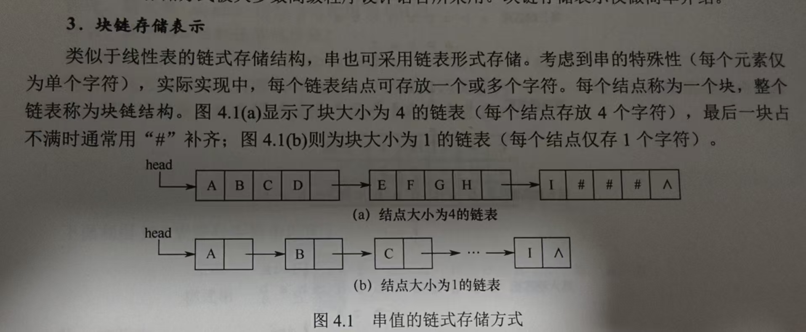

# 串

## 4.1 串的定义和实现

- **串**：字符串，简称串，计算机中非数字处理的主要对象。常见的信息检索系统（搜索引擎）、文本编辑程序（Word）、问答系统、自然语言系统等，均以字符串为核心处理对象。

### 4.1.1 串的定义

- **串**：串是由零个或多个字符组成的有限序列，通常记为

$$
S = 'a_1a_2a_3\dots a_n'
$$

### 4.1.2 串的基本操作

- `StrAssign(&T, chars)`：赋值操作。将串T赋值为chars。
- `StrCopy(&T, S)`：赋值操作。将串S赋值给串T。
- `StrEmpty(S)`：判断串是否为空。
- `StrCompare(S, T)`：比较操作。若S > T，返回值 > 0；若S = T，返回值 = 0；若S < T，返回值 < 0；
- `StrLength(S)`：求串的长度。
- `SubString(&Sub, S, pos, len)`：将S中从pos开始的长度为len的串赋值给Sub返回。
- `Concat(&T, S1, S2)`：串拼接操作。将S1和S2拼接好赋值给T返回。
- `Index(S, T)`：定位操作。若主串S中存在与串T相等的子串，则返回该子串最先出现的下标。若主串S中不存在与串T相等的子串，则返回-1。
- `ClearString(&S)`：清空字符串。
- `DestroyString(&S)`：销毁操作。将串S销毁。

[手动实现串的基础方式](../DSAA_Code/ch4/4_1_2串的基本操作.c)

[AI实现串的基础夯实](../DSAA_Code/ch4/4_1_2串的基本操作AI写.c)

### 4.1.3 串的存储结构

1. **定长顺序存储表示**：类似于线性表的顺序存储表示，串的定长顺序存储使用一组**地址连续**的存储单元来存放串值的字符序列。
2. **堆分配存储表示**：仍然用**连续地址**存储，只不过是从堆中动态申请内存。
3. **块链存储表示**：类似于链式存储。

## 4.2 串的模式匹配

### 4.2.1 简单的模式匹配算法

- **模式匹配**：模式匹配是指在主串中查找与模式串（待搜索的字符串）完全相同的子串，并返回其首次出现的位置。

**暴力模式匹配（BF）**

[暴力模式匹配源代码](../DSAA_Code/ch4/4_2_1串的普通模式匹配.c)

### 4.2.2 KMP算法原理

1. **KMP算法原理**:

- **前缀**：除最后一个字符外，字符串所有头部子串。
- **后缀**：除第一个字符外，字符串所有尾部子串。
- **部分匹配值**：前缀和后缀最长相等**前后缀长度**。

右滑位数：
$$
右滑位数 = 以匹配字符数 - 对应的部分匹配值
$$

> 王道数据结构 Page 113有详细内容

2. **手算next数组**:

