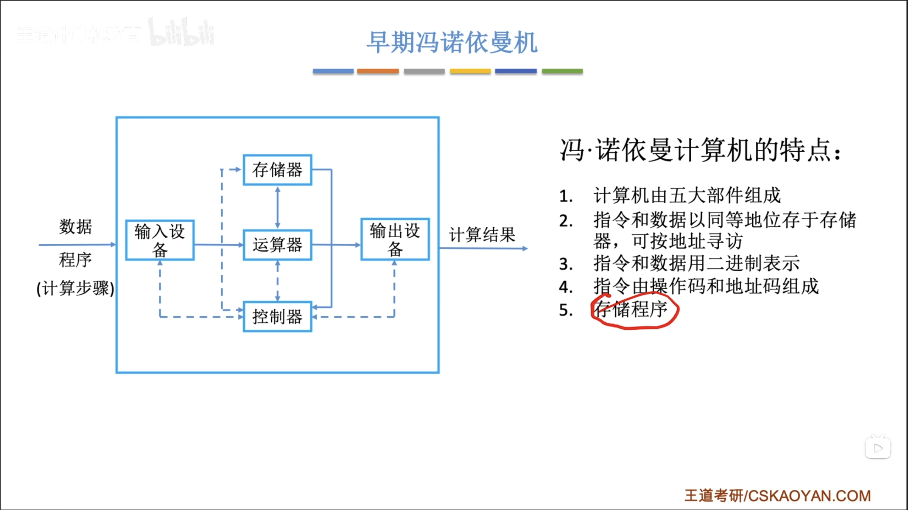
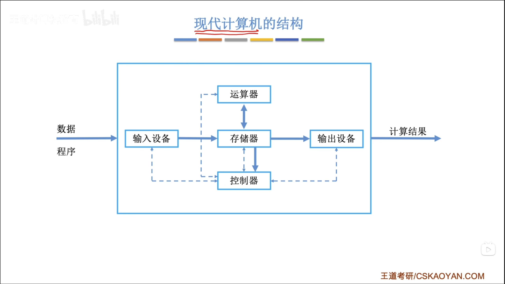

# 计算机组成原理
---
## 1 计算机系统概述

---
### 1.1 计算机发展历程

略

---
### 1.2 计算机系统层次结构

---
#### 1.2.1 计算机系统的组成

- 一个完整的计算机系统通常由**软件**和**硬件**组成。
- **硬件**：是指有形的物理装置。
- **软件**：是指运行在硬件上的程序。

>计算机系统的实际性能，在很大程度上取决于软件对硬件资源的利用效率，而该效率的实现依赖于硬件所提供的能力。计算机系统设计必须合理划分软硬件的功能边界。使用频繁且硬件实现成本低的功能，应由硬件实现，可以显著提升整体效率。

---
#### 1.2.2 计算机硬件

1. **冯·诺伊曼的基本思想**

冯·诺伊曼在研究EDVAC机时提出了“存储程序”思想，奠定了现代计算机的基本结构。

   1）**采用“存储程序”的工作方式**：将编制好的程序和初始数据预先存入主存储器中，计算机启动后能自动、连续地取指并执行，直至程序结束，无须人工干预。
   2）硬件系统由运算器、控制器、存储器、输入设备和输出设备五大部分组成。
   3）指令和数据在存储器中以相同形式存放，仅凭内容无法区分，但计算机应能识别它们。
   4）**指令和数据均采用二进制编码表示。**
   5）指令由操作码和地址码组成，其中操作码指明操作类型，地址码指出操作数地址。

2. 计算机的功能部件
   
**传统冯·诺伊曼结构**
>以运算器为中心，传输数据也经过运算器，会限制运算器性能。

**现代计算机结构**
>以存储器为中心，在冯·诺伊曼结构上的改进。

**完整部件**

(1)中央集成处理器（CPU）

中央处理器时计算机系统中负责指令执行的核心部件。**CPU由运算器和控制器组成**。在现代处理器架构中，这两部分被系统地组织为**数据通路**和**控制单元**。
   1. **数据通路**：数据通路由**算术逻辑单元（ALU）**和**通用寄存器组**组成。
      1. ALU：完成所有的算术与逻辑运算；
      2. 通用寄存器组：为ALU提供操作数并暂存运算结果，是实现告诉数据风闻的关键。
   2. **控制单元**：控制单元负责协调整个CPU的工作。
   
   
(2)存储器

存储器通常分为外存和内存。
   1. **内存**：现代内存由主存和高速缓存（Cache）组成；传统上的“内存”指的是主存，因为Cache是后来引入的。在冯·诺伊曼结构中，**主存作为核心的工作存储器，用于存放代执行的程序和数据。**
   2. **外存**：外存又称为辅存，分为两种。一种是可以与内存交互的磁盘、固态硬盘。一种是长期备份的海量存储设备（如磁带、光盘等）

(3)外部设备和设备控制器

外部设备又称为“外设”，简称I/O设备。
   1. **外设**：通常由物理功能部件和外设控制器组成。
   2. **外设控制器**：控制外设连接到主机的。

(4)总线（bus）

总线是计算机中用于在各个部件之间传输信息的公共通路。

3. 核心三部件

   1. **主存储器**：由存储体、MAR和MDR组成；
    - 存储体：用来存储二进制数据的
    - MAR：存储地址寄存器
    - MDR：存储数据寄存器
工作流程：CPU带着要获取数据的地址，拿给MAR（存储地址寄存器），然后MAR拿着这个地址去存储体中寻找数据，找到数据之后把数据放在MDR（存储数据寄存器），然后CPU从MDR中取走。

        [CPU访问主存储器工作流程](drawio/CPU访问主存储器工作流程.drawio)

    2. **运算器**：用于实现算术运算和逻辑运算；由ACC、MQ、X和ALU组成；
    
    - ACC：累加器，用于存放操作数或运算结果。
    - MQ：乘商寄存器，在乘、除运算时，用于存放操作数或运算结果。
    - X：通用寄存器，用于存放操作数。
    - ALU：算术逻辑单元，可以实现算术运算和逻辑运算

    [运算器结构图](drawio/运算器结构图.drawio)

**三个寄存器的功能**
|部件|加|减|乘|除|
|-|-|-|-|-|
|ACC|被加数、和|被减数、差|乘积高位|被除数、余数|
|MQ|无|无|乘数、乘积低位|商|
|X|加数|减数|被乘数|除数|
---
#### 1.2.3 计算机软件

---
#### 1.2.4 计算机系统的层次结构

---
#### 1.2.5 计算机系统的不同用户

---
#### 1.2.6 计算机系统的工作原理

---
#### 1.2.7 本节习题

---
### 1.3 计算机性能指标

---
#### 1.3.1 计算机主要性能指标

---
#### 1.3.2 本节习题

---
### 1.4 本章小节

---
### 1.5 常见问题

---
## 2 数据的表示和运算

---
### 2.1 数制与编码

---
#### 2.1.1 进位计数制及其相互转换

---
#### 2.1.2 定点数的编码表示

---
#### 2.1.3 整数表示

---
#### 2.1.4 C语言中的整数类型及类型转换

---
#### 2.1.5 本节习题

---
### 2.2 运算方法和运算电路

---
#### 2.2.1 基本运算部件

---
#### 2.2.2 定点数的位移运算

---
#### 2.2.3 定点数的加减运算

---
#### 2.2.4 定点数的乘除运算

---
#### 2.2.5 本节习题

---
### 2.3 浮点数的表示与运算

---
#### 2.3.1 IEEE 754标准浮点数

---
#### 2.3.2 浮点数的加减运算

---
#### 2.3.3 C语言中的浮点数类型

---
#### 2.3.4 数据的宽度和存储

---
#### 2.3.5 本节习题

---
### 2.4 本章小节

---
### 2.5 常见问题

---
## 3 存储系统

