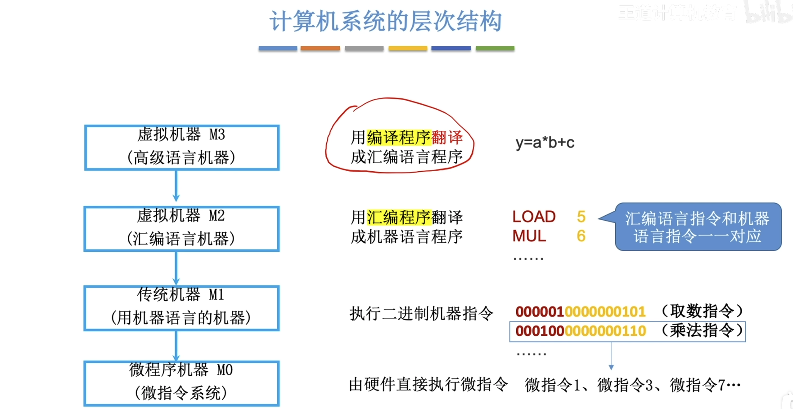
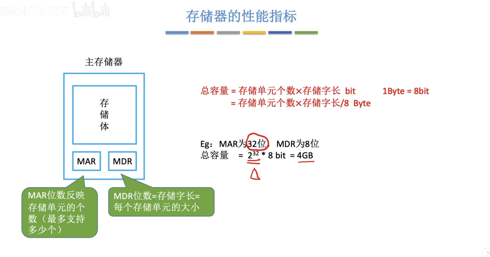

## 1 计算机系统概述

---
### 1.1 计算机发展历程

略
略
略
略
略

---
### 1.2 计算机系统层次结构

---
#### 1.2.1 计算机系统的组成

- 一个完整的计算机系统通常由**软件**和**硬件**组成。
- **硬件**：是指有形的物理装置。
- **软件**：是指运行在硬件上的程序。

>计算机系统的实际性能，在很大程度上取决于软件对硬件资源的利用效率，而该效率的实现依赖于硬件所提供的能力。计算机系统设计必须合理划分软硬件的功能边界。使用频繁且硬件实现成本低的功能，应由硬件实现，可以显著提升整体效率。

---
#### 1.2.2 计算机硬件

1. **冯·诺伊曼的基本思想**

冯·诺伊曼在研究EDVAC机时提出了“存储程序”思想，奠定了现代计算机的基本结构。

   1）**采用“存储程序”的工作方式**：将编制好的程序和初始数据预先存入主存储器中，计算机启动后能自动、连续地取指并执行，直至程序结束，无须人工干预。
   2）硬件系统由运算器、控制器、存储器、输入设备和输出设备五大部分组成。
   3）指令和数据在存储器中以相同形式存放，仅凭内容无法区分，但计算机应能识别它们。
   4）**指令和数据均采用二进制编码表示。**
   5）指令由操作码和地址码组成，其中操作码指明操作类型，地址码指出操作数地址。

2. 计算机的功能部件
   
**传统冯·诺伊曼结构**
>以运算器为中心，传输数据也经过运算器，会限制运算器性能。

**现代计算机结构**
>以存储器为中心，在冯·诺伊曼结构上的改进。

**完整部件**

(1)中央集成处理器（CPU）

中央处理器时计算机系统中负责指令执行的核心部件。**CPU由运算器和控制器组成**。在现代处理器架构中，这两部分被系统地组织为**数据通路**和**控制单元**。
   1. **数据通路**：数据通路由**算术逻辑单元（ALU）**和**通用寄存器组**组成。
      1. ALU：完成所有的算术与逻辑运算；
      2. 通用寄存器组：为ALU提供操作数并暂存运算结果，是实现告诉数据风闻的关键。
   2. **控制单元**：控制单元负责协调整个CPU的工作。
   
   
(2)存储器

存储器通常分为外存和内存。
   1. **内存**：现代内存由主存和高速缓存（Cache）组成；传统上的“内存”指的是主存，因为Cache是后来引入的。在冯·诺伊曼结构中，**主存作为核心的工作存储器，用于存放代执行的程序和数据。**
   2. **外存**：外存又称为辅存，分为两种。一种是可以与内存交互的磁盘、固态硬盘。一种是长期备份的海量存储设备（如磁带、光盘等）

(3)外部设备和设备控制器

外部设备又称为“外设”，简称I/O设备。
   1. **外设**：通常由物理功能部件和外设控制器组成。
   2. **外设控制器**：控制外设连接到主机的。

(4)总线（bus）

总线是计算机中用于在各个部件之间传输信息的公共通路。

3. 核心三部件

**运算器和控制器构成了CPU，主存储器则是内存。**
**其中ALU和CU的制作成本极高！**

   1. **主存储器**：由存储体、MAR和MDR组成；
    - 存储体：用来存储二进制数据的
    - MAR：存储地址寄存器
    - MDR：存储数据寄存器
工作流程：CPU带着要获取数据的地址，拿给MAR（存储地址寄存器），然后MAR拿着这个地址去存储体中寻找数据，找到数据之后把数据放在MDR（存储数据寄存器），然后CPU从MDR中取走。

      [CPU访问主存储器工作流程](drawio/CPU访问主存储器工作流程.drawio)

    2. **运算器**：用于实现算术运算和逻辑运算；由ACC、MQ、X和ALU组成；
    
    - ACC：累加器，用于存放操作数或运算结果。
    - MQ：乘商寄存器，在乘、除运算时，用于存放操作数或运算结果。
    - X：通用寄存器，用于存放操作数。
    - ALU：算术逻辑单元，可以实现算术运算和逻辑运算

    [运算器结构图](drawio/运算器结构图.drawio)

**三个寄存器的功能**
|部件|加|减|乘|除|
|-|-|-|-|-|
|ACC|被加数、和|被减数、差|乘积高位|被除数、余数|
|MQ|无|无|乘数、乘积低位|商|
|X|加数|减数|被乘数|除数|

   3. **控制器**：
   
   - CU：控制单元，分析指令，给出控制信号
   - IR：指令寄存器，存放当前执行的指令
   - PC：程序计数器，存放下一条指令地址，有自动加1的功能

   完成一条指令的流程
   **PC取指令，然后IR存储指令，然后CU分析并执行指令。**

---
#### 1.2.3 计算机软件

软件分为**系统软件**和**应用软件**

1. **系统软件**：系统软件负责管理硬件资源，并向上层应用程序提供基础服务。例如：操作系统、数据库管理系统、标准程序库、网络软件、语言处理程序、服务程序。
2. **应用软件**：应用软件是为了解决某个应用领域的问题而编制的程序。

各种语言
1. **低级语言**：二进制代码，他是计算机**唯一能直接识别**的语言。
2. **汇编语言**：采用英文助记符（mov、add）或其缩写代替而精致指令。
3. **高级语言**：C/C++、Python、Java等。
>编译型语言如C/C++，通常只需要编译一次就可以多次执行，生成的exe文件可以多次执行，并且编译型语言的效率通常更高。
>解释型语言如Python，通常需要执行一句翻译一句，每次执行都要重新翻译，解释型语言效率更低。
>这里说的翻译都是将非二进制语言翻译成二进制语言。只要是非二进制语言，都是翻译语言。
>还有汇编型语言。

**软件和硬件的功能等价性**

从用户视角看，在相同规范下，**二者在逻辑功能上是等价的。**这一性质称为“软/硬件逻辑功能等价性。”
**软/硬件逻辑功能的等价性是计算机系统设计的重要依据。**
**硬件实现的效率远高于软件实现，但是硬件实现的成本也远高于软件。**

**指令集体系结构（ISA）与微体系结构**

指令集体系结构是计算机软/硬件之间的**关键接口**，它从程序员和编译器的视角，**完整的定义了软件可直接使用的硬件功能。**
**ISA定义了每条指令的二进制形式**
|组成部分|说明|
|-|-|
|指令集|支持哪些指令（运算、传送、控制转移等）|
|数据表示|数据类型与格式（整数、浮点数、位宽等）|
|寄存器组织|通用寄存器、专用寄存器的数量和用途|
|寻址方式|操作数如何定位（立即、直接、间接、变址等）|
|存储管理|地址空间、大小端、对齐方式|
|中断/异常机制|如何响应外部事件|

>ISA更像是软硬件的分界线。
>ISA = “合同”: 规定指令格式、寄存器、地址空间——对外不变。
>微体系结构 = “施工方案”: 流水线深度、发射宽度、缓存大小、分支预测器——完全不同
>ISA管兼容性，微体系结构管性能/功耗/面积

||比喻|说法|
|-|-|-|
|ISA|规定/合同|“产品说明书 + API接口规范”，告诉软件能用什么功能，输出什么格式|
|微体系结构|指挥工程师|规定几条流水线、几条执行通道、缓存多达、分支预测用什么算法|

一句话总结：
**ISA管“外面能看到什么”（兼容性边界），微体系结构管“里面怎么干活”（性能/功耗/成本边界）。**

**一个ISA通常可以对应多个微体系结构。**
ISA就像是菜谱，微体系结构就像是厨师团队，一份菜谱可以由不同的厨师团队进行烹饪，但是有的厨师团队出餐更快，有的厨师团队更省煤气（性能、内存占用），最终端出来的菜是一样的（运行结果）。

---
#### 1.2.4 计算机系统的层次结构

**微体系结构和操作系统**：

例如：我们执行Hello_World程序。

有C语言编写好之后，一路翻译，直到变成exe文件（二进制文件）。
如果此时运行了这个exe，接下来的流程将会是这样的：

**操作系统**：
1. 创建进程——在注册表里注册新条目，分配PID
2. 分配虚拟地址空间——给一个进程分配一片“自己拥有全部内存”的幻觉
3. 加载exe到内存——把硬盘上的二进制拷到内存里，设置好代码段、数据段、栈。
4. 跳到main的第一条指令——设置PC......

测试OS的工作做完了

**微体系结构**
每一个时钟周期：
1. 周期1:取指
2. 周期2:解码
3. 周期3:执行

微体系结构负责指挥底层CPU工作。

---
#### 1.2.5 计算机系统的不同用户

1. **最终用户**：直接操作应用程序完成特定工作的人员。例如：使用办公软件或者娱乐。
2. **系统管理员**：负责配置、管理和维护计算机系统，确保其稳定高效运行的人员。主要职责包括安装软/硬件、管理用户账户、数据备份与系统升级等。
3. **应用程序员**：利用高级语言开发应用程序。
4. **系统程序员**：设计并开发操作系统、编译器、数据库管理系统等核心系统软件的人员。

---
#### 1.2.6 计算机系统的工作原理

1. “存储程序”工作方式

计算机执行指令无需人工干预，只需要将要执行的指令写好然后存入内存或辅存中，然后计算机开始自动执行。

- **顺序指令**：写一条指令的地址是PC值加指令长度。
- **跳转指令**：下一条指令地址为指令中指定的目标地址。

2. 从源程序到可执行文件

C语言源程序到可执行文件有**四个阶段**。

流程图：[四个阶段流程图](../drawio/编译原理.drawio)

      1. 预处理阶段：预处理器（cpp）处理源文件中以#开头的预处理指令，如将`#include<stdio.h>`替换为完整的文件内容，生成预处理后的文件hello.i
   
      2. 编译阶段：编译器（ccl）将hello.i翻译为汇编语言程序hello.s,其中每条语句以文本形式描述一条低级机器指令。

      3. 汇编阶段：汇编器（as）将hello.s转换为机器语言指令，生成可重定位目标文件hello.o，该文件为二进制格式。

      4. 链接阶段：链接器（ld）将hello.o与标准C库所需函数进行链接如（printf），解析外部符号引用，最终生成完整的可执行文件hello。

3. 指令执行过程的简要描述

可执行文件是由**一条条及其指令**构成。
指令执行可分为“取指——译码——执行”三阶段循环。

---
#### 1.2.7 本节习题

---
### 1.3 计算机性能指标

---
#### 1.3.1 计算机主要性能指标

1. 存储体性能指标

2. CPU性能指标

   1. **运算速度**：
   - 吞吐量：指系统在单位时间内处理请求的数量。
   >它受多个环节影响，包括信息输入到内存的速度、CPU取指令的速度、数据在内存中读写的速率，以及结果输出到外部设备的效率。
   - 响应时间：用户发出请求到系统返回结果的总等待时间。
   >通常包括CPU时间和等待时间（I/O时间）
   - CPU时钟周期：机器内部主时钟脉冲的宽度，是CPU工作的**最小时间单位**。
   >时钟脉冲由机器脉冲源产生，经整形和分频后形成。
   - 主频（CPU时钟频率）：机器内部主时钟的频率，即**时钟周期的倒数**，用来衡量处理器速度的重要指标。
   - CPI（Cycles Per Instruction）（每条指令的循环数）：执行一条指令需要的时钟周期数。
   - IPS（Instructions Per Second）：每秒执行多少指令。
   - CPU执行时间：运行一个程序所需要的时间。
   >**CPU执行时间 = CPU时间周期数/主频 = （指令数 x CPI）/ 主频**
   - MIPS（Million Instructions Per Second）：每秒执行多少百万条指令。
   >**MIPS = 指令总数 / （CPU执行时间 x 10^6）= 主频 / （CPI x 10^6）**
   >通常MIPS用于不同机器之间性能比较存在明显差异，不同的指令集架构会参数不同的MIPS。

   2. **基准程序**：是一组专门用于性能评测的典型程序。

---
#### 1.3.2 本节习题

---
### 1.4 本章小节

> 王道计算机组成原理 Page 18

---
### 1.5 常见问题

> 王道计算机组成原理 Page 19
