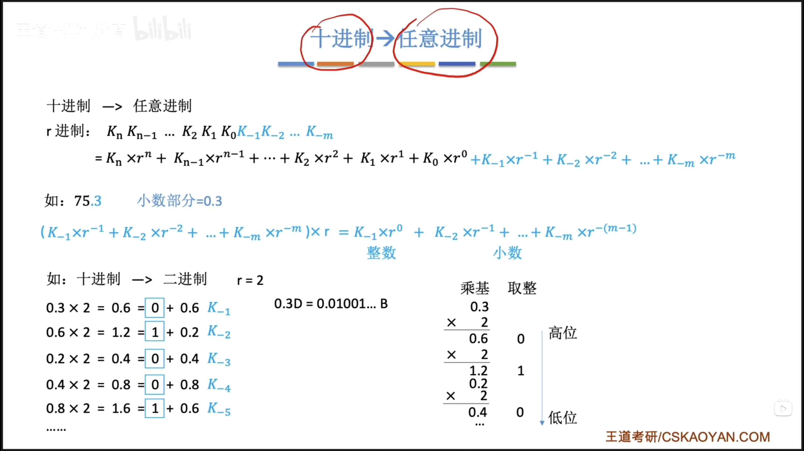
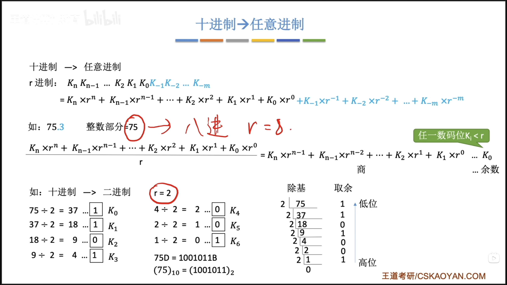
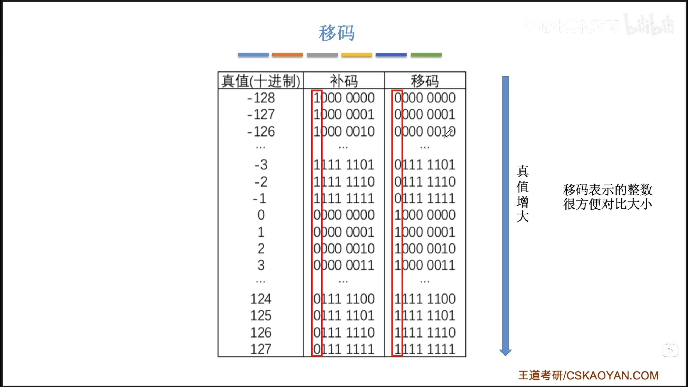

## 2 数据的表示和运算

---
### 2.1 数制与编码

---
#### 2.1.1 进位计数制及其相互转换

> 王道计算机组成原理 Page 20

---
#### 2.1.2 定点数的编码表示

1. **真值和机器数**：

通常生活中，+15、-8这类符号直接写在数字前面的数字符合人类阅读习惯（通常会省略+号），所以这类数字写法叫做**真值**。在计算机中，无法表示+、-两个符号，所以计算机中会把+、-也编码成数字，例如0表示正数、1表示负数，这种将符号数字化的表示形式成为**机器数**。

2. **机器数的定点表示**：

**计算机中的数值表示分为定点表示和浮点表示**

定点表示用于表示**定点小数**、**定点整数**。

**定点整数**：第一位为符号位，小数点位于最后。所有的数值位都用来表示整数大小，第一位表示符号。

**定点小数**：第一位为符号为，小数点位于第一位后面。所有数值位都用来表示小数大小，第一位表示符号。

>其中的**数值位**也叫做**尾数**。

- **无符号数**：整个机器字长全部用来表示数值，不表示符号。
>通常C语言的`unsigned`关键字只能用于无符号整数，不能用于无符号小数和浮点数。

3. **原码、补码、反码、移码**：

    1. **原码：**（两种0表示）
        优点：
        - 与其真值对应关系简单、直观，便于转换。
        - 用原码实现乘除运算比较简单。 
        
        缺点：
        - 零的表示不唯一。
        - 用原码实现加减运算比较复杂。

        表示范围$-(2^n - 1) \le x \le 2^n - 1$    (关于原点对称)

    2. **反码：**（两种0表示）

        
        转换：如果真值为正，反码等于原码。如果真值为负，反码等于原码的数值位全部取反。

        与原码有**一一对应**的关系。

    3. **补码**：（一种0表示）

        转换：如果真值为正，补码等于原码。如果真值为负，补码等于反码+1（要考虑进位）。
        补码和原码之间可以进行**逆转化**。

        表示范围$-2^n \le  x \le 2^n - 1$
        比原码和反码多一个$-2^n$
    4. **移码**：（一种0表示）

        转化：将补码的符号位取反。
        注意：补码只能表示整数。
        移码和补码**一一对应**关系。

计算技巧：
$[x]_{补}  转化为  [-x]_{补}$
**符号位、数值位全部取反，末尾+1**

**移码作用**
方便计算机比较真值大小。

---
#### 2.1.3 整数表示

> 王道计算机组成原理 Page 25

---
#### 2.1.4 C语言中的整数类型及类型转换

---
#### 2.1.5 本节习题

---
### 2.2 运算方法和运算电路

---
#### 2.2.1 基本运算部件

---
#### 2.2.2 定点数的位移运算

---
#### 2.2.3 定点数的加减运算

---
#### 2.2.4 定点数的乘除运算

---
#### 2.2.5 本节习题

---
### 2.3 浮点数的表示与运算

---
#### 2.3.1 IEEE 754标准浮点数

---
#### 2.3.2 浮点数的加减运算

---
#### 2.3.3 C语言中的浮点数类型

---
#### 2.3.4 数据的宽度和存储

---
#### 2.3.5 本节习题

---
### 2.4 本章小节

---
### 2.5 常见问题

---
