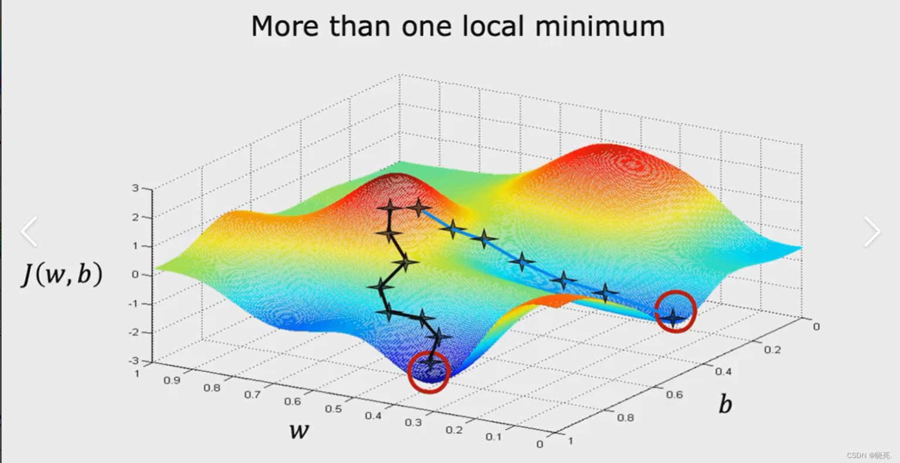

# 深度学习笔记

跟着李沐《动手学深度学习》(d2l.ai)，配合代码实践。

## 1.torch基础

**辅助函数**

>```dir()```函数能让我们知道包和包内的函数
>```help()```函数能让我们知道每个包内的函数如何使用


### 1.1 reshape与view的区别


|操作|创建新的Tensor对象|共享Storage|修改b会不会影响a|限制|
|-----|-------|-----|-----|----|
|b = a|同一个对象，不创建|共享|有影响|无|
|b = a.view(...)|创建新的Tensor对象|共享|有影响|a必须contiguous内存连续|
| b = a.reshape(...)|创建新的Tensor对象|如果内存不连续就创建新的内存空间|不一定，看是否创建新的内存空间|无|
|b = a.clone()|创建新的Tensor对象|不共享|不影响|无|

>`view()`只能作用域内存连续的对象，而`reshape()`能作用于所有的对象，如果内存连续就直接指向该内存，如果不连续就另外创建内存。

### 1.2 数据读取

**OS包读取文件路径**

- **```os.listdir(dir_path)```将dir_path中的文件名以字符串列表的形式返回。**

```python
#导入包
from PIL import Image
import os
#路径
img_path = r'data'
#把该目录的所有文件以列表的形式返回
img_path_list = os.listdir(img_path)
#输出相关信息
print(img_path_list)
print(img_path_list[0])
print(type(img_path_list))
#输出如下：
#['cifar-10-batches-py', 'cnn_demo_image.png', 'Kaggle_First_Project']
#cifar-10-batches-py
#<class 'list'>
```

- **```os.path.join(img_dir, img_path)```将img_dir和img_path拼接起来。**

```python
import os
img_dir = r'data'
img_path = r'cnn_demo_image.png'
path = os.path.join(img_dir, img_path)
print(path)
#输出 data/cnn_demo_image.png
```


### 1.3Dataset类如何重定义

**自定义Dataset类必须重写的三个函数**

- ```__init__()```初始化函数。
- ```__getitem__()```索引函数
- ```__len__()```获取长度函数

```python
from PIL import Image
import os
from torch.utils.data import Dataset
#创建该类
class imgdataset(Dataset):
    #初始化
    def __init__(self, root_path, label_path):
        #获得根目录
        self.root_path = root_path
        self.label_path = label_path
        #获得路径
        self.path = os.path.join(root_path, label_path)
        #获得该路径下的文件名列表 [str, str, str, ...]
        self.img_path = os.listdir(self.path)
        

    def __getitem__(self, idx):
        #根据输入的idx找到对应的文件名
        img_name = self.img_path[idx]
        #将文件名填入路径中，找到该文件的准确路径
        img_path = os.path.join(self.path, img_name)
        #打开图片
        img = Image.open(img_path)
        #返回label
        label = self.label_path
        #__getitem__通常返回特征和标签，在这里是img和label
        return img, label

    def __len__(self):
        return len(self.img_path)
    

def main():
    #实例化一个dataset
    ant_dataset = imgdataset(r'hymenoptera_data\train', r'ants')
    #获取第一个dataset
    img, label = ant_dataset[0]
    img.show()
    print(label)

if __name__ == '__main__':
    main()
```


**冷知识**
```python
#dataset之间可以进行相加拼接
train_dataset = ants_dataset + bees_dataset
```


### 1.4TensorBoard的使用（可视乎loss函数）


**TensorBoard网页使用指南**
| 需求 | 操作 |
|------|------|
| 曲线太抖看不清 | 调大 Smoothing 滑块 |
| 想对比两次训练 | 把日志分别存 `logs/exp1`、`logs/exp2`，TensorBoard 自动叠图 |
| 想确认模型结构对不对 | 看一眼 GRAPHS 面板，双击展开 |
| 想下载图片 | 右下角有个下载按钮 |
| 想定位某个具体的数值 | 鼠标悬停在曲线上 |


**导入TensorBoard包**
```python
from torch.utils.tensorboard import SummaryWriter
```


**SummaryWrite类**

>类似于可视化包，用于观察训练时loss下降情况。

**add_scalar()**

```python
#导入包
from torch.utils.tensorboard import SummaryWriter
#实例化SummaryWriter对象
write = SummaryWriter('logs')
#绘制图像
for i in range(100):
    write.add_scalar('y = x', i, i)
#关闭write
write.close()
```

>运行完之后会生成一个logs文件夹，接下来需要在目录中运行如下指令

```bash
tensorboard --logdir=logs
```

>然后会输出一个端口路径，打开即可查看可视化图像。

### 1.5Transforms类（Image预处理工具包）

**Transforms类通常内置于Dataset类中做一个内置工具，当取数据的时候，就会把数据放入Transforms中加工然后再拿出来。**
**其中```__getitem__()```函数是用来取Dataset中数据的函数，这个函数中往往需要用Transforms来对数据进行处理。**

```python
class MyDataset(Dataset):
    def __init__(self, data, labels, transform=None):
        self.data = data
        self.labels = labels
        self.transform = transform  # 存起来

    def __len__(self):
        return len(self.data)

    def __getitem__(self, idx):
        img = self.data[idx]            # 原始图片
        label = self.labels[idx]

        if self.transform:              # 有 transform 就用
            img = self.transform(img)

        return img, label
```


 **Transforms通常用于对图像进行预处理和数据增强**

 - **统一输入尺寸**：将不同大小的图片缩放、裁剪到模型所需的固定尺寸（如``` Resize```、```CenterCrop```）。
 - **转为张量**：将 PIL 图像或 NumPy 数组转换为 PyTorch / TensorFlow 张量，并调整数据范围（如 ```ToTensor``` 将 [0,255] 转为 [0,1]）。
 - **数据增强**：在训练阶段通过随机变换（如随机翻转、旋转、色彩抖动、仿射变换等）生成多样化的样本，提升模型泛化能力，减少过拟合。
 - **格式转换**：如灰度化（Grayscale）、转换为 PIL 图像等。


```python
from torchvision import transforms
import os
from PIL import Image
#构建文件路径
root_path = r'hymenoptera_data\train'
label_path = r'ants'
img_name = r'0013035.jpg'
img_path = os.path.join(root_path, label_path, img_name)
print(img_path)
#导入图像文件
img = Image.open(img_path)
print(img)
#实例化工具对象
t = transforms.ToTensor()
#进行转换
img_tensor = t(img)
print(img_tensor.shape)
print(img_tensor)
```


**Compose函数**

>```Compose()```可以将参数中的操作一次性执行完，也就是他可以组合多个工具，形成一个超级工具类。前面的```ToTensor()```只能算是一个转化为Tensor的工具，**而Compose可以组合多个工具。**

```python
from torchvision import transforms
# 定义一个由 Compose 包装的预处理流程
transform = transforms.Compose([
    transforms.Resize(256),          # 步骤1: 将图像最短边缩放到256像素
    transforms.CenterCrop(224),      # 步骤2: 从图像中心裁剪出224x224的区域
    transforms.ToTensor(),           # 步骤3: 将PIL图像或NumPy数组转换为PyTorch张量
    transforms.Normalize(            # 步骤4: 用均值和标准差标准化张量
        mean=[0.485, 0.456, 0.406],
        std=[0.229, 0.224, 0.225]
    )
])
# 假设有一张图片 'img'
# transformed_img = transform(img)  # 一次性完成所有步骤
```


**Transforms常用的工具类**

- ```ToTensor()```将Image对象转化为Tensor。
- ```ToPILImage()```讲Tensor或者Ndarray对象转化为Image对象。
- ```Normalize()```对一个Tensor的image进行归一化。
```python
from torchvision import transforms

transform = transforms.Compose([
    transforms.ToTensor(),           # 将 PIL 图像转为 [0,1] 的张量
    transforms.Normalize(            # 标准化
        mean=[0.485, 0.456, 0.406],
        std=[0.229, 0.224, 0.225]
    )
])
#mean表示每个通道的均值，std表示每个通道对应的方差。
#mean[0]和std[0]表示第0个通道的均值和方差，然后这个通道的所有值对这个均值和方差进行归一化。
# 假设 img 是一个 PIL Image 或 np.array
tensor_img = transform(img)   # 输出张量，每个通道满足近似 N(0,1) 分布
```

- ```Resize()```把Image对象重塑为指定大小。


### 1.6DataLoader类（数据迭代器）

**类比**

>Dataset是一副牌，Dataset中的每一个样本是一张牌，那么DataLoader就是发牌器。
>dataset参数：告诉发牌器，你的牌是哪一副。
>batch_size参数：告诉发牌器，一次发多少张。
>shuffle参数：告诉发牌器，是否洗牌（打乱数据顺序）
>drop_last参数：如果有100张牌，每次发3张，必定会余1张牌，那么当drop_last=True时会抛弃（drop）最后一张牌，当drop_last=False时不抛弃最后一张牌。


```python
from torch.utils.data import Dataset, DataLoader
import torchvision
from torch.utils.tensorboard import SummaryWriter
test_data = torchvision.datasets.CIFAR10(r'./data', train = False, transform = torchvision.transforms.ToTensor())
dataloader = DataLoader(dataset = test_data, batch_size = 4, drop_last = False)
write = SummaryWriter('logs')
step = 0
for img, label in dataloader:
    
    write.add_images('test_data', img_tensor = img, global_step = step)
    step += 1
write.close()
```


### 1.7 三者关系（Transform、Dataset、DataLoader）（究极重点）


#### 1.7.1 一句话关系

```
原始数据 ──(Transform)──► Dataset ──(DataLoader)──► 模型
```

- **Transform**：嵌入到Dataset中的转化工具，对Dataset中要取出的数据进行转化。
- **Dataset**：数据的"仓库"，负责存取和索引
- **DataLoader**：仓库的"物流"，负责分批、打乱、并行运输

---

#### 1.7.2 各自职责

##### 1. Transform —— 加工工人

| 类别 | 例子 | 作用 |
|------|------|------|
| 类型转换 | `ToTensor()` | PIL Image → Tensor ([0,255] uint8 → [0,1] float32) |
| 归一化 | `Normalize(mean, std)` | 把像素值拉到均值为0、标准差为1的分布 |
| 数据增强 | `RandomHorizontalFlip()` | 随机翻转，同一张图每次不同，防止过拟合 |
| 数据增强 | `RandomCrop(32, padding=4)` | 随机裁剪 |
| 数据增强 | `ColorJitter(...)` | 随机颜色扰动 |

> **关键：** Transform 在 Dataset 创建时存起来，在 `__getitem__` 被调用时才执行。

##### 2. Dataset —— 数据仓库

```text
┌─────────────────────────────────┐
│           Dataset               │
│                                 │
│  __init__:  存路径/标签/transform │
│  __len__:   返回数据总量          │
│  __getitem__: 取第 i 条，调 transform│
│                                 │
│  dataset[i] 返回 (tensor, label) │
└─────────────────────────────────┘
```

- **Dataset 本身不是数据**，是数据的**容器 + 索引规则**
- Transform 只是它的一个工具，存在 `self.transform` 里

##### 3. DataLoader —— 物流系统

```text
┌──────────────────────────────────────────┐
│               DataLoader                 │
│                                          │
│  从 Dataset 里取数据：                     │
│  ① shuffle（打乱顺序）                     │
│  ② 按 batch_size 分组                     │
│  ③ 把每组样本拼成一个大 tensor             │
│  ④ num_workers 并行加载（可选）            │
│  ⑤ drop_last 丢弃最后凑不齐的零头（可选）   │
│                                          │
│  输出：(batch_tensor, batch_labels)       │
└──────────────────────────────────────────┘
```

---

#### 1.7.3 数据流转全景图

```text
磁盘上的图片文件 (PIL Image)
        │
        │  dataset[i] 被调用时
        ▼
   ┌─────────────┐
   │  Transform   │   ToTensor() / Normalize() / RandomFlip()
   └──────┬──────┘
          │
          ▼
   ┌─────────────┐
   │   Dataset    │   存图片路径+标签，__getitem__ 里调 transform
   │   (仓库)     │   dataset[i] → (tensor, label)
   └──────┬──────┘
          │
          │  DataLoader 包在外面，循环取 batch
          ▼
   ┌─────────────┐
   │  DataLoader  │   shuffle → batch → 拼接 → 并行加载
   │   (物流)     │   for batch in dataloader → 喂给模型
   └──────┬──────┘
          │
          ▼
   ┌─────────────┐
   │    模型      │
   └─────────────┘
```

---

#### 1.7.4 代码对照

```python
import torch
import torchvision
from torch.utils.data import DataLoader
from torchvision import transforms

# ========== 1. Transform：定义加工规则 ==========
train_transform = transforms.Compose([
    transforms.RandomHorizontalFlip(),           # 数据增强
    transforms.RandomCrop(32, padding=4),        # 数据增强
    transforms.ToTensor(),                       # 类型转换：PIL → Tensor
    transforms.Normalize((0.5,0.5,0.5), (0.5,0.5,0.5))  # 归一化
])

test_transform = transforms.Compose([
    transforms.ToTensor(),                       # 测试集不需要增强！
    transforms.Normalize((0.5,0.5,0.5), (0.5,0.5,0.5))
])

# ========== 2. Dataset：数据仓库，绑定 transform ==========
train_dataset = torchvision.datasets.CIFAR10(
    root='data',
    train=True,
    transform=train_transform    # transform 存进 dataset，用的时候才执行
)

test_dataset = torchvision.datasets.CIFAR10(
    root='data',
    train=False,
    transform=test_transform
)

# ========== 3. DataLoader：物流，包住 dataset ==========
train_loader = DataLoader(
    train_dataset,        # ← 包的是 Dataset
    batch_size=64,        # ← 每批 64 张
    shuffle=True,         # ← 训练打乱
    num_workers=2         # ← 2个进程并行加载
)

test_loader = DataLoader(
    test_dataset,
    batch_size=64,
    shuffle=False,        # ← 测试不用打乱
    num_workers=2
)

# ========== 4. 训练循环 ==========
for epoch in range(10):
    for imgs, labels in train_loader:   # 每次取一个 batch
        # imgs.shape = (64, 3, 32, 32)
        # labels.shape = (64,)
        outputs = model(imgs)
        loss = criterion(outputs, labels)
        ...
```

---

#### 1.7.5 自定义 Dataset 示例

```python
from torch.utils.data import Dataset

class MyDataset(Dataset):
    def __init__(self, images, labels, transform=None):
        self.images = images        # 原始数据（路径或 PIL Image）
        self.labels = labels
        self.transform = transform  # 把 transform 存起来

    def __len__(self):
        return len(self.images)

    def __getitem__(self, idx):
        img = self.images[idx]      # 取原始图
        label = self.labels[idx]

        if self.transform:          # transform 在这里才真正执行
            img = self.transform(img)

        return img, label           # 返回 (处理后的tensor, 标签)
```

---

#### 1.7.6 常见误区

| 误区 | 正解 |
|------|------|
| "Dataset 里面存的是 Tensor" | 不一定。存的是原始数据（路径/PIL），取的时候才经 transform 转成 Tensor |
| "transform 把 Dataset 变成了 Tensor" | transform 作用在**每一张图上**，不改变 Dataset 本身的类型 |
| "DataLoader 只是分批" | 还做了 shuffle、并行加载、自动拼接、drop_last 等 |
| "测试集也要做数据增强" | ❌ 测试集只需要 `ToTensor()` + `Normalize()`，不要随机变换 |


### 1.8 神经网络的搭建


#### 1.8.0 官方文档访问

[中文文档](https://docs.pytorch.ac.cn/docs/2.12/index.html)

>按住CTRL左键点击。


#### 1.8.1 nn.Module类

**所有模型的父类**

**搭建模型时要重写一下函数：**
- ```__init__()```：初始化函数。
- ```forward()```：前向传播函数。


#### 1.8.2 卷积层API使用

**常用Conv2d，二维卷积，对应图片。也有一维和三维的，三维对应视频或者其他的有第三个维度的数据类型。**

**常用参数**
- in_channels：输入通道数。
- out_channels：输出通道数。
- kernel_size：卷积核大小，可以填入标量也可以填入向量。例如标量参数3表示3×3、向量参数(3, 5)表示3×5的卷积核。
- stride：表示卷积核的步幅。
- padding：表示周围填充的数量。

#### 1.8.3 池化层API使用


**常用参数**
- kernel_size：池化核大小。
- stride：移动步幅。
- padding：周围填充大小。


#### 1.8.4 其他常用层API使用

**BN层**

>用于对数据做归一化。

```python
#num_feature表示表示特征数，在卷积神经网络中表示通道数。
nn.BatchNorm2d(num_feature, ...)
```


**Recurrent Layers（处理自然语言的网络层）**

具体查官方文档

**Transformer Layers（自注意力）**

具体查看官方文档

**Linear Layers（线性层）（常用）**

具体查看官方文档

**Dropout Layers（丢弃层）（常用的正则化方式）**

具体查看官方文档


**Sequential**


```python
#构建一个简单的网络
model = nn.Sequential(
	nn.Conv2d(), 
	nn.ReLU(), 
	nn.Conv2d(), 
	nn.Dropout(), 
	nn.ReLU()
)
```
具体查看官方文档


**Flatten层**

**作用**
>**连接卷积部分与全连接部分**，将多维张量转化为1维向量。

例如：输入特征图：```(4, 4, 32)```，输出```(4*4*32)=512```的一维向量。


#### 1.8.5 优化器（optim）


```python
#优化器实例化。
#model.parameters()，必须把模型的参数放进去，这样优化器才知道这个模型的参数有哪些，才能进行参数更新。
optimizer = optim.SGD(model.parameters(), lr = lr, momentum = 0.9)
optimizer = optim.Adam([var1, var2], lr = lr)
#zero_grad()函数用来对梯度清理，防止前一轮学习的梯度影响当前的计算。
optimizer.zero_grad()
#利用损失函数的backward()前向传播函数进行梯度计算。
loss.backward()
#step函数，用损失函数计算出的梯度对参数进行更新。
optimizer.step()
```


#### 1.8.6 模型的保存和模型的加载


```python

#模型保存，输入模型的名字和保存路径即可，路径要以pth格式保存。
#方式1，保存模型的结构和参数。
torch.save(model_name, path)
#方式2，仅仅保存模型的参数（官方推荐，因为这样可以减少内存占用）
torch.save(model_name.state_dict(), path)
#导入模型
#如果path中保存了网络结构，那么model可以直接使用
#如果path中仅仅保存了网络参数，那么model还不能直接使用，model只是个参数字典。
#方式1，导入含有网络结构的pth文件
model = torch.load(path)
#方式2，导入仅含有网络参数的pth文件
#先创建网络结构
model = torchvision.models.resnet18(pretrained = False)
#导入网络参数
model.load_state_dict(torch.load(path))


```


#### 1.8.7数据增强API（Transforms类）

**`torchvision.transforms.v2` 常用数据增强 API 速查笔记**

---

**`Compose`**  
组合多个变换  
- `transforms` (list): 变换列表  

**`RandomHorizontalFlip`**  
随机水平翻转  
- `p` (float): 翻转概率，默认 0.5  

**`RandomVerticalFlip`**  
随机垂直翻转  
- `p` (float): 翻转概率，默认 0.5  

**`RandomRotation`**  
随机旋转  
- `degrees` (float/tuple): 旋转角度范围，如 30 表示 [-30,30]  
- `expand` (bool): 是否扩大画布以适应旋转，默认 False  
- `fill` (int/tuple): 填充像素值，默认 0  
- `antialias` (bool): 是否抗锯齿，推荐 True  

**`RandomCrop`**  
随机裁剪  
- `size` (int/tuple): 裁剪后尺寸  
- `padding` (int/tuple): 裁剪前填充大小，默认 None  
- `pad_if_needed` (bool): 若图像小于目标尺寸是否填充，默认 False  

**`RandomResizedCrop`**  
随机裁剪后缩放到固定尺寸  
- `size` (int/tuple): 输出尺寸  
- `scale` (tuple): 裁剪面积相对于原图的比例范围，默认 (0.08, 1.0)  
- `ratio` (tuple): 宽高比范围，默认 (3/4, 4/3)  
- `antialias` (bool): 是否抗锯齿，推荐 True  

**`ColorJitter`**  
随机调整颜色属性  
- `brightness` (float/tuple): 亮度调整因子，0 为全黑，1 为原图；若为单数 a 表示 [max(0,1-a), 1+a]  
- `contrast` (float/tuple): 对比度，同上  
- `saturation` (float/tuple): 饱和度，同上  
- `hue` (float/tuple): 色相偏移范围，最大不超过 0.5  

**`RandomGrayscale`**  
随机转灰度图  
- `p` (float): 转换概率，默认 0.1  

**`RandAugment`**  
自动搜索增强策略（RandAugment）  
- `num_ops` (int): 每张图像应用的操作数量，默认 2  
- `magnitude` (int): 增强强度，常用 1~10，默认 9  
- `num_magnitude_bins` (int): 强度分级数，默认 31  

**`AutoAugment`**  
自动搜索策略（AutoAugment）  
- `policy` (AutoAugmentPolicy): 预设策略，可选 `AutoAugmentPolicy.IMAGENET`、`CIFAR10`、`SVHN`  

**`AugMix`**  
混合多种增强图像  
- `severity` (int): 增强链的强度，默认 3  
- `mixture_width` (int): 混合链的条数，默认 3  
- `alpha` (float): 混合权重的分布参数，默认 1.0  

**`ToDtype`**  
转换张量数据类型（推荐替代旧版 `ToTensor`）  
- `dtype` (torch.dtype): 目标类型，如 `torch.float32`  
- `scale` (bool): 如果输入是 uint8 且目标为 float，是否自动除以 255，默认 False  

**`Normalize`**  
按均值和标准差归一化  
- `mean` (sequence): 各通道均值  
- `std` (sequence): 各通道标准差  
- `inplace` (bool): 是否原地操作，默认 False  

**`Resize`**  
缩放图像  
- `size` (int/tuple): 目标尺寸  
- `antialias` (bool): 是否抗锯齿，推荐 True  

**`CenterCrop`**  
中心裁剪  
- `size` (int/tuple): 裁剪尺寸  

**`Pad`**  
填充图像边界  
- `padding` (int/tuple): 填充大小  
- `fill` (int/tuple): 填充像素值  
- `padding_mode` (str): 填充模式，支持 `constant`, `edge`, `reflect`, `symmetric`  

**`GaussianBlur`**  
高斯模糊  
- `kernel_size` (int/tuple): 高斯核大小，必须为奇数  
- `sigma` (float/tuple): 高斯标准差，若为单数则表示范围 [0, sigma]  

**`RandomApply`**  
以一定概率应用一组变换  
- `transforms` (list): 变换列表  
- `p` (float): 应用概率  

---

**使用示例**（标准流水线）  
```python
from torchvision.transforms import v2

train_transform = v2.Compose([
    v2.RandomResizedCrop(size=(224, 224), antialias=True),
    v2.RandomHorizontalFlip(p=0.5),
    v2.ColorJitter(brightness=0.2, contrast=0.2, saturation=0.2, hue=0.1),
    v2.ToDtype(torch.float32, scale=True),
    v2.Normalize(mean=[0.485, 0.456, 0.406], std=[0.229, 0.224, 0.225])
])
```


### 1.9 网络设计思路

---

#### 1.9.0 总论：网络设计的核心思维

**不要把网络设计当成"调参数"，要当成"设计信息管道"。**

每一个神经网络本质上做的是一件事：**把原始数据逐步变换成目标形式**。设计网络时，你问自己的第一个问题不应该是"用几层"，而是：

> **"输入数据的结构是什么？输出需要什么形式？中间需要经历怎样的信息变换？"**

这句话听起来抽象，但它是所有网络设计的总纲。下面逐一拆解。

**三大设计原则（适用所有架构）**

| 原则 | 含义 | 反面教材 |
|------|------|----------|
| **结构匹配数据** | 网络的归纳偏置要匹配数据的结构特性 | 用 MLP 处理图像（无视空间局部性，参数爆炸） |
| **容量匹配任务** | 网络的参数量要匹配任务的复杂度和数据量 | 1000 条数据用 ResNet-152（严重过拟合） |
| **梯度流通畅** | 反向传播时梯度能从输出顺畅传到输入 | 深层 Sigmoid 网络没有残差连接（梯度消失） |

**拿到一个新问题时，按这个流程走：**

```
1. 分析数据结构：输入是什么类型？（图像/表格/文本/图/...）
   → 这决定了你选哪一类基础架构

2. 分析任务类型：输出是什么？（分类/回归/生成/检测/...）
   → 这决定了输出层的设计

3. 评估数据规模：训练样本有多少？
   → 这决定了网络可以有多深、多宽

4. 设计管道：输入 → 中间表示 → 输出，每一层的 shape 变化是什么？
   → 在纸上画出来，确认每一层的输入输出维度

5. 用一个 batch 的假数据做 dry-run，验证 shape 正确
```

---

#### 1.9.1 图像网络设计思路（CNN）

**适用场景**：图像分类、目标检测、图像分割、图像生成

**数据的结构特性**：
- **空间局部性**：相邻像素相关性强，远处的像素相关性弱
- **平移不变性**：一只猫在图片左边还是右边，都是猫
- **层次化特征**：边缘 → 纹理 → 局部形状 → 全局语义

**核心设计模式：空间压缩 + 通道扩张**

```
原始图像 (H × W × 3)
    ↓  空间大，语义浅
  浅层卷积（小通道数，捕捉边缘/纹理）
    ↓  空间缩小，语义加深
  中层卷积（通道翻倍，组合成局部形状）
    ↓  空间再缩小，语义更深
  深层卷积（通道再翻倍，组合成全局语义）
    ↓  空间最小，语义最抽象
  全局池化 → 分类输出
```

**五条具体设计规则**

**规则 1：通道数的翻倍节奏**

```
第一层：输入 3(RGB) → 输出 16 或 32
之后每降一次空间分辨率：通道翻倍
32 → 64 → 128 → 256 → 512
```

为什么翻倍？当你用 stride=2 把空间砍半（H/2 × W/2），信息量减少到 1/4。通道翻倍（×2）只能补偿一半的信息容量损失——这是故意设计的有损压缩，迫使网络保留最重要的语义信息，丢弃噪声。

**规则 2：卷积核大小选择**

| 核大小 | 何时用 | 原因 |
|--------|--------|------|
| 3×3 | **默认选择** | 最小能捕捉空间关系的核，两个 3×3 的感受野 = 一个 5×5，参数更少 |
| 1×1 | 调整通道数 / 降维 | 不改变空间，只做通道间的线性组合（NiN、ResNet bottleneck 的核心） |
| 5×5 / 7×7 | 第一层偶尔用 | 输入图大时快速扩大感受野，但现代网络也多用 3×3 堆叠替代 |

几乎永远不需要 2×2、4×4、6×6 的卷积核。3×3 是过去十年被验证的最优默认值。

**规则 3：降空间分辨率的方式和时机**

两种方式，效果近似，选一种保持一致：
- `Conv2d(..., stride=2)` — 可学习的降采样
- `MaxPool2d(2, 2)` — 固定降采样

降采样的时机：不要在第一个卷积层立刻降，先让网络在原始分辨率上提取一些特征：

```
Conv(保持空间) → Conv(保持空间) → 降采样(空间减半+通道翻倍) → 重复
```

**规则 4：用"块"思维搭网络**

不要一个 `nn.Sequential` 从头写到尾。把反复出现的模式封装成块：

```python
# 基础卷积块
def conv_block(in_ch, out_ch):
    return nn.Sequential(
        nn.Conv2d(in_ch, out_ch, 3, padding=1),
        nn.BatchNorm2d(out_ch),
        nn.ReLU(),
    )

# 降采样块
def downsample_block(in_ch, out_ch):
    return nn.Sequential(
        nn.Conv2d(in_ch, out_ch, 3, stride=2, padding=1),
        nn.BatchNorm2d(out_ch),
        nn.ReLU(),
    )
```

**规则 5：用全局平均池化代替全连接**

```python
# 旧做法（VGG/AlexNet）：Flatten → 巨大的全连接层 → 参数爆炸
# 新做法（ResNet/现代CNN）：
nn.AdaptiveAvgPool2d(1)   # H×W×C → 1×1×C
nn.Flatten()               # → C 维向量
nn.Linear(C, num_classes)  # 轻量分类头
```

好处：参数少、不容易过拟合、允许任意输入尺寸。

**规则 6：降采样次数怎么定？**

| 输入尺寸 | 降采样次数 | 最终特征图 | 适用任务 |
|----------|:---------:|-----------|----------|
| 32×32 (CIFAR-10) | 3 次 | 4×4 | 小图分类 |
| 224×224 (ImageNet) | 5 次 | 7×7 | 标准分类 |
| 512×512 | 5-6 次 | 8×8 或 16×16 | 高分辨率分类/检测 |

降采样到特征图大约 4×4 ~ 8×8 时接入全局池化。

**实战示例：为新任务快速搭一个 CNN**

CIFAR-10（32×32，10 类）的设计推导：

```
输入 32×32×3
  ↓ 规则3：先不降采样，在原始分辨率提取特征
  Conv(3→32, 3×3, pad=1) → 32×32×32
  Conv(32→32, 3×3, pad=1) → 32×32×32
  ↓ 规则1+3：降空间 + 翻通道
  stride=2, 32→64 → 16×16×64
  Conv(64→64, 3×3, pad=1) → 16×16×64
  ↓ 再降 + 再翻
  stride=2, 64→128 → 8×8×128
  Conv(128→128, 3×3, pad=1) → 8×8×128
  ↓ 再降 + 再翻
  stride=2, 128→256 → 4×4×256
  ↓ 规则5
  AdaptiveAvgPool2d(1) → 1×1×256 → Flatten → 256
  ↓
  Linear(256, 10)
```

管道：32→16→8→4（三次降采样），通道 3→32→64→128→256。

**现有经典架构的位置（你的知识地图）**

你已经在第 8 章学过的网络，每个解决了一个核心问题：

| 网络 | 解决了什么问题 | 设计创新 |
|------|---------------|----------|
| LeNet | 奠定 CNN 基本范式 | 卷积→池化→全连接 |
| AlexNet | 证明深度 CNN 能处理大规模图像 | ReLU、Dropout、GPU |
| VGG | 证明深度有用，架构可以很规整 | 全部 3×3、VGG 块 |
| NiN | 去掉昂贵的大全连接层 | 1×1 卷积 + 全局池化 |
| GoogLeNet | 同一层用不同感受野并行 | Inception 多分支 |
| ResNet | 让 100+ 层网络能训练 | 残差连接（梯度高速公路） |
| BN | 让深层网络稳定训练 | 归一化 + 可学习缩放平移 |

---

#### 1.9.2 表格数据网络设计思路（MLP）

**适用场景**：房价预测、用户分类、信用评分、推荐系统的特征交叉——任何"Excel 表格"形式的数据

**数据的结构特性**：
- **无空间/时间结构**：列之间没有固定的拓扑关系（不像图像的相邻像素或文本的先后顺序）
- **特征独立但语义相关**：年龄和收入虽然不"相邻"，但逻辑上有关系
- **混合数据类型**：数值型（年龄 25）+ 类别型（城市=北京）+ 缺失值

**核心设计模式：逐步压缩维度**

```
输入 (N个特征，可能几百到几千维)
    ↓  宽→窄，每一层压缩一些
  隐藏层1：宽（让网络有足够容量发现特征间的组合关系）
    ↓
  隐藏层2：中（压缩冗余信息）
    ↓
  隐藏层3：窄（提炼最关键信息）
    ↓
  输出层
```

**四条设计规则**

**规则 1：层数和宽度的选择**

| 数据量 | 网络规模 | 例子 |
|--------|----------|------|
| < 1000 条 | 2-3 层，每层 64-128 | 小规模回归/分类 |
| 1000-10万 条 | 3-5 层，每层 128-512 | 房价预测、信用评分 |
| > 10万 条 | 5-10 层，每层 256-1024 | 推荐系统、大规模 CTR |

**表格数据第一铁律**：数据量小的时候，网络一定要窄要浅。表格数据比图像容易过拟合得多——因为表格特征已经是被人工提取过的"高层语义"，网络需要做的只是发现特征之间的组合关系，不需要像 CNN 那样从像素重建语义。

**规则 2：形状——漏斗型 vs 长方体型**

```
漏斗型（推荐，大多数情况）：
in_features → 256 → 128 → 64 → 1

长方体型（数据量大且特征维度高时）：
in_features → 256 → 256 → 256 → 1

膨胀型（几乎不用，除非做自编码器的编码部分）：
不要用
```

默认使用漏斗型。每一层压缩 30%-50% 的神经元数量。

**规则 3：激活函数选择**

| 激活函数 | 适用场景 | 原因 |
|----------|----------|------|
| ReLU | 默认选择 | 简单高效，大多数表格任务够用 |
| Leaky ReLU | 担心神经元死亡 | 负半轴有小斜率 |
| GELU | 大规模数据 / 深层网络 | 比 ReLU 更平滑，现代 MLP 常用 |
| Tanh | 输入已归一化到 [-1, 1] | 对称性好，但容易饱和 |

**规则 4：表格数据特有的预处理（比网络设计更重要）**

> **表格数据的性能差距，80% 来自预处理，20% 来自网络设计。**

| 步骤 | 操作 | 原因 |
|------|------|------|
| 缺失值处理 | 数值型填中位数/均值，类别型加一列 `is_missing` | 神经网络不能处理 NaN |
| 数值型归一化 | StandardScaler 或 MinMaxScaler | 不同量纲的特征会让梯度不稳定 |
| 类别型编码 | 低基数（<50类）用 one-hot，高基数用 embedding | one-hot 维度爆炸时 embedding 更高效 |
| 标签异常值 | 房价预测等任务，标签取 log1p | 标签跨度大时防止梯度爆炸 |
| 特征工程 | 根据业务知识构造交叉特征 | 让网络的"发现关系"工作变简单 |

**实战示例：Kaggle 房价预测的网络设计**

你之前做的房价预测就是一个典型的表格网络：

```python
class Model(nn.Module):
    def __init__(self, in_features):
        super().__init__()
        self.layout1 = nn.Linear(in_features, 200)   # 宽→中
        self.layout2 = nn.Linear(200, 100)            # 中→窄
        self.layout3 = nn.Linear(100, 1)              # 窄→输出
        self.dropout = nn.Dropout(0.2)

    def forward(self, x):
        x = torch.tanh(self.layout1(x))
        x = self.dropout(x)
        x = torch.tanh(self.layout2(x))
        x = self.dropout(x)
        x = self.layout3(x)  # 最后一层不用激活
        return x
```

设计逻辑：
- 输入特征约 300 维（one-hot 后）
- 漏斗形 200→100→1
- Dropout(0.2) 防止过拟合（数据只有 1168 条）
- 最后一层不用激活函数（回归任务，输出无界）
- Tanh 配合 xavier 初始化

**表格网络 vs 树模型的权衡**

| | 神经网络 (MLP) | 树模型 (XGBoost/LightGBM) |
|---|---|---|
| 数据量小 (< 1万) | 容易过拟合，需要仔细调参 | **通常更优**，天然抗过拟合 |
| 数据量大 (> 10万) | **通常更优**，能学到复杂交互 | 训练慢，可能欠拟合 |
| 特征含义模糊（embedding） | **天然支持**，可以端到端学习 | 不擅长处理稠密 embedding |
| 需要在线更新 | **支持**，SGD 增量学习 | 不支持增量更新 |
| 可解释性 | 差 | **好**，特征重要性一目了然 |

---

#### 1.9.3 语言/序列网络设计思路（RNN/LSTM/Transformer）

**适用场景**：文本分类、情感分析、机器翻译、文本生成、时间序列预测

**数据的结构特性**：
- **时序依赖性**：第 t 个词的语义取决于前面的词（"我不喜欢"中的"不"翻转了"喜欢"的语义）
- **长距离依赖**：一段话开头的主语可能影响 100 个词之后的谓语
- **变长输入**：每条文本长度不同，不像图像有固定尺寸
- **离散性**：词是离散符号，不是连续数值，需要先变成向量（Embedding）

---

**Part A：RNN / LSTM 设计思路**

**核心设计模式：循环体 + 时间展开**

RNN 的本质是一个**在时间轴上反复使用的同一个网络块**。不是串联很多层不同的网络，而是**一层网络反复调用 T 次**（T = 序列长度）。

```
输入序列: w1  w2  w3  ...  wT
          ↓   ↓   ↓        ↓
Embedding: e1  e2  e3  ...  eT
          ↓   ↓   ↓        ↓
RNN Cell → RNN Cell → RNN Cell → ... → RNN Cell
  ↓h0       ↓h1       ↓h2            ↓hT
           （同一个 Cell，参数共享）

输出：取最后一个隐藏状态 hT → Linear → 分类
     或者：取所有 h1...hT → 每个时刻都输出（序列标注）
```

**RNN 的致命问题：梯度消失/爆炸**

RNN 在时间轴上展开等同于一个 T 层的极深网络。反向传播穿过 T 个时间步（BPTT），连乘 T 次权重矩阵，梯度指数级衰减或爆炸。

**LSTM：用"门"机制解决长距离依赖**

LSTM 引入三个门（遗忘门、输入门、输出门）+ 一个细胞状态 C：

```
遗忘门：决定丢掉哪些旧信息
输入门：决定写入哪些新信息
输出门：决定输出哪些信息
细胞状态 C：一条贯穿时间的高速公路（类似 ResNet 的恒等映射）
```

LSTM 的设计核心是**细胞状态 C 的更新是加法不是乘法**：

```
C_t = f_t * C_{t-1}  +  i_t * C_tilde_t
      ↑ 遗忘旧信息      ↑ 加入新信息
      乘法门控          加法写入
```

加法操作让梯度可以不衰减地穿过时间步——这和 ResNet 的 x+F(x) 是同一个思路。

**RNN/LSTM 设计规则**

| 设计要素 | 建议 |
|----------|------|
| Embedding 维度 | 50-300（小任务），300-768（大任务）。嵌入维度 = 词表大小的 4 次方根 是一个经验起点 |
| 隐藏层维度 | 128-512（小/中任务），512-2048（大任务） |
| RNN 层数 | 1-3 层。>3 层 RNN 很难训练，需要考虑 LSTM/GRU |
| 双向(Bidirectional) | 分类任务用双向，生成任务用单向（因果约束） |
| 取隐藏状态的方式 | 分类取最后时刻/最大池化/平均池化；序列标注取所有时刻 |
| 防止过拟合 | Embedding 后加 Dropout，RNN 层之间加 Dropout |

**LSTM vs GRU 的选择**

| | LSTM | GRU |
|---|---|---|
| 参数量 | 4 组门（更多） | 3 组门（少 25%） |
| 性能 | 大任务略优 | 小任务与 LSTM 持平 |
| 何时用 | 数据充足、需要最强建模能力 | 数据量一般、想更快训练 |

**实战示例：IMDB 情感分类（你马上要做的任务）**

```
输入：一段电影评论 (变长文本)
  ↓
Tokenization + 词表映射 → [seq_len] 的整数索引
  ↓
Embedding(vocab_size, 128) → [seq_len, 128]
  ↓
LSTM(128, 256, num_layers=2, bidirectional=True, dropout=0.3)
  → 取出最后一个时间步的隐藏状态（双向拼接后 = 512 维）
  ↓
Dropout(0.5)
  ↓
Linear(512, 1) → Sigmoid → 正面/负面
```

设计逻辑：
- Embedding 128 维（IMDB 词表约 2-5 万，128 维够用）
- LSTM 256 隐藏 + 2 层（2 万条训练数据，不需要太深）
- 双向（分类任务不需要因果约束）
- 高 Dropout（文本任务比图像更容易过拟合）
- 取最后隐藏状态（整个句子 → 一个情感标签）

---

**Part B：Transformer 设计思路（现代 NLP 的绝对主力）**

> Transformer 彻底取代了 RNN/LSTM 成为 NLP 的主流架构。李沐 d2l 第 11 章会讲，暑假第四阶段你也要手写一个。这里先建立设计直觉。

**Transformer 的核心创新：抛弃时间顺序，用"注意力"一步到位**

RNN 最大的痛点是：词 w1 和词 w100 之间的信息要穿过 99 个时间步。Transformer 说：**让每个词直接看到所有其他词**——这就是 Self-Attention。

```
RNN 的信息流：   w1 → w2 → w3 → ... → w100  （串行，99 步）
Transformer：    w1 ↔ w2 ↔ w3 ↔ ... ↔ w100  （并行，1 步全局可见）
```

不再有时间步，不再有循环，所有位置同时处理。训练时可以并行（比 RNN 快得多）。

**Transformer 的完整管道**

```
输入文本: ["我", "爱", "深度", "学习"]
  ↓
Embedding + Positional Encoding → [4, d_model]
（位置编码注入位置信息——因为没有了 RNN 的天然时序，需要手动加）
  ↓
× N 层 Transformer Block:
  ├── Multi-Head Self-Attention（核心：让每个词看到所有其他词并加权）
  ├── Add & Norm（残差连接 + LayerNorm）
  ├── Feed-Forward Network（对每个位置独立做非线性变换）
  └── Add & Norm
  ↓
取 [CLS] token 或平均池化 → Linear → 分类输出
```

**Transformer 设计规则**

| 设计要素 | 小模型（GPT-2 Small） | 中模型（BERT-base） | 大模型（LLaMA-7B） |
|----------|----------------------|--------------------|--------------------|
| d_model（隐藏维度） | 768 | 768 | 4096 |
| num_heads（注意力头数） | 12 | 12 | 32 |
| num_layers（层数） | 12 | 12 | 32 |
| d_ff（FFN 中间维度） | 3072 | 3072 | 11008 |
| 参数量 | 117M | 110M | 7B |

**设计规律**：
- d_model 必须能被 num_heads 整除（每个头 d_model/num_heads 维）
- d_ff 通常是 d_model 的 4 倍（经验比例，不要随意改）
- num_layers 决定深度——层数越多，能建模的抽象层次越高
- 小数据用浅层（4-6 层），大数据用深层（12+ 层）

**对于你自己的学习/实验级 Transformer**

```
d_model = 256 或 512
num_heads = 8
num_layers = 4 或 6
d_ff = d_model × 4 = 1024 或 2048
```

这个配置参数在 5M-20M 之间，能在单张 GPU 上轻松训练，足够学习。

**RNN vs LSTM vs Transformer：三种序列架构的演变逻辑**

| 架构 | 核心机制 | 解决了什么 | 新问题 |
|------|----------|-----------|--------|
| RNN | 循环：h_t = f(h_{t-1}, x_t) | 让网络有了"记忆" | 长序列梯度消失 |
| LSTM | 门控 + 细胞状态 | C_t 用加法更新，梯度不衰减 | 还是串行，速度慢 |
| Transformer | Self-Attention | 并行 + 全局依赖 + 可解释 | 计算量 O(n^2)，长序列吃显存 |

**一句话串联**：RNN 给了网络记忆 → LSTM 让记忆能穿越很远的时间 → Transformer 说"为什么还要穿越时间？让所有词一秒钟互通！"

---

#### 1.9.4 其他重要架构（知识地图）

除了图像、表格、语言三大主流架构，还有几个你应当知道存在的方向。现阶段不需要深入，但要知道它们分别解决什么问题。

**1. 图神经网络（GNN / Graph Neural Network）**

**解决的问题**：数据不是规则的网格（图像）或序列（文本），而是一个图——社交网络、分子结构、知识图谱、推荐系统的用户-物品关系。

**数据结构**：节点 + 边，节点之间的连接关系不规则。

**核心思想**：每个节点通过聚合它的邻居节点的信息来更新自己的表示（Message Passing）。

```
节点 A ← 聚合所有邻居 {B, C, D} 的特征 → 更新 A 的表示
```

**典型应用**：药物发现（分子结构 → 药性预测）、社交推荐、蛋白质结构预测。

**何时需要 GNN**：当你的数据天然是一个**图结构**（对象之间有明确的关系连接），而不是独立的行（表格）或网格（图像）。

---

**2. 自编码器（AutoEncoder, AE / VAE）**

**解决的问题**：不是分类/回归，而是**无监督学习**——数据压缩、降噪、异常检测、生成。

**核心设计模式**：

```
输入 x → 编码器(Encoder) → 低维潜在表示 z（瓶颈） → 解码器(Decoder) → 重建 x'
训练目标：让 x' 尽可能接近 x
```

设计逻辑：
- 编码器：逐步压缩维度（漏斗），迫使网络提取最关键的信息
- 瓶颈（bottleneck）：维度远小于输入，这是"压缩"的关键
- 解码器：逐步扩展维度（倒漏斗），从压缩表示重建原始数据

**关键变体**：
- **VAE（变分自编码器）**：瓶颈不是固定向量，而是一个概率分布的参数（μ, σ），可以生成新样本
- **去噪自编码器**：输入加噪声，训练重建原始无噪声数据，学习更鲁棒的特征

---

**3. U-Net（编码器-解码器 + 跳跃连接）**

**解决的问题**：图像分割、图像到图像的翻译（图像去噪、超分辨率）。

**核心设计**：

```
输入图像
  ↓ 编码器（下采样，类似 CNN，提取语义）
  逐层压缩空间 + 增加通道
  ↓ ... ↓ ... ↓ ... ↓
  Bottleneck（最小空间，最高语义）
  ↓ 解码器（上采样，恢复空间）
  逐层恢复空间 + 减少通道
  ↓ ... ↓ ... ↓ ... ↓
  跳跃连接：编码器每层的输出直接拼接到解码器对应层
  ↓
输出（与输入相同空间尺寸）
```

**为什么需要跳跃连接**：编码器下采样丢失了精确的空间位置。解码器做分割时，既需要高层语义（"这是肝脏"），也需要低层空间细节（"边界精确到像素"）。跳跃连接把编码器的低层特征直接传给解码器——类似 ResNet，但跨的层数更多。

---

**4. 生成对抗网络（GAN）**

**解决的问题**：生成逼真的图像、超分辨率、风格迁移。

**核心思想**：两个网络互相对抗——生成器 G 造假图，判别器 D 区分真假。G 和 D 互相博弈，最终 G 生成的图可以以假乱真。

```
随机噪声 z → 生成器 G → 假图
                         ↓
              真假图混在一起 → 判别器 D → 真/假
真实图像 → ------------------↑
```

**一般不自己设计 GAN**：GAN 的训练极不稳定，需要大量调参技巧。知道这个方向存在即可，需要时直接用 StyleGAN 等成熟框架。

---

**5. 扩散模型（Diffusion Models）**

**解决的问题**：图像生成（Stable Diffusion、DALL-E、Midjourney 的基础）。

**核心思想**：先学怎么加噪声（把图一步步毁掉），再学怎么去噪声（把纯噪声一步步恢复成图）。生成时，从纯噪声出发，一步步去噪，最终生成一张真实图片。

这是当前（2024-2025）图像生成领域的最强范式，但数学要求很高（随机微分方程、马尔可夫链），现阶段只需知道它存在。

---

**"我应该学哪个"决策树**

拿不准的时候，按这个走：

```
你的数据长什么样？
├── 图像（规则网格像素）
│   ├── 分类 → CNN (ResNet/VGG)
│   ├── 分割 → U-Net
│   └── 生成 → Diffusion Model / GAN
├── 表格（Excel 行列）
│   ├── 数据量 < 1万 → 先试 XGBoost，再试 MLP
│   └── 数据量 > 10万 → MLP / TabTransformer
├── 文本/序列
│   ├── 序列 → LSTM/GRU（小规模）/ Transformer（大规模）
│   └── 分类/生成 → Transformer 系列
├── 图（社交网络、分子）
│   └── GNN
└── 无标签数据（降维、压缩、异常检测）
    └── AutoEncoder / VAE
```

---

#### 1.9.5 从"会调 API"到"会设计网络"的检查清单

当你拿到一个新问题时，按顺序回答下面 7 个问题。回答完，网络的大致结构就有了：

1. **输入是什么类型？**（图像/表格/文本/其他）
2. **输出是什么类型？**（分类→Softmax+类别数 / 回归→无激活+输出维度=1 / 分割→逐像素分类 / 生成→输出=输入维度）
3. **训练数据有多少条？**（决定网络的深度和宽度上限）
4. **输入张量的形状？**（决定第一层的 in_features / in_channels）
5. **信息管道怎么走？**（画出来：每一步 shape 怎么变）
6. **哪里可能梯度断流？**（深层无残差？Sigmoid 饱和？RNN 长序列？→ 加残差/LSTM/BN）
7. **哪里可能过拟合？**（数据少网络大？→ 加 Dropout / 减小网络 / 数据增强）

做完这 7 步，你的网络设计就不再是"凭感觉填参数"，而是有逻辑、可以解释、可以 debug 的工程设计。


### 1.10 完整模型训练套路


#### 1.10.0 设计公式

给定输入高度 $H_{\text{in}}$、宽度 $W_{\text{in}}$，以及卷积层参数：

- **卷积核大小 $K$**（假设正方形，即 $K \times K$，若矩形则分别指定 $K_h, K_w$）
- **步长 $S$**
- **填充 $P$**（每边填充的行/列数）
- **膨胀率 $D$**（dilation，默认1）

则输出尺寸为：

$$
H_{\text{out}} = \left\lfloor \frac{H_{\text{in}} + 2P - D \times (K - 1) - 1}{S} + 1 \right\rfloor
$$

$$
W_{\text{out}} = \left\lfloor \frac{W_{\text{in}} + 2P - D \times (K - 1) - 1}{S} + 1 \right\rfloor
$$

- **简化版**（当 $D=1$，即无膨胀时）：

$$
H_{\text{out}} = \left\lfloor \frac{H_{\text{in}} + 2P - K}{S} + 1 \right\rfloor
$$

- **向下取整 $\lfloor \cdot \rfloor$** 表示如果除不尽，多余部分被丢弃（PyTorch默认行为）。


#### 1.10.1测试方式

**```argmax(dim)```**将dim维度中的所有值取出，然后返回最大值的下标。


```python

import torch
#初始化output
output = torch.tensor([[0.6, 0.3, 0.1], 
                       [0.1, 0.1, 0.8]])
#dim表示维度，将dim维度中的所有值，返回最大值的下标。
pre = output.argmax(dim = 1)
label = torch.tensor([0, 0])
print(pre)
print(pre == label)
print((pre == label).sum())
print((pre == label).sum().item())
#输出如下：
# tensor([0, 2])
# tensor([ True, False])
# tensor(1)
# 1

```


## 2.线性回归基础

### 2.1线性回归数学原理

线性回归的标签y和特征值x的关系：

$$
y = w\_1 x\_1 + w\_2 x\_2 + \cdots + w\_n x\_n + b
$$


而线性回归模型所要做的就是**找到最佳的权重w和偏置b**

$$
X = \begin{bmatrix}1 & x_{11} & x_{12} & \cdots & x_{1d} \\
				   1 & x_{21} & x_{22} & \cdots & x_{2d} \\
				   \vdots &\vdots  &\vdots  &\ddots &\vdots \\
				   1 & x_{n1} & x_{n2} & \cdots & x_{nd}
	\end{bmatrix}
	
\\
\\
\theta = \begin{bmatrix}
		b\\w_1\\w_2\\\vdots\\w_d
		 \end{bmatrix}
\\
\\
X\theta = Y_{pre} = \begin{bmatrix}
		y_1\\y_2\\\vdots\\y_d
		 \end{bmatrix}
\\
\\
损失函数：
loss(\theta) = \frac{1}{2} \begin{Vmatrix} X\theta - Y_{true} \end{Vmatrix}^2 \\= \frac{1}{2} \begin{Vmatrix} Y_{pre} - Y_{true} \end{Vmatrix}^2\\ = \frac{1}{2} (X\theta - Y_{true})^T (X\theta - Y_{true})
\\
= \frac{1}{2}[(X\theta)^T - Y_{true}^T](X\theta - Y_{true})\\ = \frac{1}{2}[(X\theta)^TX\theta - (X\theta)^T Y_{true} - Y_{true}^TX\theta + Y_{true}^TY_{true}]
\\=\frac{1}{2}[\theta^TX^TX\theta - 2Y_{true}^TX\theta + Y_{true}^TY_{true}]\\其中(X\theta)^T Y_{true} 和 Y_{true}^TX\theta都是标量，所以他们的转置等于自己。\\
根据矩阵求导法则:\frac{\partial (X^TAX)}{\partial X} = (A+A^T)X\\\frac{\partial(a^TX)}{\partial X} = a
\\
所以:\frac{\partial loss}{\partial\theta} = \nabla_{\theta} loss(\theta) = \frac{1}{2}[2X^TX\theta - 2X^TY_{true}] = X^TX\theta - X^TY_{true}
\\
为了求出loss的最小值，我们就必须找到梯度为0的w和b，也就是\theta
\\
令 \nabla_{\theta} loss(\theta) = 0 = X^TX\theta - X^TY_{true} => \theta = (X^TX)^{-1}X^TY_{true}
\\
所以最优解\theta = (X^TX)^{-1}X^TY
\\只有线性回归才有通解，并且只有当X^TX可逆时，才能直接求出\theta
$$


### 2.2 学习率对loss的影响

梯度下降需要消耗大量的算力，所以学习率太大和太小都会浪费算力。


### 2.3手写线性回归

**Python语法扩展（yield）**

- `return`在函数结束时返回一个结果。
- `yield` 函数运行到`yield`时，返回一个值，然后函数挂起，知道下一次用`next()`调用或者`for`迭代。

```python
def count_up_to(n):
    i = 0
    while i < n:
        yield i   # 每调用一次 next()，就返回当前的 i，并暂停
        i += 1

# 使用生成器
gen = count_up_to(3)
print(next(gen))  # 输出 0
print(next(gen))  # 输出 1
print(next(gen))  # 输出 2
# print(next(gen))  # 触发 StopIteration

# 更常见的用法：直接 for 循环
for num in count_up_to(3):
    print(num)    # 打印 0 1 2
```

**手写线性回归**

```python
import random
import torch

import os
os.environ["KMP_DUPLICATE_LIB_OK"] = "TRUE"

#创建随机数据
def create_data(w, b, num_examples):
    
    #生成符合正态分布的x，0是均值，1是方差，（num_examples, len(w)）行列。
    x = torch.normal(0, 1, (num_examples, len(w)))
    
    y = x@w + b
    #加入噪音
    y += torch.normal(0, 0.01, y.shape)

    return x, y.reshape((-1, 1))

#批量抽取数据进行梯度下降
def data_iter(batch_size, feature, label):

    num_example = len(feature)
    #生成0到num_example的索引列表
    index = list(range(num_example))
    #用shuffle函数将index打乱，以达到随机抽样的效果
    random.shuffle(index)
    #i是每次抽样的第一个下标
    for i in range(0, num_example, batch_size):
        batch_index = index[i: min(i + batch_size, num_example)]
        #返回feature和label
        yield feature[batch_index], label[batch_index]

#定义模型
def linear_model(x, w, b):
    return x @ w + b

def squared_loss(y_pre, y_true):
    #用平方误差，为了防止两个y的维度不同，我们进行reshape调整
    return 0.5 * (y_pre - y_true.reshape(y_pre.shape))**2

def sgd(params, lr, batch_size):

    with torch.no_grad():
        for param in params:
            #梯度下降
            param -= lr * param.grad / batch_size
            #计算完一轮之后要将grad清零
            param.grad.zero_()


if __name__ == '__main__':

    #创建数据
    example = 1000
    w_true = torch.tensor([2, -3.4])
    b_true = 4.2

    feature, label = create_data(w_true, b_true, example)
    #数据创建成功
    #=========================================================

    #初始化权重和偏置
    #requires_grad = True表示该参数需要进行梯度下降
    w = torch.normal(0, 0.01, size = (2, 1), requires_grad = True)
    b = torch.zeros(1, requires_grad = True)
    print(w, b)

    #=========================================================
    #开始训练
    lr = 0.03
    num_epochs = 3
    batch_size = 10
    net = linear_model
    loss = squared_loss
    #第一层循环，对全部数据扫一遍，一共扫三遍
    for epoch in range(num_epochs):
        #每次拿出batch_size的x和y
        for x, y in data_iter(batch_size, feature, label):
            #计算小批量损失
            l = loss(net(x, w, b), y)
            #计算得到的l是一个[batch_size, 1]的向量
            #我们需要进行求和才是每个样本预测值和真实值的差距
            #用backward()计算梯度
            l.sum().backward()
            #计算完梯度之后才能访问grad这个属性
            if epoch == 0:
                print("grad->", w.grad)
            sgd([w, b], lr, batch_size)
            if epoch == 0:
                print("w->", w)
        #出来这个for循环之后表示已经扫完一遍数据了
        #表示一下内容不需要计算梯度
        with torch.no_grad():
            train_l = loss(net(feature, w, b), label)
            print(f'epoch: {epoch + 1}, loss: {train_l.sum()/example}')

"""
第一次数据：
epoch: 1, loss: 0.040368854999542236
epoch: 2, loss: 0.00015070709923747927
epoch: 3, loss: 5.0547547289170325e-05
tensor([[ 1.9995],
        [-3.3997]], requires_grad=True) tensor([4.2006], requires_grad=True)
第二次数据：
epoch: 1, loss: 0.043382592499256134
epoch: 2, loss: 0.00017751296400092542
epoch: 3, loss: 5.148643322172575e-05
tensor([[ 2.0008],
        [-3.3987]], requires_grad=True) tensor([4.1997], requires_grad=True)
第三次数据：
epoch: 1, loss: 0.04251382499933243
epoch: 2, loss: 0.00017745311197359115
epoch: 3, loss: 5.071829218650237e-05
tensor([[ 1.9993],
        [-3.3996]], requires_grad=True) tensor([4.1995], requires_grad=True)
"""
```

### 2.4 学习率lr和epoch的关系

该模型对应的数据最合适的lr和epoch应该是lr = 0.3、epoch = 3。如图：


我们对参数lr进行调整，将其调整为lr = 0.0003、epoch = 3。如图：


>由于学习率lr过低，epoch也低，导致学习不充分，也就是欠拟合，loss一直降不下来。

我们将参数epoch提升到100。如图：


>此时虽然学习率低，但是epoch上来了，也就是扫描了100遍该训练数据，也能强行把loss降下来。

通常工程中的参数很难找到理想的，一般情况下都是这种情况：


>loss有升有降，但loss最终能下降到可接受范围。

学习率过小会导致欠拟合，学习率过大则会造成梯度爆炸：


>此时loss已经是nan了，梯度爆炸了，学习率过大，导致权重变化过快。

**总结：**
1. 当学习率过小的时候，loss降不下来，提升学习次数（epochs），有可能可以降下来，但是推荐调整参数。
2. 当学习率过大的时候，会出现梯度爆炸，loss=nan，请立刻调整学习率。

### 2.5 用torch实现线性回归

```python
class model(nn.Module):
    #定义单层神经网络

    def __init__(self, *args, **kwargs):
        super().__init__(*args, **kwargs)
        #一层线性回归网络层
        self.layout1 = nn.Linear(in_features = 2, out_features = 1)
    
    def forward(self, x):

        x = self.layout1(x)
        #经过线性计算之后直接返回值
        return x
if __name__ == '__main__':
    plt.figure(figsize = (10, 5))
    #初始化样本数量
    example = 1000
    #初始化真实的w和b
    w_true = torch.tensor([[2.], [-3.4]]) # 2*1
    b_true = torch.tensor(1.0)
    #随机生成样本
    x = torch.normal(0, 3, (example, 2))# example*2
    #y_true的值
    y_true =  x @ w_true + b_true + torch.normal(0, 0.01, (example, 1))
    #把feature和label组合成dataset！！！！！
    data = TensorDataset(x, y_true)#Dataset可以把feature和label组合起来，格式类似于DataFrame但是在深度学习中比DataFrame更加方便
    #初始化参数
    lr = 0.003
    epochs = 3
    batch_size = 10
    net = model()
    #输出初始化的w和b
    print(net.layout1.weight, ' ', net.layout1.bias)
    #定义损失函数
    loss = nn.MSELoss()
    #定义优化器，用来优化参数的，梯度下降
    opt = optim.SGD(net.parameters(), lr = lr)
    loss_num = []
    for epoch in range(epochs):
        data_loader = DataLoader(data, batch_size, shuffle = True)
        loss_sum = 0
        for x, y_true in data_loader:
            #用神经网络进行预测
            y_pre = net(x)
            #计算损失
            l = loss(y_pre, y_true)
            # print(f'loss = {l}')
            loss_num.append(l.item())
            loss_sum += l
            #清除之前的梯度
            opt.zero_grad()
            #进行反向传播，计算梯度
            l.backward()
            #更具bachward计算出的梯度更新参数
            opt.step()  
        l = loss(net(x), y_true)
        print(f'epoch: {epoch + 1} ==> loss: {loss_sum / 100}')
    print(net.layout1.weight, ' ', net.layout1.bias)
    sns.lineplot(x = range(300), y = loss_num)
    plt.show()
```


## 3.Softmax回归

### 3.0 Softmax激活函数公式
>将输出值进行指数运算可以**扩大不同输出之间的差异**，有利于分类。
$$
\text{Softmax}(z_i) = \frac{e^{z_i}}{\sum_{j=1}^{K} e^{z_j}} \quad \text{for } i = 1, 2, \ldots, K
$$

$$
\sigma(\mathbf{z})_i = \frac{e^{z_i}}{\sum_{j=1}^{K} e^{z_j}}
$$

$$
\text{Softmax}(z_i) = \frac{\exp(z_i / T)}{\sum_{j=1}^{K} \exp(z_j / T)}
$$

### 3.1Softmax数学原理

二分类交叉熵公式：
$$
\text{BCE}(y, \hat{y}) = -\left[ y \log(\hat{y}) + (1 - y) \log(1 - \hat{y}) \right]
$$

多分类交叉熵公式：
$$
\text{CE}(y, \hat{y}) = -\sum_{i=1}^{C} y_i \log(\hat{y}_i)
$$

- $ y_i  \in \begin{Bmatrix} 0, 1 \end{Bmatrix}$：one-hut真是标签，只有第i维为1，其余都为0，表示该样本分类为i类。
- $\hat{y}$：表示模型预测样本为第i类的概率大小，会被归一化。所有的$\hat{y}$相加等于1。
- 公式：只有 $y_i$ 这一项不为零，所以公式的数值等于 $-y_i \log(\hat{y}_i)$ ，此时 $\hat{y}$ 越大，损失值越小，所以模型会尽可能地让 $\hat{y}$ 变大，从而提升了区分度。


**容易误解：** 交叉熵损失通常不能用于梯度下降，因为它不具有参数，但是它可以指导前面的全连接层（隐藏层）进行梯度下降。


### 3.2 损失函数

3个常用损失函数：
1. $l(y, y') = \frac{1}{2}(y - y')^2$：均方损失，当权重距离真实权重很远的时候，梯度会比较大，可以加速学习，但同时也不稳定。
2. $l(y, y') = |y - y'|$：绝对损失，不管权重距离真实权重有多远，梯度都是一个常数，学习速度可能没那么快，但是很稳定。当权重距离真实权重很近的时候，因为原点不可导，容易导致稳定性变差。
3. $l(y, y') = \begin{cases} 
|y - y'| - \frac{1}{2} & \text{if } |y - y'| > 1 \\
\frac{1}{2}(y - y')^2 & \text{otherwise}
\end{cases}$：Robust Loss，结合了两者的优点，是梯度下降整体变稳定。


**RobustLoss比较常用**


### 3.3 前向传播和反向传播

前向传播 (Forward Propagation)
第一层：

*   **线性变换与激活**：
    $$ z_1 = w_1 x + b_1 = 3 \times 2 + 1 = 7 $$
    $$ a_1 = f(z_1) = 7 \times 2 + 1 = 15 $$

第二层（假设全连接层）：
*   **线性变换**：
    $$ z_2 = W_2 a_1 + b_2 = 3 \times 15 + 1 = 46 $$
*   **激活**：
    $$ a_2 = f(z_2) = 3 \times 46 + 1 = 139 $$

**损失计算**：
$$ L = (y - a_2)^2 = 2435 $$

---

反向传播 (Backward Propagation)

方向流：`首先输出层 -> dL/d... -> 更新参数`

输出层到损失函数的梯度推导
设损失为均方误差，则有：
$$ \hat{y} = a_2 $$
$$ \frac{dL}{da_2} = 2(y - a_2) $$
$$ \text{代入数值： } 2 \times (80 - 139) = -118 $$

全连接层链式法则 (Chain Rule)
笔记右下角的推导逻辑展示了链式法则在各层的应用：

**输出层函数导数（需根据激活函数选择）：**
*   **如果是 Sigmoid 函数**：
    $$ \frac{da_2}{dz_2} = a_2(1-a_2) $$
*   **如果是线性函数（如 \(y=a_2\)）**：
    $$ \frac{da_2}{dz_2} = 1 \quad (\text{即当 } y=a_2 \text{ 时}) $$

第二层权重梯度计算
根据链式法则：
$$ \frac{dL}{dw_2} = \frac{dL}{dz_2} \cdot a_1 $$
图中具体的数值逻辑（假设 \(\frac{dL}{dz_2} = 26\)）：
$$ grad = \frac{dL}{dw_2} = \frac{dL}{dz_2} \cdot \frac{dz_2}{dw_2} = \frac{dL}{dz_2} \cdot a_1 $$
$$ \text{代入数值： } 26 \times 15 = 390 $$

 第一层权重梯度计算
继续利用链式法则向上一层传播：
$$ \frac{dL}{dw_1} = \frac{dL}{dz_1} \cdot x $$
图中具体的数值逻辑（假设 \(\frac{dL}{dz_1} = 52\)）：
$$ \text{代入数值： } 52 \times 2 = 104 $$

---

 参数更新
图中底部注明了计算出的梯度用于**更新参数**，完成向后传播 → 向前传播的闭环迭代：

*   \( \frac{dL}{dw_1} \rightarrow \text$4{用于更新参数} \)
*   \( \frac{dL}{dw_2} \rightarrow \text{用于更新参数} \)

**易错提醒：**

>每一个神经元都有一组参数（权重），如果某一层的输入3且输出2，那么这一层的W矩阵的形状是3×2。
>通常都是把反向传播完全算完才进行梯度更新，不是边反向传播边更新梯度。


**具体例子：**

**三层神经网络的前向与反向传播（手算版）**

> 费曼说：别背公式，动手拧旋钮。下面我们用一个具体的三层网络（无激活函数、无偏置），手算前向传播和反向传播的每一步。所有数字都是小整数，方便你拿笔跟着算。

**网络结构**

- **输入层**：2个特征  
  $x = \begin{bmatrix} x_1 \\ x_2 \end{bmatrix}$
- **第一隐藏层**：3个神经元 → 权重矩阵 $W^{(1)}$ 大小 **3×2**
- **第二隐藏层**：2个神经元 → 权重矩阵 $W^{(2)}$ 大小 **2×3**
- **输出层**：1个神经元 → 权重矩阵 $W^{(3)}$ 大小 **1×2**（一个行向量）

**激活函数**：无（线性传播，先学会走路）  
**损失函数**：平方误差的一半  
$L = \frac{1}{2}(y_{pred} - y_{true})^2$

**具体数字（全是小整数）**

- 输入：  
  $x = \begin{bmatrix} 1 \\ 2 \end{bmatrix}$

- 第一层权重 $W^{(1)}$（3行2列）：  
  $W^{(1)} = \begin{bmatrix} 0.1 & 0.2 \\ 0.3 & 0.4 \\ 0.5 & 0.6 \end{bmatrix}$

- 第二层权重 $W^{(2)}$（2行3列）：  
  $W^{(2)} = \begin{bmatrix} 0.7 & 0.8 & 0.9 \\ 1.0 & 1.1 & 1.2 \end{bmatrix}$

- 输出层权重 $W^{(3)}$（1行2列）：  
  $W^{(3)} = \begin{bmatrix} 1.3 & 1.4 \end{bmatrix}$

- 真实值（标量）：  
  $y_{true} = 5$

- 学习率：  
  $\eta = 0.1$

---

**第一步：前向传播（算出当前预测）**

**第一层输出 $h^{(1)} = W^{(1)} x$**

$ \begin{aligned} h^{(1)}_1 &= 0.1\times1 + 0.2\times2 = 0.1 + 0.4 = 0.5 \\ h^{(1)}_2 &= 0.3\times1 + 0.4\times2 = 0.3 + 0.8 = 1.1 \\ h^{(1)}_3 &= 0.5\times1 + 0.6\times2 = 0.5 + 1.2 = 1.7 \end{aligned} $

$h^{(1)} = \begin{bmatrix} 0.5 \\ 1.1 \\ 1.7 \end{bmatrix}$

**第二层输出 $h^{(2)} = W^{(2)} h^{(1)}$**

$ \begin{aligned} h^{(2)}_1 &= 0.7\times0.5 + 0.8\times1.1 + 0.9\times1.7 \\ &= 0.35 + 0.88 + 1.53 = 2.76 \\ h^{(2)}_2 &= 1.0\times0.5 + 1.1\times1.1 + 1.2\times1.7 \\ &= 0.5 + 1.21 + 2.04 = 3.75 \end{aligned} $

$h^{(2)} = \begin{bmatrix} 2.76 \\ 3.75 \end{bmatrix}$

**输出层 $y_{pred} = W^{(3)} h^{(2)}$**

$y_{pred} = 1.3\times2.76 + 1.4\times3.75 = 3.588 + 5.25 = 8.838$

**损失**

$L = \frac{1}{2}(y_{pred} - y_{true})^2 = \frac{1}{2}(8.838 - 5)^2 = \frac{1}{2}(3.838)^2 = \frac{1}{2}\times14.730244 = 7.365122$

预测 8.838，真实 5，误差很大。现在反向传播，看看每个旋钮要拧多少。

---

**第二步：反向传播（从输出往输入算梯度）**

**输出层 delta**

$\delta^{(3)} = \frac{\partial L}{\partial y_{pred}} = y_{pred} - y_{true} = 8.838 - 5 = 3.838$  
（这是一个标量）

**对 $W^{(3)}$ 的梯度**

$\frac{\partial L}{\partial W^{(3)}} = \delta^{(3)} \cdot (h^{(2)})^T = 3.838 \times \begin{bmatrix} 2.76 & 3.75 \end{bmatrix}$

$3.838\times2.76 \approx 10.593 \quad,\quad 3.838\times3.75 = 14.3925$

$\nabla_{W^{(3)}} L \approx \begin{bmatrix} 10.593 & 14.3925 \end{bmatrix}$

---

**第二隐藏层的 delta（传播到 $h^{(2)}$）**

$\delta^{(2)} = \left( \frac{\partial L}{\partial h^{(2)}} \right)^T = (W^{(3)})^T \cdot \delta^{(3)}$

因为 $y_{pred} = W^{(3)} h^{(2)}$，所以 $\frac{\partial y_{pred}}{\partial h^{(2)}} = (W^{(3)})^T$。

$W^{(3)} = \begin{bmatrix} 1.3 & 1.4 \end{bmatrix} \quad\Rightarrow\quad (W^{(3)})^T = \begin{bmatrix} 1.3 \\ 1.4 \end{bmatrix}$

$\delta^{(2)} = \begin{bmatrix} 1.3 \\ 1.4 \end{bmatrix} \times 3.838 = \begin{bmatrix} 1.3\times3.838 \\ 1.4\times3.838 \end{bmatrix} = \begin{bmatrix} 4.9894 \\ 5.3732 \end{bmatrix}$

**对 $W^{(2)}$ 的梯度**

$\frac{\partial L}{\partial W^{(2)}} = \delta^{(2)} \cdot (h^{(1)})^T$

$\delta^{(2)}$ 是 $2\times1$，$h^{(1)}$ 是 $3\times1$，外积得 $2\times3$ 矩阵：

$\nabla_{W^{(2)}} L = \begin{bmatrix} 4.9894 \\ 5.3732 \end{bmatrix} \begin{bmatrix} 0.5 & 1.1 & 1.7 \end{bmatrix} = \begin{bmatrix} 4.9894\times0.5 & 4.9894\times1.1 & 4.9894\times1.7 \\ 5.3732\times0.5 & 5.3732\times1.1 & 5.3732\times1.7 \end{bmatrix}$

计算近似值：
- 第一行：$2.4947,\; 5.48834,\; 8.48198$
- 第二行：$2.6866,\; 5.91052,\; 9.13444$

---

**第一隐藏层的 delta（传播到 $h^{(1)}$）**

$\delta^{(1)} = (W^{(2)})^T \cdot \delta^{(2)}$

$W^{(2)}$ 是 $2\times3$，转置是 $3\times2$：

$(W^{(2)})^T = \begin{bmatrix} 0.7 & 1.0 \\ 0.8 & 1.1 \\ 0.9 & 1.2 \end{bmatrix}$

$\delta^{(1)} = \begin{bmatrix} 0.7 & 1.0 \\ 0.8 & 1.1 \\ 0.9 & 1.2 \end{bmatrix} \begin{bmatrix} 4.9894 \\ 5.3732 \end{bmatrix} = \begin{bmatrix} 0.7\times4.9894 + 1.0\times5.3732 \\ 0.8\times4.9894 + 1.1\times5.3732 \\ 0.9\times4.9894 + 1.2\times5.3732 \end{bmatrix}$

计算：
- 第一项：$3.49258 + 5.3732 = 8.86578$
- 第二项：$3.99152 + 5.91052 = 9.90204$
- 第三项：$4.49046 + 6.44784 = 10.9383$

$\delta^{(1)} \approx \begin{bmatrix} 8.86578 \\ 9.90204 \\ 10.9383 \end{bmatrix}$

**对 $W^{(1)}$ 的梯度**

$\frac{\partial L}{\partial W^{(1)}} = \delta^{(1)} \cdot x^T$

$x = [1; 2]$，$x^T = [1, 2]$。$\delta^{(1)}$ 是 $3\times1$，结果 $3\times2$：

$\nabla_{W^{(1)}} L = \begin{bmatrix} 8.86578 \\ 9.90204 \\ 10.9383 \end{bmatrix} \begin{bmatrix} 1 & 2 \end{bmatrix} = \begin{bmatrix} 8.86578\times1 & 8.86578\times2 \\ 9.90204\times1 & 9.90204\times2 \\ 10.9383\times1 & 10.9383\times2 \end{bmatrix} = \begin{bmatrix} 8.86578 & 17.73156 \\ 9.90204 & 19.80408 \\ 10.9383 & 21.8766 \end{bmatrix}$

---

**第三步：更新权重（往梯度反方向拧）**

学习率 $\eta = 0.1$，新权重 = 旧权重 $-\; \eta \times \nabla L$

**更新 $W^{(3)}$**

$W^{(3)}_{\text{new}} = \begin{bmatrix} 1.3 & 1.4 \end{bmatrix} - 0.1\times\begin{bmatrix} 10.593 & 14.3925 \end{bmatrix} = \begin{bmatrix} 1.3 - 1.0593 & 1.4 - 1.43925 \end{bmatrix} = \begin{bmatrix} 0.2407 & -0.03925 \end{bmatrix}$

**更新 $W^{(2)}$**

$W^{(2)}_{\text{new}} = \begin{bmatrix} 0.7 & 0.8 & 0.9 \\ 1.0 & 1.1 & 1.2 \end{bmatrix} - 0.1\times\begin{bmatrix} 2.4947 & 5.48834 & 8.48198 \\ 2.6866 & 5.91052 & 9.13444 \end{bmatrix}$

$= \begin{bmatrix} 0.7-0.24947 & 0.8-0.548834 & 0.9-0.848198 \\ 1.0-0.26866 & 1.1-0.591052 & 1.2-0.913444 \end{bmatrix} = \begin{bmatrix} 0.45053 & 0.251166 & 0.051802 \\ 0.73134 & 0.508948 & 0.286556 \end{bmatrix}$

**更新 $W^{(1)}$**

$W^{(1)}_{\text{new}} = \begin{bmatrix} 0.1 & 0.2 \\ 0.3 & 0.4 \\ 0.5 & 0.6 \end{bmatrix} - 0.1\times\begin{bmatrix} 8.86578 & 17.73156 \\ 9.90204 & 19.80408 \\ 10.9383 & 21.8766 \end{bmatrix}$

$= \begin{bmatrix} 0.1-0.886578 & 0.2-1.773156 \\ 0.3-0.990204 & 0.4-1.980408 \\ 0.5-1.09383 & 0.6-2.18766 \end{bmatrix} = \begin{bmatrix} -0.786578 & -1.573156 \\ -0.690204 & -1.580408 \\ -0.59383 & -1.58766 \end{bmatrix}$

---

**第四步：验证（一次前向传播看损失是否下降）**

用新权重重新计算一遍（只算到输出）：

**第一层** $h^{(1)}_{\text{new}} = W^{(1)}_{\text{new}} x$：

$ \begin{aligned} h^{(1)}_{\text{new},1} &= (-0.786578)\times1 + (-1.573156)\times2 = -0.786578 - 3.146312 = -3.93289 \\ h^{(1)}_{\text{new},2} &= (-0.690204)\times1 + (-1.580408)\times2 = -0.690204 - 3.160816 = -3.85102 \\ h^{(1)}_{\text{new},3} &= (-0.59383)\times1 + (-1.58766)\times2 = -0.59383 - 3.17532 = -3.76915 \end{aligned} $

**第二层** $h^{(2)}_{\text{new}} = W^{(2)}_{\text{new}} h^{(1)}_{\text{new}}$（取近似值）：

$ \begin{aligned} h^{(2)}_{\text{new},1} &= 0.45053\times(-3.933) + 0.251166\times(-3.851) + 0.051802\times(-3.769) \\ &\approx -1.771 + (-0.967) + (-0.195) = -2.933 \\ h^{(2)}_{\text{new},2} &= 0.73134\times(-3.933) + 0.508948\times(-3.851) + 0.286556\times(-3.769) \\ &\approx -2.876 + (-1.960) + (-1.080) = -5.916 \end{aligned} $

**输出层** $y_{pred,\text{new}} = W^{(3)}_{\text{new}} h^{(2)}_{\text{new}}$：

$y_{pred,\text{new}} = 0.2407\times(-2.933) + (-0.03925)\times(-5.916) \approx -0.706 + 0.232 = -0.474$

**新损失**：

$L_{\text{new}} = \frac{1}{2}(-0.474 - 5)^2 = \frac{1}{2}(-5.474)^2 = \frac{1}{2}\times29.96 \approx 14.98$

> 😲 损失反而从 7.37 升到了 14.98！  
> **费曼点评**：我们步子迈得太大了——学习率 0.1 对于这么大的梯度（数量级 10~20）来说太大，导致权重更新过猛，甚至改变了符号。算法本身没错，只是超参数没选好。把学习率改成 0.01 再试一次，你就会看到损失稳步下降。这就是为什么深度学习训练要小心调整学习率。

---

**核心规则（费曼三句话记住反向传播）**

1. **前向**：输出 = 权重 × 输入（矩阵乘法）
2. **反向**：  
   - 当前层的 delta = 后一层的权重矩阵的转置 × 后一层的 delta  
   - 当前层权重的梯度 = 当前层的 delta × 前一层的输出的转置
3. **更新**：新权重 = 旧权重 − 学习率 × 梯度

只要记住这三句，就算有一百层也能算。

---

> 现在，你可以自己取一组新数字，比如把学习率改成 0.01，重新执行第三步和第四步，你会看到损失真的变小了。数学永远不会骗人，只是手算太累而已。


## 4.正则化方法

1. 损失函数添加正则项（范数惩罚），通常使用L1和L2正则项。
- $\min \ell(\mathbf{w}, b) + \frac{\lambda}{2} \|\mathbf{w}\|^2$
- $\min \ell(\mathbf{w}, b) + \lambda \|\mathbf{w}\|_1$
2. Dropout正则化。
- 放弃全连接层的某些神经元，以达到正则化的效果。（放弃掉的神经元梯度为0，权重无法更新，和范数惩罚效果差不多）
- 没被放弃的神经元要进行相应的扩大，为了使整体的期望不变。
$$
x'_i = \begin{cases} 
0 & \text{with probability } p \\
\frac{x_i}{1-p} & \text{otherwise}
\end{cases}
$$
>被放弃的直接变成0，没被放弃的，除1-p。整体数值权重不变。

3. BN层。
**详情在8.9章节**。


## 5.数据稳定性


### 5.0 梯度下降直观感受




### 5.1引发梯度爆炸和梯度消失的原因

$$
\frac{\partial \ell}{\partial \mathbf{W}^t} = \frac{\partial \ell}{\partial \mathbf{h}^d} \frac{\partial \mathbf{h}^d}{\partial \mathbf{h}^{d-1}} \cdots \frac{\partial \mathbf{h}^{t+1}}{\partial \mathbf{h}^t} \frac{\partial \mathbf{h}^t}{\partial \mathbf{W}^t}
$$

>反向传播时，要用链式法则，也就是后面的权重的梯度会不断地连乘前面的权重，如果前面的权重大部分大于1的话，由于网络层数可能很深，当这么多层的权重乘在一起容易使后面的梯度变得异常大甚至无法用数据容器装载（溢出）。如果前面的权重都小于1并且比较小，则容易导致梯度消失，也就是梯度很小，几乎起不到学习的效果。

例如：

我们设有一个三层的网络结构：
- 第一层：$h_1 = w_1x$
- 第二层：$h_2 = w_2x$
- 第三层：$\hat{y} = w_3 \cdot h_2$

**前向传播过程省略**

反向传播：

链式法则：
$$
\frac{\partial L}{\partial w_1} = \frac{\partial L}{\partial \hat{y}} \cdot \frac{\partial \hat{y}}{\partial h_2} \cdot \frac{\partial h_2}{\partial h_1} \cdot \frac{\partial h_1}{\partial w_1}
$$


- $\frac{\partial L}{\partial \hat{y}} = \hat{y} - y = 24$
- $\frac{\partial \hat{y}}{\partial h_2} = w_3 = 4$
- $\frac{\partial h_2}{\partial h_1} = w_2 = 3$
- $\frac{\partial h_1}{\partial w_1} = x = 1$


这些都是链式法则要连乘的内容，这些是后面这些层的权重，而且权重都>1。

**第一层的梯度会变成：**
$$
\frac{\partial L}{\partial w_1} = 24 \times 4 \times 3 \times 1 = 288
$$

>变成288了，这里只是3层，如果是100层的话，梯度很容易爆炸，当然，如果权重都特别小，也会造成梯度消失。


### 5.2激活函数对反向传播的影响


|**激活函数**|**对梯度影响**|**主要原因**|
|---------|----------|-----------|
|RuLU|如果权重初始化不到位，容易引发**梯度爆炸**，但是缓解了**梯度消失**。|正半轴导数为1，梯度完全由权重乘积决定；权重>1时连乘导致爆炸。|
|Leaky ReLU / PReLU|比ReLU更稳定，轻微缓解爆炸风险。|负半轴有微小斜率（如0.01），避免神经元死亡，但正半轴仍为1，爆炸风险仍存|
|Sigmoid|容易造成**梯度消失**，几乎不会**梯度爆炸**。|导数最大值仅0.25，且大部分区域导数接近0；连乘后梯度指数级衰减。|
|Tanh|容易**梯度消失**，极少爆炸。|导数最大值1（在0处），但两端饱和趋近0；连乘后梯度仍会消失（除非权重非常大且输入一直在0附近）。|
|Softmax（通常用于输出层）|本身不直接引起消失/爆炸，但配合交叉熵时梯度稳定|梯度形式为$p_i - y_i$，范围在[-1,1]，不受深层连乘影响。|


**知识扩展：激活函数和参数初始化函数的搭配**
|函数|适用场景|
|-|-|
|xavier_uniform_ / xavier_normal_|配合 sigmoid/tanh|
|kaiming_uniform_ / kaiming_normal_|配合 ReLU|
|normal_|简单的正态分布初始化|


### 5.3梯度消失和梯度爆炸所带来的问题

**梯度消失带来的问题：**

- 梯度值会变成0，因为机器存储数据的精度有限，所以梯度太小了会变成0
>对16位浮点数尤其严重

-  梯度太小对训练没有进展
-  梯度太小仅仅对距离输出层进的全连接层训练有效果，因为越往前，梯度变得越小。

**梯度爆炸带来的问题：**

- 值会超出值域
>对于16位浮点数尤其严重

- 对学习率异常敏感
>如果学习率太大->大参数值->更大的梯度
>如果学习率太小->学习没有进展

### 5.4**如何让训练变得更加稳定**


1. 将乘法变成加法，避免连乘
>ResNet和LSTM

2. 归一化
>梯度归一化，梯度裁剪

3. 选择合理的激活函数和合理的参数初始化


**补充知识ont-hot编码：**


>补充知识：one-hut热编码，用于将数据中的离散值变成bool值。例如：
>原始列：颜色 = 红色、蓝色、绿色
>one-hot之后：
>颜色_红	颜色_绿	颜色_蓝
>     0 		        1		    0           --------->表示绿色
>  1	             0		    0	       --------->表示红色
>  0	             0            1           --------->表示蓝色
>  

>要将DataFrame转化为Tensor，不能直接转化，要先把DataFrame转化为Numpy数组，因为DataFrame有行id和列名等Tensor所没有的东西，Tensor只表示数组，没有列名和行号之类的，而Numpy数组就是只有数值。用DataFrame.values可以转化为Numpy数组。

增加维度之后对算力要求有没有提升？

|情况|影响|建议|
|----|----|----|
|离散值很小（<50）|基本可以忽略|直接用one-hot|
|离散值多（50~几百）|有点吃力|可以考虑用embedding，把一个高维向量压缩成稠密的低维向量|
|离散值极多（>几千）|显著拖慢|必须用embedding或做特征工程|

```python
train_data = pd.get_dummies(train_data, dummy_na = True)
test_data = pd.get_dummies(test_data, dummy_na = True)
#dummy_na = True表示将空值区分开
#因为 dummy_na=True 给每个原始列都生成了一个 _nan 列，如果原始数据中该特征没有缺失值，那个 _nan 列就全是 False，转成 float 后自然全是 0.0。
```


**补充Torch小知识：**

```python
# 将特征和标签按样本对齐，打包在一起
dataset = TensorDataset(X, y)
# 你可以在此设定批大小(batch_size)、是否打乱(shuffle)等
data_loader = DataLoader(dataset, batch_size=2, shuffle=True)

#激活函数的调用时从torch中调用，而不是torch.nn中调用。
```

>TensorDataset(X, y)将tensorX和y组合起来，组合成类似于DataFrame但是又比DataFrame更适合深度学习的数据结构，其中X是特征，y是标签。
>DataLoader用来加载数据，按批次送入网络中学习。


## 6.Kaggle房价预测实例

### 6.1补充StandardScaler归一化知识

**StandardScaler归一化：**
>StandardScaler中，是将每一列的数据进行归一化，写成正态分布的形式，每一个值对这一列的平均值差了几个标准差。

**造成数据泄露的原因：**
>如果错误的将测试数据进行fit_transform之后，这个transform对象就会存储测试集的均值和方差，如果再对训练数据进行transform的话，训练数据对应的列会使用测试数据对应的列的均值和方差进行归一化，也就是说训练数据中可以间接的反映出测试数据的均值和方差，这会造成数据泄露。

**容易误解的地方：**
>如果把测试集的标签和特征拆开也会造成数据泄露，因为即使没有标签，测试集的特征也已经泄露到训练集中，会导致模型评分虚高。
>

**标签是否要进行StandardScaler归一化：**

需要使用归一化处理：

1. 神经网络中依赖梯度下降来拟合曲线，其中要用到反向传播和链式法则，如果y_true特别大（房价预测等），那么对应的y_pre与y_true的值相差**可能**就会特别大，这个差值过大的话，就容易导致梯度爆炸
2. 标签的跨度极大，也需要用归一化处理。

不需要使用归一化处理：

1. 树模型，树在分裂节点只关系**特征或标签的相对大小和排序，完全不关心绝对数值**。
2. 分类任务，分类任务的标签是离散型，没必要归一化。


**知识扩展：**
```python
net.eval()
#让网络进入评估模式，此时不进行参数更新
net.train()
#让网络进行训练模式，此时进行参数更新
```


### 6.2 源代码

```python
import torch
import pandas as pd
import torch.optim as optim
import torch.nn as nn
from torch.utils.data import TensorDataset, DataLoader
from sklearn.preprocessing import StandardScaler
import numpy as np
from sklearn.model_selection import train_test_split

# 模型定义
# =============================================================================

class Model(nn.Module):

    def __init__(self, in_features):
        #调用父类的初始化函数
        super().__init__()
        #第一层线性层
        self.layout1 = nn.Linear(in_features, 200)
        #第一层参数初始化
        nn.init.xavier_normal_(self.layout1.weight)
        nn.init.zeros_(self.layout1.bias)
        #第二层线性层
        self.layout2 = nn.Linear(200, 100)
        #第二层参数初始化
        nn.init.xavier_normal_(self.layout2.weight)
        nn.init.zeros_(self.layout2.bias)
        #第三层线性层
        self.layout3 = nn.Linear(100, 1)
        #第三层参数初始化
        nn.init.xavier_normal_(self.layout3.weight)
        nn.init.zeros_(self.layout3.bias)
        #Dropout防止过拟合
        self.dropout = nn.Dropout(0.2)

    def forward(self, x):
        #前向传播，用tanh激活函数，并且每一层都是用dropout
        x = torch.tanh(self.layout1(x))
        x = self.dropout(x)
        x = torch.tanh(self.layout2(x))
        x = self.dropout(x)
        x = self.layout3(x)
        return x


# 数据处理
# =============================================================================

#读取表格数据DataFrame
train_data = pd.read_csv(r'data\train.csv')
test_data = pd.read_csv(r'data\test.csv')

# 提取特征和标签
train_label = train_data.iloc[:, -1].values.reshape(-1, 1)
train_feature = train_data.iloc[:, 1:-2]
test_feature = test_data.iloc[:, 1:-1]

# one-hot 编码（train + test 合并，保证列一致）
#concat将两个DataFrame合并成一个
all_feature = pd.concat([train_feature, test_feature], axis=0)
#进行one-hot编码
all_feature = pd.get_dummies(all_feature, dummy_na=True)

#编码完之后再拆开
n_train = train_feature.shape[0]
train_feature = all_feature.iloc[:n_train, :]
test_feature = all_feature.iloc[n_train:, :]

# ===== 先切分，再 fit scaler（防止数据泄露）=====
X_train, X_val, y_train, y_val = train_test_split(
    train_feature, train_label,
    test_size=0.2, random_state=42
)

# 特征标准化：只在训练集上 fit
feature_scaler = StandardScaler()
X_train = feature_scaler.fit_transform(X_train)
X_val   = feature_scaler.transform(X_val)
X_test  = feature_scaler.transform(test_feature)

# label：log1p → 标准化（只在训练集上 fit）
y_train = np.log1p(y_train)
y_val   = np.log1p(y_val)

label_scaler = StandardScaler()
y_train = label_scaler.fit_transform(y_train)
y_val   = label_scaler.transform(y_val)

# 清理 NaN（零方差 one-hot 列导致）
X_train = np.nan_to_num(X_train)
X_val   = np.nan_to_num(X_val)
X_test  = np.nan_to_num(X_test)

# 转 tensor
#要转成tensor才能送入dataset中转化问dataset数据结构，然后才能送入dataloader中
X_train = torch.tensor(X_train, dtype=torch.float32)
y_train = torch.tensor(y_train, dtype=torch.float32)
X_val   = torch.tensor(X_val,   dtype=torch.float32)
y_val   = torch.tensor(y_val,   dtype=torch.float32)
X_test  = torch.tensor(X_test,  dtype=torch.float32)

# 模型训练
# =============================================================================

batch_size = 100
epochs = 500

#初始化模型
net = Model(in_features=X_train.shape[1])

#转化为dataset，送入dataloader，方便读取batch_size条数据
dataset_train = TensorDataset(X_train, y_train)
dataloader_train = DataLoader(dataset_train, batch_size=batch_size, shuffle=True)

#L2损失函数
loss_fn = nn.MSELoss()
#用向量法来稳定参数，缓解梯度爆炸
optimizer = optim.Adam(net.parameters(), lr=0.0001, weight_decay=1e-4)

#开始训练
for epoch in range(epochs):
    # ---- 训练 ----
    #将net网络切换为训练模式
    net.train()
    loss_sum = 0
    for x, y_true in dataloader_train:
        y_pre = net(x)
        l = loss_fn(y_pre, y_true)

        optimizer.zero_grad()
        l.backward()
        #对梯度进行裁剪
        torch.nn.utils.clip_grad_norm_(net.parameters(), max_norm=1.0)
        optimizer.step()

        loss_sum += l.item()

    train_loss = loss_sum / len(dataloader_train)

    # ---- 验证 ----
    #将net网络切换为评估模式
    net.eval()
    with torch.no_grad():
        val_pred = net(X_val)
        val_loss = loss_fn(val_pred, y_val).item()

    print(f"epoch {epoch+1:3d}  train_loss={train_loss:.6f}  val_loss={val_loss:.6f}")

# 验证集 RMSLE
# =============================================================================

net.eval()
with torch.no_grad():
    val_pred = net(X_val).numpy()

# 逆变换：标准化空间 → log 空间
y_pred_log = label_scaler.inverse_transform(val_pred)
y_true_log = label_scaler.inverse_transform(y_val.numpy())

# RMSLE = log 空间里的 RMSE
rmsle = np.sqrt(np.mean((y_pred_log - y_true_log) ** 2))
print(f"\n验证集 RMSLE: {rmsle:.5f}")

# 生成提交文件
# =============================================================================

net.eval()
with torch.no_grad():
    test_pred = net(X_test).numpy()

# 逆变换：标准化空间 → log 空间 → 原始价格
test_pred_log = label_scaler.inverse_transform(test_pred)   # log 空间
test_pred_price = np.expm1(test_pred_log)                    # 原始价格

# 组装提交文件（两列：Id, SalePrice）
submission = pd.DataFrame({
    'Id': test_data['Id'],
    'SalePrice': test_pred_price.flatten()
})
submission.to_csv('submission.csv', index=False)

print(f"提交文件已保存: submission.csv ({len(submission)} 条)")
print('end')
```

**RMSLE评估公式：**
$$
\text{RMSLE} = \sqrt{\frac{1}{n} \sum_{i=1}^{n} \left( \log(p_i + 1) - \log(a_i + 1) \right)^2 }
$$

其中 $p_i$ 是预测价格，$a_i$ 是真实价格，$n$ 是样本数。


### 6.3遇到的问题和解决方式

1. 'int' object is not callable

|问题|原因|解决|
|-|-|-|
|TensorDataset 报这个错|传入了 numpy 数组而非 torch.Tensor，numpy 的 .size 是 int 属性，PyTorch 内部把它当 .size(0) 调用了|torch.tensor(data, dtype=torch.float32) 转换|

2. 梯度爆炸，loss = NaN

|问题|原因|解决|
|-|-|-|
|训练中 loss 变 NaN|SGD + 深层 ReLU 无梯度裁剪，某个 batch 大误差 → 大梯度 → 权重暴涨 → 正反馈爆炸|① SGD 换 Adam ② 加 clip_grad_norm_ ③ ReLU 换 tanh|

3. 特征中含有NaN
|问题|原因|解决|
|-|-|-|
|train_feature has NaN|one-hot 列的稀有类别在训练集全为 0，方差 = 0，StandardScaler 做 (x-0)/0 → NaN|np.nan_to_num() 清掉，默认用0代替NaN|

4. 初始化和激活函数不匹配
|问题|原因|解决|
|-|-|-|
|tanh 用了 Kaiming init|Kaiming 的 gain=√2 是给 ReLU 的，tanh 用这个会导致输入方差偏大、神经元饱和|换成 xavier_normal_|

5. 数据泄露问题
|问题|原因|解决|
|-|-|-|
|StandardScaler 在切分前 fit|scaler 学到了验证集和测试集的均值/方差，验证分数虚高	|先 train_test_split，再 fit_transform（训练集），transform（验证/测试）|

6. 严重过拟合
|问题|原因|解决|
|-|-|-|
|train_loss=0.0002, val_loss=0.19|1168 条数据 vs 8 万参数，三层 200→100→1 太大|加 Dropout(0.2) + Adam weight_decay=1e-4|

7. 欠拟合假象
|问题|原因|解决|
|-|-|-|
|train=0.10, val=0.15，以为是欠拟合|其实是过拟合已缓解但模型到瓶颈，增加 epoch 只让 train 继续跌、val 不动|认清"数据承载力天花板"，不做无用功|


## 7.在GPU中创建神经网络

**在GPU中创建张量和神经网络**

```python

#在GPU创建张量
#默认创建在CPU
x = torch.tensor([1, 2, 3])
print(x.device)#输出GPU
#在GPU中创建数据
y = torch.tensor([1, 2, 3], device = 'cuda')#表示在GPU创建y
y = torch.tensor([1, 2, 3], device = 'cuda:0')#表示在第一张GPU创建y，通常个人计算机只有1张GPU

#在GPU创建网络
#方法1：
device = torch.device("cuda")
layer = nn.Linear(10, 20, device=device)   # 参数直接在GPU上
#方法2：
class MyModel(nn.Module):
    def __init__(self):
        super().__init__()
        #在CPU创建的线性层
        self.fc = nn.Linear(10, 20)
        #用to函数挪到GPU
        self.to("cuda")   # 将整个模型（包括刚创建的Linear）移到GPU

```


## 8.卷积神经网络

### 8.1卷积数学原理理解

**视频讲解：**
>https://www.bilibili.com/video/BV1VV411478E?t=1599.0

**数学公式：**
$$
(f * g)(t) = \int_{-\infty}^{\infty} f(\tau) g(t - \tau) \, d\tau
$$


卷积处理的问题：
>在一个系统中
>1. 系统的输入不稳定。$f(x)$
>2. 系统的输出稳定。$g(x)$
>3. 需要求系统的剩余量$(f * g)(t) = \int_{-\infty}^{\infty} f(\tau) g(t - \tau) \, d\tau$

**在卷积神经网络中的直观理解：**

>1. 卷积核规定了周围像素点对该像素点会有什么样的影响。
>2. 一个像素点会如何试探周围的像素点（过滤器）。

也就是将一个卷积核大小的像素块按照卷积核的具体数值进行压缩提取特征，以达到提取局部特征的效果，然后再送给神经网络进行判断。


### 8.2 卷积层

**卷积核：**

- 卷积核就像是**一组不同形状的筛子。**
- 训练过程就是不断调整卷积核，也就是不断调整筛子的大小，让某种**特征**能通过。
- 区分不同图片（猫 vs 狗）时，不是单个筛子直接说出答案，而是所有筛子过滤后的结果（特征图）**组合**起来，再由最后的分类器（全连接层）判断。

**填充与步幅：**

1. 填充：
>在输入矩阵的周围n圈填充0

作用：
>1. 控制输出特征图的空间尺寸。
>2. 保留图像边缘和角落的特征（这些地方被扫描的次数更少）。
>3. 保持特征图中心与边缘的平衡（中间部分往往容易被多次扫描，填充之后可以缓解“中心偏向”）。
>4. 配合步长精确控制下采样，可以配和步长来精准控制输出的矩阵大小。


2. 步幅：

>每次扫描移动的步数

**卷积核大小与卷积层输入输出的关系：**


> **输入通道数（层数）要和卷积核的通道数（层数）相同，然后卷积核的个数，决定了该卷积层的输出通道数（层数）。**
> 


**卷积层对相对位置非常敏感**

>卷积层对于位置信息非常敏感。
>例如：让CNN区分数字6和数字9，因为CNN只能提取局部特征，所以在CNN中，这两个数字就是一个圈圈加一个勾勾。如果CNN对位置信息不敏感的话，也就无法区分圈圈和勾勾的相对位置，自然无法分辨6和9。所以对于CNN这种提取局部信息来判断图片的模型，必须对每个特征的相对位置敏感。

**不同卷积层所提取的特征之间的区别**

- **底层卷积：**它会去匹配一些非常简单的模式，比如明暗交界线（脸和背景的边界）、45度方向的线条（眉毛的角度）、小圆点（可能是瞳孔）。这些特征在猫脸、车轮上也可能出现，所以非常通用。
- **中层卷积：**在底层的基础上组合，开始匹配局部部件：一个弧形加一个圆点（眼睛）、两条短线加一个空隙（嘴巴）、一个半圆（耳朵）。这些已经和人脸相关了。
- **高层卷积：**感受野覆盖了几乎整张脸。它匹配的是完整的脸型、各个部件之间的全局配置（两只眼睛在鼻子上面，嘴巴在下面）。甚至能区分“正面脸”还是“侧脸”。这一层的一个卷积核可能只对“闭着的左眼”有强烈响应，另一个只对“微笑的嘴”有响应。

**数学原因**：

1. **感受野随层数指数增长**
	假设每层都是3×3卷积，步长1，那么：
	- 第1层输出上的1个像素，看到输入3×3区域。
	
	- 第2层输出上的1个像素，看到上一层3×3区域，每个又对应输入3×3，所以实际看到输入5×5区域。
	
	- 第3层看到7×7，依此类推。
	

因此，**高层卷积的一个神经元，其感受野覆盖了原始图像的很大一部分。**它能“看到”全局布局。


**Conv2d和Conv3d**
>Conv2d就是处理一张图片，Conv3d就是比图片多一个维度，这个维度可以是时间（视频）也可以是空间（核磁共振3D图，就是多个剖面图）。


### 8.3 池化层


**池化层的作用：**

>卷积层对位置信息比较敏感，所以能区分6和9。但是为了防止**过拟合**，我们需要引入池化层。

>卷积层用来区分6和9，而池化层用来区分不同人写的9。也就是说卷积层用来拟合，池化层用来泛化也就是防止过拟合。可以增加鲁棒性。

>池化层也具有填充和步幅，池化层没有可学习参数。

**池化层核心思想：**

>**在一个小局部窗口内，只保留最强烈的激活信号，而忽略它具体在这个窗口的哪个位置。**
>**局部窗口内取最大/平均，主动丢弃精确位置信息，换来对小位移和形变的容忍。**

**池化层分类：**

1. 最大池化层：

>在池化层照射的区域内选取最大的数值代替该区域。


2. 平均池化层：

>在池化层照射的区域内选取平均值来代替该区域。


直观对比：


### 8.4 LeNet


> 其中池化层是平均池化层。


**卷积神经网络设计思想**
>将一个图片的长宽信息不断地进行压缩，然后将信息压缩进不同的通道中（层数），最后将通道数高且长宽低的数据整理成矩阵或者向量，传入多层感知机中进行收尾学习。
>
>整体趋势是通道增加而长宽减少。

**卷积神经网络设计思想提炼：**

>**通过交替的卷积和池化（或步长卷积），逐步压缩空间尺寸、扩张通道数，从而将低级空间特征抽象为高级语义特征；最后根据任务决定——分类任务常用全连接层或全局平均池化输出类别，而检测/分割任务则保留空间维度进行逐像素预测。**


### 8.5 AlexNet

**容易误解的数学知识：**
>**凸问题**通常存在这种特性：局部最小值 = 全局最小值
>**凹问题**通常存在这种特性：局部最大值 = 全局最大值
>真正让AI领域头疼的是非凸非凹的问题，也就是**非凸问题**，这类问题通常局部最优解 ！= 全局最优解，所以容易让AI学习陷入到鞍点和局部最小值点卡住。鞍点问题能通过判断奇异值的正负性来判断是不是鞍点，局部最小值往往还没有很好的解决办法，但是工程领域中也认为局部最优解也可以接受，因为他能满住需求，同时还可以防止过拟合。


**AlesNet与LeNet对比：**

| 对比维度 | LeNet-5 (1998) | AlexNet (2012) |
| :--- | :--- | :--- |
| **提出者 / 团队** | Yann LeCun 等 | Alex Krizhevsky、Ilya Sutskever、Geoffrey Hinton |
| **主要应用场景** | 手写数字识别（MNIST） | 大规模图像分类（ImageNet 1000类） |
| **输入图像尺寸** | 32×32×1（灰度图） | 227×227×3（RGB彩色图） |
| **网络深度（可训练层）** | **7层**（2个卷积层 + 3个全连接层 + 2个子采样层，通常不计入池化）<br>更常见描述：2卷积+3全连接，共5层？实际经典结构：C1-S2-C3-S4-C5-F6-输出，即2个卷积+2个池化+3个全连接（含输出）共7层 | **8层**（5个卷积层 + 3个全连接层） |
| **卷积层数** | 2层（C1、C3） | 5层（Conv1 ~ Conv5） |
| **全连接层数** | 3层（C5、F6、输出层） | 3层（FC6、FC7、FC8） |
| **池化方式** | **平均池化**（子采样，2×2，步长2，非重叠） | **最大池化**（3×3，步长2，**重叠**） |
| **激活函数** | **Tanh** 或 **Sigmoid** | **ReLU**（大幅缓解梯度消失，加速训练） |
| **局部响应归一化 (LRN)** | 无 | 有（在Conv1、Conv2后，增强泛化） |
| **Dropout 正则化** | 无 | **有**（仅在FC6、FC7后，比例50%，防过拟合） |
| **数据增强** | 无（或简单的平移/缩放） | **丰富**（随机裁剪、水平翻转、PCA颜色扰动） |
| **参数量** | 约 **6万** (60k) | 约 **6000万** (60M) |
| **神经元数量** | 约 20万（主要是子采样层降低） | 约 65万 |
| **GPU 并行设计** | 单CPU/GPU即可 | **双GPU分路**（由于显存限制，模型结构分为上下两路） |
| **主要创新点** | • 奠定CNN基本框架（卷积-池化-全连接）<br>• 梯度下降与反向传播成功应用于CNN | • 首次将深度CNN用于大规模图像识别<br>• 引入ReLU、Dropout、重叠池化、LRN<br>• 充分运用GPU并行计算与数据增强 |
| **历史意义** | 现代CNN的**鼻祖**，验证了端到端学习的有效性 | **深度学习复兴的里程碑**，开启ImageNet时代 |


### 8.6 VGG


**创新点：**

**全部使用 3×3 小卷积核**
- 两个 3×3 卷积堆叠等效于一个 5×5 感受野；三个堆叠等效于 7×7。
- **优点**：更少的参数（3×3×C×C×2 vs 5×5×C×C）、更多的非线性（多次ReLU），加深网络的同时控制参数量。

**网络深度大幅提升：**
- VGG16 有 **13 个卷积层** + **3 个全连接层** = 16 个可训练层。相比 AlexNet 的 8 层，深度翻倍，证明了深度的有效性。

**统一的架构设计：**
- 所有卷积层配置高度一致，结构简洁、易于理解和复现。（VGG块，封装）

**参数量巨大（约 1.38 亿）：**
- 虽然卷积层参数较少，但 全连接层占绝大部分参数（约 1.2 亿），导致模型臃肿、推理慢。

**训练技巧：**
- 继承 AlexNet 的 ReLU、Dropout、数据增强等。
- 采用多尺度训练（将图像缩放到不同尺寸再裁剪）提升泛化。


### 8.7 NiN

**NiN块：**

- 1个卷积层后面跟2个全连接层（1×1的卷积层可以看作全连接层），本质上这两个全连接层是两个1×1的卷积层。


**NiN结构：**

- 无全连接层
- 交替使用NiN块和步幅为2的最大池化层
	- 逐步减少高宽和增大通道数
- 最后使用全局平均池化层得到输出
	- 其输入通道是类别数


### 8.8 GoogleLeNet

**Inception块**


> 对输入分别复制输入4个层中。


### 8.9 批量归一化（BN）

**BN是什么：**

>把每一层输入的数据“拉回”标准形态（均值0、方差1），再让网络自己微调成最合适的形态，从而让训练更稳、更快、更不挑初始化。

**通俗说法：**
>BN层先将每一层的数据归一化，让他们符合标准状态（均值=0，方差=1），然后再让网络自己搜索γ和β，γ用于用来拉伸和压缩差异β用来平移，通过γ和β来使得数据最终符合神经网络的需求，**因为并不是所有的输入都要标准状态，我们需要适当的用γ和β来调整。**


**为什么需要BN层：**

**在深度学习中，因为链式法则导致深层网络和浅层网络的梯度不一样甚至差异巨大，会导致梯度变小。这也就是在前向传播的时候，因为梯度大，深层网络很快就收敛了，但是浅层网络因为梯度小而收敛慢，但是数据是从浅层向上传播的，如果浅层没有收敛的话，深层的收敛也就没有意义，类似于木桶效应。**


**易错误解：**

>通常都是梯度消失导致的深层先收敛问题。也存在梯度变大导致浅层先收敛，但是这种情况很小，当出现这种情况的时候，因为深层的梯度不为零，传到浅层的时候，梯度也不可能为0，所以还会继续更新。


**BN层的作用：**

1. 没有BN层：
- **内部协变量偏移**：每层的输入分布随前层参数变化而变化，导致后层需要不断适应新的分布。

- **梯度不稳定**：浅层参数的微小变化，经过多层放大/缩小后，可能造成深层梯度爆炸或消失。为了安全，学习率必须设得很小。

- **木桶效应：**即使深层梯度大、收敛快，但浅层梯度小、更新慢，整个网络的实际收敛速度由最慢的浅层决定。
  结果就是：**需要很多轮迭代（epochs）**，总计算量大。

  

2. 有BN层：
- **切断前层参数变化对后层输入分布的剧烈影响**：后层看到的分布总是稳定的（均值方差固定），不需要花精力去适应分布变化。

- **梯度流更平滑**：每层输入被限制在合理的范围（不会太大或太小），反向传播时梯度可以更稳定地传递到浅层。

- **浅层的梯度不再被深层“压制”**：因为每层的输出都被标准化，梯度的尺度被规范化，浅层也能获得有效的更新信号。
  **浅层收敛变快**，木桶效应被缓解。网络不再需要小心翼翼地用很小的学习率，可以大胆地用大学习率，迭代次数大幅减少。
  此时学习率可以挑大，迭代次数可以减少，总体提升计算效率。

  

**当BN层可能起副作用的情况：**

>因为BN层的参数γ和β也需要进行**梯度下降**来更新，所以BN层也会提升计算量。
>那么有些情况会导致BN提升的计算量甚至大于它减少的计算量。

| 场景 | 分析 |
| :--- | :--- |
| **极小的网络**（如 LeNet-5 在 MNIST） | 原网络迭代已经很快，BN 的额外计算可能使总时间变长。很多小模型上不加 BN 反而更快。 |
| **batch size 非常小**（如 ≤4） | 均值和方差估计不准，BN 效果差，甚至拖慢收敛。此时 LayerNorm 或 GroupNorm 更合适。 |
| **推理阶段** | BN 在推理时没有参数更新，但仍有 $\gamma/\beta$ 和固定的 $\mu/\sigma$，计算量增加但不会减少迭代数。不过推理通常不需要收敛加速，BN 的收益来自提高精度或稳定性，而非节省时间。 |


**BN的正则化：**
>BN的正则效果更像是意外，因为BN最初想法是用来加快收敛减少计算量的

**正则化效果产生的原因：**

>引入**“幽灵误差”**。
>这个幽灵误差是因为每次BN计算样本的均值和方差都是根据**当前batch的全部数据**来计算的，但是实际上最科学的均值和方差应该是从**所有batch的数据**中计算得来，也就是从**全部数据**中获得。这其中的误差就叫做幽灵误差。
>batch越大，也就导致幽灵误差越小，从而导致正则化效果差。有的研究会在大的batch中，拆成更小的batch来计算，因为**小的batch正则化效果强**。

**BN 的正则化，本质上是因为训练时使用了不完美的、随 batch 变化的统计量来近似全局统计量，这种近似误差带来了有益的正则化噪声。**


**BN具体作用：**
>特征和通道差不多，卷积就是不断地减少高宽提升通道，每一个通道存储着一个像素点对应的各种特征。

1. 作用与线性层时，对输出的值的每一个特征值进行归一化。
2. 作用与卷积层时，对输出的值的同一个通道的图内的所有值进行归一化。
**例如：**
**一个通道只有2个样本**
通道1的样本1
[1.0, 2.0]
[3.0, 4.0]

​	   通带1的样本2
​       [5.0, 6.0]
​       [7.0, 8.0]

对[1.0, 2.0, 3.0, 4.0, 5.0, 6.0, 7.0, 8.0]这8个值进行归一化。


**BN的应用：**

>**通常用于很深的神经网络，防止链式反应导致梯度变小。**


### 8.10 ResNet（残差网络）（很常用）

**ResNet直觉：**、

>学习复杂的东西不会一次性学会，而是先把简单的学通透，然后再一点点补充残差。

举个例子：
>你学骑自行车。普通网络是：你必须从零学会所有动作——平衡、踩踏板、转弯……如果让你学高级技巧（比如脱把），你可能连平衡都忘了。
ResNet呢？它说：“你先把普通骑行学透（这部分是x），然后只需要额外学一点点新东西（F(x)就是‘脱把’的那个小调整）。最后输出 = 普通骑行 + 这个小调整。”这样，你永远不会忘记基础，只需要学残差——就是“还差的那一点点”。

**额外新学的信息就是残差**


**为什么叫“残差”：**
>因为神经网络想学的是从输入到输出的完美映射H(x)。但H(x) = x + 多余部分。如果直接学H(x)很难，那就去学F(x) = H(x) - x —— 也就是剩下没被x解释的部分。当网络很深时，它至少可以轻松让F(x) = 0，这样输出就等于x，啥也不变——这叫恒等映射。所以即便中间有几层没用，网络也不会变差，反而能安心地多堆层数，只在一两个地方学真正的残差。

**易错知识**
>g(x) = f(x) + x，有没有一种可能，就是f(x)学坏了，导致离目标值变远了

**这是完全有可能的，但是ResNet有一个设计可以防止这种情况发生。它让“什么都不做”变得超级容易**

**学坏之后，梯度下降会自动把f(x)往0方向推**


**ResNet可以缓解梯度消失，从而可以大幅加深网络深度**

ResNet的一个残差块是 $g(x) = f(x) + x$。反向传播时，从输出 $g$ 回到输入 $x$ 的梯度分为两条路：

1.  **经过 $f(x)$ 的路**：这跟普通网络一样，要经过权重、激活函数，梯度可能会变小。
2.  **恒等映射的路**：就是那个 $+x$，它的导数**正好是1**，不乘以任何小于1的数。

所以总的梯度 $\partial g / \partial x = \partial f / \partial x + 1$。

就算 $\partial f / \partial x$ 很小（甚至为零），那个 **+1** 依然存在。梯度就像水管里的水，除了那条容易堵塞的小管子（$f(x)$ 路径），旁边还有一根**粗直的备用管道**（恒等映射），水永远可以通畅地流回去。

>无论梯度有多小，都有一个1可以兜着。


### 8.11 数据增广（图片增广）（数据增强）


**数据增广：通过对已有数据进行变换，让数据具有更多的多样性，从而提升模型的泛化能力。**

>如果是语言数据，我可以加入背景噪音来达到数据增强的效果。
>如果是图像数据，我可以通过改变图像颜色和形状达到数据增强的效果。

通常只有在训练的时候才会进行数据增强，测试的时候不会，可以将数据增强看成正则化。

**图像中的数据增强**
- **翻转：**上下翻转、左右翻转。
- **切割：**从原图中切割一部分下来，然后拉伸到对应的尺寸。
- **颜色：**改变原图的颜色和色温。


### 8.12 模型微调和迁移学习（最重要的技术）


**1. 迁移学习：别从零发明轮子**

深度学习里，训练一个大型神经网络就像训练一个婴儿——你得给他看几百万张猫、狗、汽车、飞机……他才能慢慢学会认东西。这个过程要花好几天、用好几百块显卡、电费都能把账本烧个洞。

聪明的办法是：**直接拿别人已经训练好的模型**。比如谷歌、Meta这些大公司已经用海量数据训练好了一个叫“ResNet”或者“BERT”的家伙。它虽然没见过你手头的问题，但它已经学会了很多通用的本领——比如“边缘检测”、“纹理识别”、“词语之间的关系”。

现在你要做的是：
- 把它的“大脑”拿过来，冻结前面90%的层（保留那些通用能力）。
- 只替换最后一两层（原来它输出1000类物体，你现在只要输出猫和狗两类）。
- 用你的少量数据（比如100张猫狗照片）去训练这最后两层。

这就像你去参加“速成物理竞赛”——不需要再自己推导牛顿定律，直接站在牛顿、麦克斯韦的肩膀上，只学那最后几道高级题的解法。

**迁移学习的关键**：源任务（别人的大数据任务）和目标任务（你的小任务）要有点相似。用“自行车经验”学“摩托车”很管用，但用来学“炒菜”就悬了。

**2. 模型微调：把别人的知识拧一拧**

微调是迁移学习的一种更细致的玩法。

别人那个训练好的模型，就像一把通用的瑞士军刀——能切、能锯、能开瓶，但可能不够锋利。你的任务需要它在“切奶酪”这个动作上特别精准。怎么办？

你不会重新打一把刀，而是**把刀刃再磨一磨**。


**例如：**

某神经网络：

>输入图像 → [卷积层组1] → [卷积层组2] → ... → [卷积层组5] → [全局池化] → [全连接层（1000个神经元）] → Softmax → 输出1000类概率

- **前5个卷积层组**：学会了边、角、纹理、形状、物体部分（车轮、眼睛）等**通用特征**。
- **最后的全连接层**：把通用特征组合起来，专门识别 ImageNet 里的1000类（比如“金毛犬”、“校车”）。

**迁移学习（极少数据，每类5张图）的操作**

1. **删除原有的全连接层**（那1000个神经元）。
2. **创建一个新的全连接层**，它的输出维度等于你任务里的类别数（比如2类：猫和狗）。这个新层的参数是随机初始化的。
3. **冻结前面所有卷积层组**（设置 `layer.trainable = False`）。
4. **只训练这个新全连接层**（设置新层 `trainable = True`）。

**结果**：
- 前面的卷积层参数**一个字都没变**——它们还是原来识别“车轮”、“眼睛”的权重。
- 只有最后一层那几千个参数（比如 `2048×2`）被你的5张图片训练了。
- 训练结束后的模型：输入一张图 → 前面冻结的卷积层提取通用特征（例如“毛茸茸”、“两只耳朵”） → 新全连接层学习如何把这些特征映射到“猫”或“狗”的得分。

**所以迁移学习对原来网络做的改动是：**  
**切掉原分类头，换上一个新分类头，然后只训练这个新头。原来的身体纹丝不动。**

**模型微调（数据较多，每类>100张）的操作**

1. 保留模型所有层（包括原分类头，或者也换一个新头）。
2. **不解冻所有层**（或者部分解冻，比如只解冻最后几个卷积块）。
3. 设置一个**很小的学习率**（比如原始训练学习率的 1/10 或更小）。
4. 用你的数据继续训练所有（或选定的）层。

**结果**：
- 原来的卷积层参数会发生微小的变化，从“通用特征”向“任务特有特征”偏移。
- 新分类头（如果有替换）快速学习映射。

**4. 极少数数据怎么办？（“几乎为零”）**

如果每类只有1-2张图，连训练新分类头都危险。这时候更极端的做法是：
- 把预训练模型当做一个固定的**特征提取器**。
- 对每张图，提取倒数第二层的特征向量（比如2048维的向量）。
- 用这些特征向量做**近邻分类（KNN）**或者直接算余弦相似度。整个过程中没有任何“训练”发生，网络参数完全不变。
- 这也属于迁移学习的一种，只是“改动”为零——你只是用了它的输出，连最后一层都没加。

**5. 总结表（费曼喜欢表格）**

| 方法 | 训练数据量 | 对预训练模型层的改动 | 哪些参数被更新 |
|------|------------|----------------------|----------------|
| **迁移学习（特征提取）** | 极少（每类<10张） | 删除原分类层，新增分类层；冻结所有原层 | 只有新分类层的参数 |
| **部分微调** | 中等（每类10-100张） | 冻结前几个卷积块，解冻后几个块 + 新分类头 | 后几个块 + 新分类头的参数 |
| **微调（全部层）** | 较多（每类>100张） | 不解冻任何层，或部分解冻 | 所有层（或选定的层），用小学习率 |

**6. 费曼的总结（带点小幽默）**

迁移学习就像**借大脑**——别人学了一辈子的常识，你直接拿来用，只换最后一个“输出单元”去决定“这是披萨还是不是披萨”。

模型微调就像**借大脑并给它做个小手术**——不是换最后一个单元，而是轻轻拧一下前额叶的几根神经，让它更擅长分辨“芝加哥深盘披萨”和“那不勒斯薄底披萨”。

如果你手头数据特别少（比如10张图片），就用迁移学习（只训练最后一层），防止过拟合（别把偶然的噪点当真理）。  
如果数据中等（比如1000张），就微调所有层，但学习率要小。  
如果数据超大（比如100万张），那你就可以从零开始训练——但为啥呢？你又不是没脑子借用。

最后记住：**好的科学家从不去重新发现万有引力，他们只负责在引力上面荡秋千**。迁移学习和微调，就是让你在深度学习里荡得又快又稳的工具。


总结：
>模型微调：用一个极小的学习了对所有参数进行微调也可以只调整部分参数。
>迁移学习：前面所有的网络层的参数都不去修改，最后修改一整个输出层。


## 9. 序列模型


## 10.三个实战项目


### 10.1 CIFAR-10图像分类


