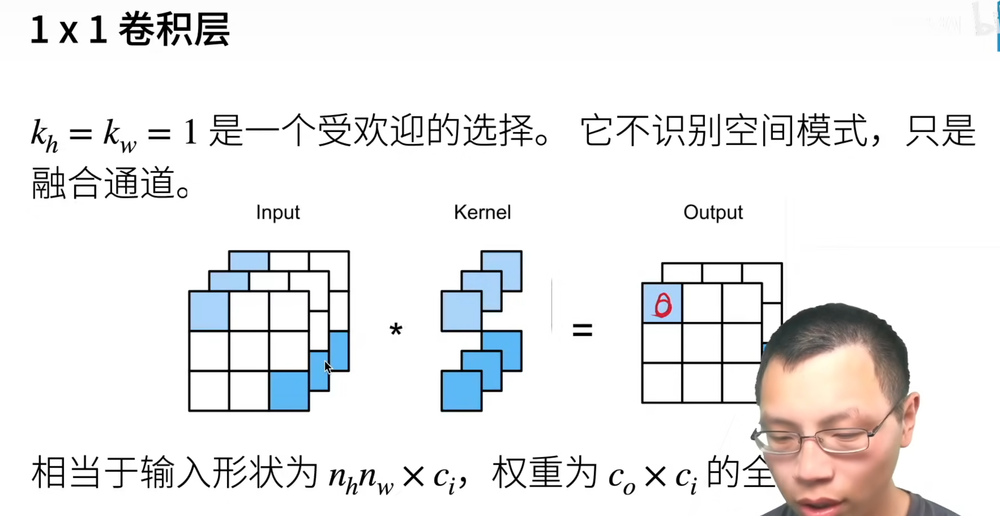
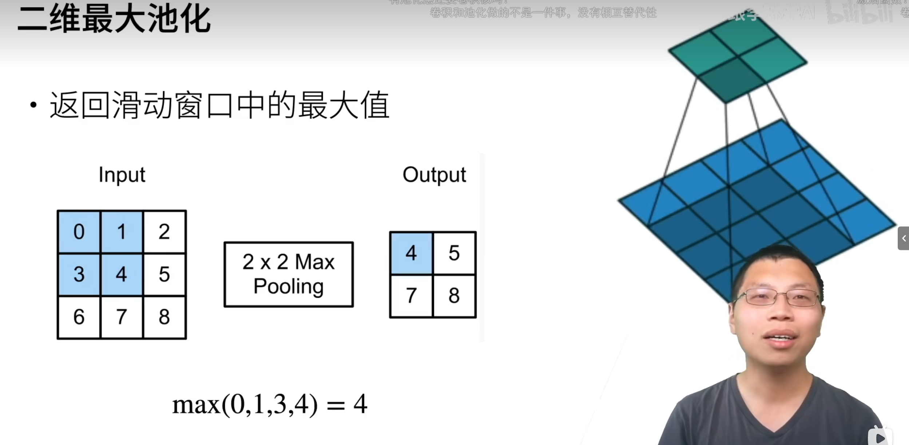
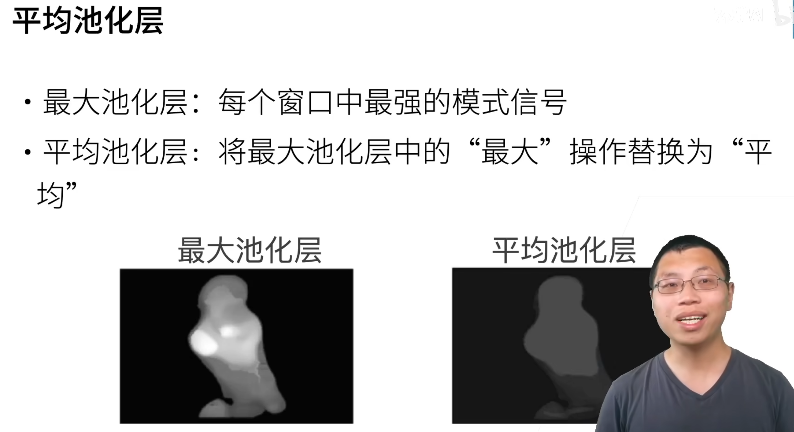
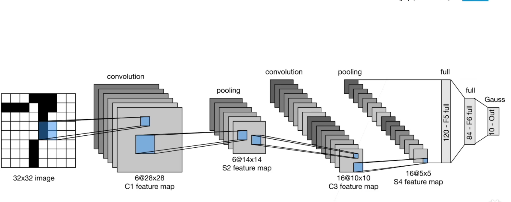
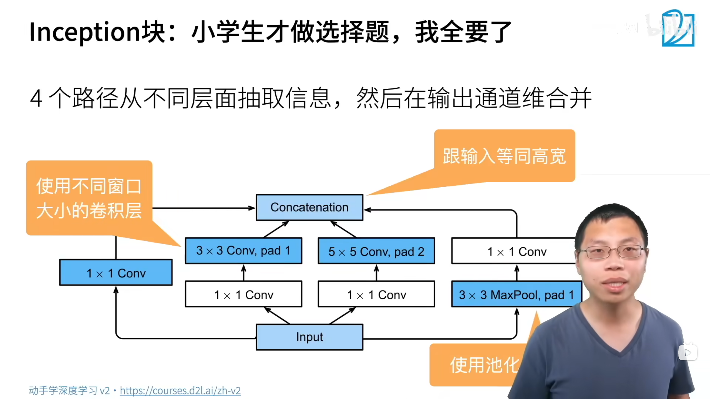

# 深度学习笔记

跟着李沐《动手学深度学习》(d2l.ai)，配合代码实践。

## 1.torch基础


### 1.1 reshape与view的区别


|操作|创建新的Tensor对象|共享Storage|修改b会不会影响a|限制|
|-----|-------|-----|-----|----|
|b = a|同一个对象，不创建|共享|有影响|无|
|b = a.view(...)|创建新的Tensor对象|共享|有影响|a必须contiguous内存连续|
| b = a.reshape(...)|创建新的Tensor对象|如果内存不连续就创建新的内存空间|不一定，看是否创建新的内存空间|无|
|b = a.clone()|创建新的Tensor对象|不共享|不影响|无|

>`view()`只能作用域内存连续的对象，而`reshape()`能作用于所有的对象，如果内存连续就直接指向该内存，如果不连续就另外创建内存。


## 2.线性回归基础

### 2.1线性回归数学原理

线性回归的标签y和特征值x的关系：

$$
y = w\_1 x\_1 + w\_2 x\_2 + \cdots + w\_n x\_n + b
$$


而线性回归模型所要做的就是**找到最佳的权重w和偏置b**

$$
X = \begin{bmatrix}1 & x_{11} & x_{12} & \cdots & x_{1d} \\
				   1 & x_{21} & x_{22} & \cdots & x_{2d} \\
				   \vdots &\vdots  &\vdots  &\ddots &\vdots \\
				   1 & x_{n1} & x_{n2} & \cdots & x_{nd}
	\end{bmatrix}
	
\\
\\
\theta = \begin{bmatrix}
		b\\w_1\\w_2\\\vdots\\w_d
		 \end{bmatrix}
\\
\\
X\theta = Y_{pre} = \begin{bmatrix}
		y_1\\y_2\\\vdots\\y_d
		 \end{bmatrix}
\\
\\
损失函数：
loss(\theta) = \frac{1}{2} \begin{Vmatrix} X\theta - Y_{true} \end{Vmatrix}^2 \\= \frac{1}{2} \begin{Vmatrix} Y_{pre} - Y_{true} \end{Vmatrix}^2\\ = \frac{1}{2} (X\theta - Y_{true})^T (X\theta - Y_{true})
\\
= \frac{1}{2}[(X\theta)^T - Y_{true}^T](X\theta - Y_{true})\\ = \frac{1}{2}[(X\theta)^TX\theta - (X\theta)^T Y_{true} - Y_{true}^TX\theta + Y_{true}^TY_{true}]
\\=\frac{1}{2}[\theta^TX^TX\theta - 2Y_{true}^TX\theta + Y_{true}^TY_{true}]\\其中(X\theta)^T Y_{true} 和 Y_{true}^TX\theta都是标量，所以他们的转置等于自己。\\
根据矩阵求导法则:\frac{\partial (X^TAX)}{\partial X} = (A+A^T)X\\\frac{\partial(a^TX)}{\partial X} = a
\\
所以:\frac{\partial loss}{\partial\theta} = \nabla_{\theta} loss(\theta) = \frac{1}{2}[2X^TX\theta - 2X^TY_{true}] = X^TX\theta - X^TY_{true}
\\
为了求出loss的最小值，我们就必须找到梯度为0的w和b，也就是\theta
\\
令 \nabla_{\theta} loss(\theta) = 0 = X^TX\theta - X^TY_{true} => \theta = (X^TX)^{-1}X^TY_{true}
\\
所以最优解\theta = (X^TX)^{-1}X^TY
\\只有线性回归才有通解，并且只有当X^TX可逆时，才能直接求出\theta
$$


### 2.2 学习率对loss的影响

梯度下降需要消耗大量的算力，所以学习率太大和太小都会浪费算力。


### 2.3手写线性回归

**Python语法扩展（yield）**

- `return`在函数结束时返回一个结果。
- `yield` 函数运行到`yield`时，返回一个值，然后函数挂起，知道下一次用`next()`调用或者`for`迭代。

```python
def count_up_to(n):
    i = 0
    while i < n:
        yield i   # 每调用一次 next()，就返回当前的 i，并暂停
        i += 1

# 使用生成器
gen = count_up_to(3)
print(next(gen))  # 输出 0
print(next(gen))  # 输出 1
print(next(gen))  # 输出 2
# print(next(gen))  # 触发 StopIteration

# 更常见的用法：直接 for 循环
for num in count_up_to(3):
    print(num)    # 打印 0 1 2
```

**手写线性回归**

```python
import random
import torch

import os
os.environ["KMP_DUPLICATE_LIB_OK"] = "TRUE"

#创建随机数据
def create_data(w, b, num_examples):
    
    #生成符合正态分布的x，0是均值，1是方差，（num_examples, len(w)）行列。
    x = torch.normal(0, 1, (num_examples, len(w)))
    
    y = x@w + b
    #加入噪音
    y += torch.normal(0, 0.01, y.shape)

    return x, y.reshape((-1, 1))

#批量抽取数据进行梯度下降
def data_iter(batch_size, feature, label):

    num_example = len(feature)
    #生成0到num_example的索引列表
    index = list(range(num_example))
    #用shuffle函数将index打乱，以达到随机抽样的效果
    random.shuffle(index)
    #i是每次抽样的第一个下标
    for i in range(0, num_example, batch_size):
        batch_index = index[i: min(i + batch_size, num_example)]
        #返回feature和label
        yield feature[batch_index], label[batch_index]

#定义模型
def linear_model(x, w, b):
    return x @ w + b

def squared_loss(y_pre, y_true):
    #用平方误差，为了防止两个y的维度不同，我们进行reshape调整
    return 0.5 * (y_pre - y_true.reshape(y_pre.shape))**2

def sgd(params, lr, batch_size):

    with torch.no_grad():
        for param in params:
            #梯度下降
            param -= lr * param.grad / batch_size
            #计算完一轮之后要将grad清零
            param.grad.zero_()


if __name__ == '__main__':

    #创建数据
    example = 1000
    w_true = torch.tensor([2, -3.4])
    b_true = 4.2

    feature, label = create_data(w_true, b_true, example)
    #数据创建成功
    #=========================================================

    #初始化权重和偏置
    #requires_grad = True表示该参数需要进行梯度下降
    w = torch.normal(0, 0.01, size = (2, 1), requires_grad = True)
    b = torch.zeros(1, requires_grad = True)
    print(w, b)

    #=========================================================
    #开始训练
    lr = 0.03
    num_epochs = 3
    batch_size = 10
    net = linear_model
    loss = squared_loss
    #第一层循环，对全部数据扫一遍，一共扫三遍
    for epoch in range(num_epochs):
        #每次拿出batch_size的x和y
        for x, y in data_iter(batch_size, feature, label):
            #计算小批量损失
            l = loss(net(x, w, b), y)
            #计算得到的l是一个[batch_size, 1]的向量
            #我们需要进行求和才是每个样本预测值和真实值的差距
            #用backward()计算梯度
            l.sum().backward()
            #计算完梯度之后才能访问grad这个属性
            if epoch == 0:
                print("grad->", w.grad)
            sgd([w, b], lr, batch_size)
            if epoch == 0:
                print("w->", w)
        #出来这个for循环之后表示已经扫完一遍数据了
        #表示一下内容不需要计算梯度
        with torch.no_grad():
            train_l = loss(net(feature, w, b), label)
            print(f'epoch: {epoch + 1}, loss: {train_l.sum()/example}')

"""
第一次数据：
epoch: 1, loss: 0.040368854999542236
epoch: 2, loss: 0.00015070709923747927
epoch: 3, loss: 5.0547547289170325e-05
tensor([[ 1.9995],
        [-3.3997]], requires_grad=True) tensor([4.2006], requires_grad=True)
第二次数据：
epoch: 1, loss: 0.043382592499256134
epoch: 2, loss: 0.00017751296400092542
epoch: 3, loss: 5.148643322172575e-05
tensor([[ 2.0008],
        [-3.3987]], requires_grad=True) tensor([4.1997], requires_grad=True)
第三次数据：
epoch: 1, loss: 0.04251382499933243
epoch: 2, loss: 0.00017745311197359115
epoch: 3, loss: 5.071829218650237e-05
tensor([[ 1.9993],
        [-3.3996]], requires_grad=True) tensor([4.1995], requires_grad=True)
"""
```

### 2.4 学习率lr和epoch的关系

该模型对应的数据最合适的lr和epoch应该是lr = 0.3、epoch = 3。如图：


我们对参数lr进行调整，将其调整为lr = 0.0003、epoch = 3。如图：


>由于学习率lr过低，epoch也低，导致学习不充分，也就是欠拟合，loss一直降不下来。

我们将参数epoch提升到100。如图：


>此时虽然学习率低，但是epoch上来了，也就是扫描了100遍该训练数据，也能强行把loss降下来。

通常工程中的参数很难找到理想的，一般情况下都是这种情况：


>loss有升有降，但loss最终能下降到可接受范围。

学习率过小会导致欠拟合，学习率过大则会造成梯度爆炸：


>此时loss已经是nan了，梯度爆炸了，学习率过大，导致权重变化过快。

**总结：**
1. 当学习率过小的时候，loss降不下来，提升学习次数（epochs），有可能可以降下来，但是推荐调整参数。
2. 当学习率过大的时候，会出现梯度爆炸，loss=nan，请立刻调整学习率。

### 2.5 用torch实现线性回归

```python
class model(nn.Module):
    #定义单层神经网络

    def __init__(self, *args, **kwargs):
        super().__init__(*args, **kwargs)
        #一层线性回归网络层
        self.layout1 = nn.Linear(in_features = 2, out_features = 1)
    
    def forward(self, x):

        x = self.layout1(x)
        #经过线性计算之后直接返回值
        return x
if __name__ == '__main__':
    plt.figure(figsize = (10, 5))
    #初始化样本数量
    example = 1000
    #初始化真实的w和b
    w_true = torch.tensor([[2.], [-3.4]]) # 2*1
    b_true = torch.tensor(1.0)
    #随机生成样本
    x = torch.normal(0, 3, (example, 2))# example*2
    #y_true的值
    y_true =  x @ w_true + b_true + torch.normal(0, 0.01, (example, 1))
    #把feature和label组合成dataset！！！！！
    data = TensorDataset(x, y_true)#Dataset可以把feature和label组合起来，格式类似于DataFrame但是在深度学习中比DataFrame更加方便
    #初始化参数
    lr = 0.003
    epochs = 3
    batch_size = 10
    net = model()
    #输出初始化的w和b
    print(net.layout1.weight, ' ', net.layout1.bias)
    #定义损失函数
    loss = nn.MSELoss()
    #定义优化器，用来优化参数的，梯度下降
    opt = optim.SGD(net.parameters(), lr = lr)
    loss_num = []
    for epoch in range(epochs):
        data_loader = DataLoader(data, batch_size, shuffle = True)
        loss_sum = 0
        for x, y_true in data_loader:
            #用神经网络进行预测
            y_pre = net(x)
            #计算损失
            l = loss(y_pre, y_true)
            # print(f'loss = {l}')
            loss_num.append(l.item())
            loss_sum += l
            #清除之前的梯度
            opt.zero_grad()
            #进行反向传播，计算梯度
            l.backward()
            #更具bachward计算出的梯度更新参数
            opt.step()  
        l = loss(net(x), y_true)
        print(f'epoch: {epoch + 1} ==> loss: {loss_sum / 100}')
    print(net.layout1.weight, ' ', net.layout1.bias)
    sns.lineplot(x = range(300), y = loss_num)
    plt.show()
```


## 3.Softmax回归

### 3.1Softmax数学原理

二分类交叉熵公式：
$$
\text{BCE}(y, \hat{y}) = -\left[ y \log(\hat{y}) + (1 - y) \log(1 - \hat{y}) \right]
$$

多分类交叉熵公式：
$$
\text{CE}(y, \hat{y}) = -\sum_{i=1}^{C} y_i \log(\hat{y}_i)
$$

- $ y_i  \in \begin{Bmatrix} 0, 1 \end{Bmatrix}$：one-hut真是标签，只有第i维为1，其余都为0，表示该样本分类为i类。
- $\hat{y}$：表示模型预测样本为第i类的概率大小，会被归一化。所有的$\hat{y}$相加等于1。
- 公式：只有 $y_i$ 这一项不为零，所以公式的数值等于 $-y_i \log(\hat{y}_i)$ ，此时 $\hat{y}$ 越大，损失值越小，所以模型会尽可能地让 $\hat{y}$ 变大，从而提升了区分度。


**容易误解：** 交叉熵损失通常不能用于梯度下降，因为它不具有参数，但是它可以指导前面的全连接层（隐藏层）进行梯度下降。


### 3.2 损失函数

3个常用损失函数：
1. $l(y, y') = \frac{1}{2}(y - y')^2$：均方损失，当权重距离真实权重很远的时候，梯度会比较大，可以加速学习，但同时也不稳定。
2. $l(y, y') = |y - y'|$：绝对损失，不管权重距离真实权重有多远，梯度都是一个常数，学习速度可能没那么快，但是很稳定。当权重距离真实权重很近的时候，因为原点不可导，容易导致稳定性变差。
3. $l(y, y') = \begin{cases} 
|y - y'| - \frac{1}{2} & \text{if } |y - y'| > 1 \\
\frac{1}{2}(y - y')^2 & \text{otherwise}
\end{cases}$：Robust Loss，结合了两者的优点，是梯度下降整体变稳定。


**RobustLoss比较常用**


### 3.3 前向传播和反向传播

前向传播 (Forward Propagation)
第一层：

*   **线性变换与激活**：
    $$ z_1 = w_1 x + b_1 = 3 \times 2 + 1 = 7 $$
    $$ a_1 = f(z_1) = 7 \times 2 + 1 = 15 $$

第二层（假设全连接层）：
*   **线性变换**：
    $$ z_2 = W_2 a_1 + b_2 = 3 \times 15 + 1 = 46 $$
*   **激活**：
    $$ a_2 = f(z_2) = 3 \times 46 + 1 = 139 $$

**损失计算**：
$$ L = (y - a_2)^2 = 2435 $$

---

反向传播 (Backward Propagation)

方向流：`首先输出层 -> dL/d... -> 更新参数`

输出层到损失函数的梯度推导
设损失为均方误差，则有：
$$ \hat{y} = a_2 $$
$$ \frac{dL}{da_2} = 2(y - a_2) $$
$$ \text{代入数值： } 2 \times (80 - 139) = -118 $$

全连接层链式法则 (Chain Rule)
笔记右下角的推导逻辑展示了链式法则在各层的应用：

**输出层函数导数（需根据激活函数选择）：**
*   **如果是 Sigmoid 函数**：
    $$ \frac{da_2}{dz_2} = a_2(1-a_2) $$
*   **如果是线性函数（如 \(y=a_2\)）**：
    $$ \frac{da_2}{dz_2} = 1 \quad (\text{即当 } y=a_2 \text{ 时}) $$

第二层权重梯度计算
根据链式法则：
$$ \frac{dL}{dw_2} = \frac{dL}{dz_2} \cdot a_1 $$
图中具体的数值逻辑（假设 \(\frac{dL}{dz_2} = 26\)）：
$$ grad = \frac{dL}{dw_2} = \frac{dL}{dz_2} \cdot \frac{dz_2}{dw_2} = \frac{dL}{dz_2} \cdot a_1 $$
$$ \text{代入数值： } 26 \times 15 = 390 $$

 第一层权重梯度计算
继续利用链式法则向上一层传播：
$$ \frac{dL}{dw_1} = \frac{dL}{dz_1} \cdot x $$
图中具体的数值逻辑（假设 \(\frac{dL}{dz_1} = 52\)）：
$$ \text{代入数值： } 52 \times 2 = 104 $$

---

 参数更新
图中底部注明了计算出的梯度用于**更新参数**，完成向后传播 → 向前传播的闭环迭代：

*   \( \frac{dL}{dw_1} \rightarrow \text{用于更新参数} \)
*   \( \frac{dL}{dw_2} \rightarrow \text{用于更新参数} \)


## 4.正则化方法

1. 损失函数添加正则项（范数惩罚），通常使用L1和L2正则项。
- $\min \ell(\mathbf{w}, b) + \frac{\lambda}{2} \|\mathbf{w}\|^2$
- $\min \ell(\mathbf{w}, b) + \lambda \|\mathbf{w}\|_1$
2. Dropout正则化。
- 放弃全连接层的某些神经元，以达到正则化的效果。（放弃掉的神经元梯度为0，权重无法更新，和范数惩罚效果差不多）
- 没被放弃的神经元要进行相应的扩大，为了使整体的期望不变。
$$
x'_i = \begin{cases} 
0 & \text{with probability } p \\
\frac{x_i}{1-p} & \text{otherwise}
\end{cases}
$$
>被放弃的直接变成0，没被放弃的，除1-p。整体数值权重不变。

3. BN层。
**详情在8.9章节**。


## 5.数据稳定性


### 5.1引发梯度爆炸和梯度消失的原因

$$
\frac{\partial \ell}{\partial \mathbf{W}^t} = \frac{\partial \ell}{\partial \mathbf{h}^d} \frac{\partial \mathbf{h}^d}{\partial \mathbf{h}^{d-1}} \cdots \frac{\partial \mathbf{h}^{t+1}}{\partial \mathbf{h}^t} \frac{\partial \mathbf{h}^t}{\partial \mathbf{W}^t}
$$

>反向传播时，要用链式法则，也就是后面的权重的梯度会不断地连乘前面的权重，如果前面的权重大部分大于1的话，由于网络层数可能很深，当这么多层的权重乘在一起容易使后面的梯度变得异常大甚至无法用数据容器装载（溢出）。如果前面的权重都小于1并且比较小，则容易导致梯度消失，也就是梯度很小，几乎起不到学习的效果。

例如：

我们设有一个三层的网络结构：
- 第一层：$h_1 = w_1x$
- 第二层：$h_2 = w_2x$
- 第三层：$\hat{y} = w_3 \cdot h_2$

**前向传播过程省略**

反向传播：

链式法则：
$$
\frac{\partial L}{\partial w_1} = \frac{\partial L}{\partial \hat{y}} \cdot \frac{\partial \hat{y}}{\partial h_2} \cdot \frac{\partial h_2}{\partial h_1} \cdot \frac{\partial h_1}{\partial w_1}
$$


- $\frac{\partial L}{\partial \hat{y}} = \hat{y} - y = 24$
- $\frac{\partial \hat{y}}{\partial h_2} = w_3 = 4$
- $\frac{\partial h_2}{\partial h_1} = w_2 = 3$
- $\frac{\partial h_1}{\partial w_1} = x = 1$


这些都是链式法则要连乘的内容，这些是后面这些层的权重，而且权重都>1。

**第一层的梯度会变成：**
$$
\frac{\partial L}{\partial w_1} = 24 \times 4 \times 3 \times 1 = 288
$$

>变成288了，这里只是3层，如果是100层的话，梯度很容易爆炸，当然，如果权重都特别小，也会造成梯度消失。


### 5.2激活函数对反向传播的影响


|**激活函数**|**对梯度影响**|**主要原因**|
|---------|----------|-----------|
|RuLU|如果权重初始化不到位，容易引发**梯度爆炸**，但是缓解了**梯度消失**。|正半轴导数为1，梯度完全由权重乘积决定；权重>1时连乘导致爆炸。|
|Leaky ReLU / PReLU|比ReLU更稳定，轻微缓解爆炸风险。|负半轴有微小斜率（如0.01），避免神经元死亡，但正半轴仍为1，爆炸风险仍存|
|Sigmoid|容易造成**梯度消失**，几乎不会**梯度爆炸**。|导数最大值仅0.25，且大部分区域导数接近0；连乘后梯度指数级衰减。|
|Tanh|容易**梯度消失**，极少爆炸。|导数最大值1（在0处），但两端饱和趋近0；连乘后梯度仍会消失（除非权重非常大且输入一直在0附近）。|
|Softmax（通常用于输出层）|本身不直接引起消失/爆炸，但配合交叉熵时梯度稳定|梯度形式为$p_i - y_i$，范围在[-1,1]，不受深层连乘影响。|


**知识扩展：激活函数和参数初始化函数的搭配**
|函数|适用场景|
|-|-|
|xavier_uniform_ / xavier_normal_|配合 sigmoid/tanh|
|kaiming_uniform_ / kaiming_normal_|配合 ReLU|
|normal_|简单的正态分布初始化|


### 5.3梯度消失和梯度爆炸所带来的问题

**梯度消失带来的问题：**

- 梯度值会变成0，因为机器存储数据的精度有限，所以梯度太小了会变成0
>对16位浮点数尤其严重

-  梯度太小对训练没有进展
-  梯度太小仅仅对距离输出层进的全连接层训练有效果，因为越往前，梯度变得越小。

**梯度爆炸带来的问题：**

- 值会超出值域
>对于16位浮点数尤其严重

- 对学习率异常敏感
>如果学习率太大->大参数值->更大的梯度
>如果学习率太小->学习没有进展

### 5.4**如何让训练变得更加稳定**


1. 将乘法变成加法，避免连乘
>ResNet和LSTM

2. 归一化
>梯度归一化，梯度裁剪

3. 选择合理的激活函数和合理的参数初始化


**补充知识ont-hot编码：**


>补充知识：one-hut热编码，用于将数据中的离散值变成bool值。例如：
>原始列：颜色 = 红色、蓝色、绿色
>one-hot之后：
>颜色_红	颜色_绿	颜色_蓝
>     0 		        1		    0           --------->表示绿色
>  1	             0		    0	       --------->表示红色
>  0	             0            1           --------->表示蓝色
>  

>要将DataFrame转化为Tensor，不能直接转化，要先把DataFrame转化为Numpy数组，因为DataFrame有行id和列名等Tensor所没有的东西，Tensor只表示数组，没有列名和行号之类的，而Numpy数组就是只有数值。用DataFrame.values可以转化为Numpy数组。

增加维度之后对算力要求有没有提升？

|情况|影响|建议|
|----|----|----|
|离散值很小（<50）|基本可以忽略|直接用one-hot|
|离散值多（50~几百）|有点吃力|可以考虑用embedding，把一个高维向量压缩成稠密的低维向量|
|离散值极多（>几千）|显著拖慢|必须用embedding或做特征工程|

```python
train_data = pd.get_dummies(train_data, dummy_na = True)
test_data = pd.get_dummies(test_data, dummy_na = True)
#dummy_na = True表示将空值区分开
#因为 dummy_na=True 给每个原始列都生成了一个 _nan 列，如果原始数据中该特征没有缺失值，那个 _nan 列就全是 False，转成 float 后自然全是 0.0。
```


**补充Torch小知识：**

```python
# 将特征和标签按样本对齐，打包在一起
dataset = TensorDataset(X, y)
# 你可以在此设定批大小(batch_size)、是否打乱(shuffle)等
data_loader = DataLoader(dataset, batch_size=2, shuffle=True)

#激活函数的调用时从torch中调用，而不是torch.nn中调用。
```

>TensorDataset(X, y)将tensorX和y组合起来，组合成类似于DataFrame但是又比DataFrame更适合深度学习的数据结构，其中X是特征，y是标签。
>DataLoader用来加载数据，按批次送入网络中学习。


## 6.Kaggle房价预测实例

### 6.1补充StandardScaler归一化知识

**StandardScaler归一化：**
>StandardScaler中，是将每一列的数据进行归一化，写成正态分布的形式，每一个值对这一列的平均值差了几个标准差。

**造成数据泄露的原因：**
>如果错误的将测试数据进行fit_transform之后，这个transform对象就会存储测试集的均值和方差，如果再对训练数据进行transform的话，训练数据对应的列会使用测试数据对应的列的均值和方差进行归一化，也就是说训练数据中可以间接的反映出测试数据的均值和方差，这会造成数据泄露。

**容易误解的地方：**
>如果把测试集的标签和特征拆开也会造成数据泄露，因为即使没有标签，测试集的特征也已经泄露到训练集中，会导致模型评分虚高。
>

**标签是否要进行StandardScaler归一化：**

需要使用归一化处理：

1. 神经网络中依赖梯度下降来拟合曲线，其中要用到反向传播和链式法则，如果y_true特别大（房价预测等），那么对应的y_pre与y_true的值相差**可能**就会特别大，这个差值过大的话，就容易导致梯度爆炸
2. 标签的跨度极大，也需要用归一化处理。

不需要使用归一化处理：

1. 树模型，树在分裂节点只关系**特征或标签的相对大小和排序，完全不关心绝对数值**。
2. 分类任务，分类任务的标签是离散型，没必要归一化。


**知识扩展：**
```python
net.eval()
#让网络进入评估模式，此时不进行参数更新
net.train()
#让网络进行训练模式，此时进行参数更新
```


### 6.2 源代码

```python
import torch
import pandas as pd
import torch.optim as optim
import torch.nn as nn
from torch.utils.data import TensorDataset, DataLoader
from sklearn.preprocessing import StandardScaler
import numpy as np
from sklearn.model_selection import train_test_split

# 模型定义
# =============================================================================

class Model(nn.Module):

    def __init__(self, in_features):
        #调用父类的初始化函数
        super().__init__()
        #第一层线性层
        self.layout1 = nn.Linear(in_features, 200)
        #第一层参数初始化
        nn.init.xavier_normal_(self.layout1.weight)
        nn.init.zeros_(self.layout1.bias)
        #第二层线性层
        self.layout2 = nn.Linear(200, 100)
        #第二层参数初始化
        nn.init.xavier_normal_(self.layout2.weight)
        nn.init.zeros_(self.layout2.bias)
        #第三层线性层
        self.layout3 = nn.Linear(100, 1)
        #第三层参数初始化
        nn.init.xavier_normal_(self.layout3.weight)
        nn.init.zeros_(self.layout3.bias)
        #Dropout防止过拟合
        self.dropout = nn.Dropout(0.2)

    def forward(self, x):
        #前向传播，用tanh激活函数，并且每一层都是用dropout
        x = torch.tanh(self.layout1(x))
        x = self.dropout(x)
        x = torch.tanh(self.layout2(x))
        x = self.dropout(x)
        x = self.layout3(x)
        return x


# 数据处理
# =============================================================================

#读取表格数据DataFrame
train_data = pd.read_csv(r'data\train.csv')
test_data = pd.read_csv(r'data\test.csv')

# 提取特征和标签
train_label = train_data.iloc[:, -1].values.reshape(-1, 1)
train_feature = train_data.iloc[:, 1:-2]
test_feature = test_data.iloc[:, 1:-1]

# one-hot 编码（train + test 合并，保证列一致）
#concat将两个DataFrame合并成一个
all_feature = pd.concat([train_feature, test_feature], axis=0)
#进行one-hot编码
all_feature = pd.get_dummies(all_feature, dummy_na=True)

#编码完之后再拆开
n_train = train_feature.shape[0]
train_feature = all_feature.iloc[:n_train, :]
test_feature = all_feature.iloc[n_train:, :]

# ===== 先切分，再 fit scaler（防止数据泄露）=====
X_train, X_val, y_train, y_val = train_test_split(
    train_feature, train_label,
    test_size=0.2, random_state=42
)

# 特征标准化：只在训练集上 fit
feature_scaler = StandardScaler()
X_train = feature_scaler.fit_transform(X_train)
X_val   = feature_scaler.transform(X_val)
X_test  = feature_scaler.transform(test_feature)

# label：log1p → 标准化（只在训练集上 fit）
y_train = np.log1p(y_train)
y_val   = np.log1p(y_val)

label_scaler = StandardScaler()
y_train = label_scaler.fit_transform(y_train)
y_val   = label_scaler.transform(y_val)

# 清理 NaN（零方差 one-hot 列导致）
X_train = np.nan_to_num(X_train)
X_val   = np.nan_to_num(X_val)
X_test  = np.nan_to_num(X_test)

# 转 tensor
#要转成tensor才能送入dataset中转化问dataset数据结构，然后才能送入dataloader中
X_train = torch.tensor(X_train, dtype=torch.float32)
y_train = torch.tensor(y_train, dtype=torch.float32)
X_val   = torch.tensor(X_val,   dtype=torch.float32)
y_val   = torch.tensor(y_val,   dtype=torch.float32)
X_test  = torch.tensor(X_test,  dtype=torch.float32)

# 模型训练
# =============================================================================

batch_size = 100
epochs = 500

#初始化模型
net = Model(in_features=X_train.shape[1])

#转化为dataset，送入dataloader，方便读取batch_size条数据
dataset_train = TensorDataset(X_train, y_train)
dataloader_train = DataLoader(dataset_train, batch_size=batch_size, shuffle=True)

#L2损失函数
loss_fn = nn.MSELoss()
#用向量法来稳定参数，缓解梯度爆炸
optimizer = optim.Adam(net.parameters(), lr=0.0001, weight_decay=1e-4)

#开始训练
for epoch in range(epochs):
    # ---- 训练 ----
    #将net网络切换为训练模式
    net.train()
    loss_sum = 0
    for x, y_true in dataloader_train:
        y_pre = net(x)
        l = loss_fn(y_pre, y_true)

        optimizer.zero_grad()
        l.backward()
        #对梯度进行裁剪
        torch.nn.utils.clip_grad_norm_(net.parameters(), max_norm=1.0)
        optimizer.step()

        loss_sum += l.item()

    train_loss = loss_sum / len(dataloader_train)

    # ---- 验证 ----
    #将net网络切换为评估模式
    net.eval()
    with torch.no_grad():
        val_pred = net(X_val)
        val_loss = loss_fn(val_pred, y_val).item()

    print(f"epoch {epoch+1:3d}  train_loss={train_loss:.6f}  val_loss={val_loss:.6f}")

# 验证集 RMSLE
# =============================================================================

net.eval()
with torch.no_grad():
    val_pred = net(X_val).numpy()

# 逆变换：标准化空间 → log 空间
y_pred_log = label_scaler.inverse_transform(val_pred)
y_true_log = label_scaler.inverse_transform(y_val.numpy())

# RMSLE = log 空间里的 RMSE
rmsle = np.sqrt(np.mean((y_pred_log - y_true_log) ** 2))
print(f"\n验证集 RMSLE: {rmsle:.5f}")

# 生成提交文件
# =============================================================================

net.eval()
with torch.no_grad():
    test_pred = net(X_test).numpy()

# 逆变换：标准化空间 → log 空间 → 原始价格
test_pred_log = label_scaler.inverse_transform(test_pred)   # log 空间
test_pred_price = np.expm1(test_pred_log)                    # 原始价格

# 组装提交文件（两列：Id, SalePrice）
submission = pd.DataFrame({
    'Id': test_data['Id'],
    'SalePrice': test_pred_price.flatten()
})
submission.to_csv('submission.csv', index=False)

print(f"提交文件已保存: submission.csv ({len(submission)} 条)")
print('end')
```

**RMSLE评估公式：**
$$
\text{RMSLE} = \sqrt{\frac{1}{n} \sum_{i=1}^{n} \left( \log(p_i + 1) - \log(a_i + 1) \right)^2 }
$$

其中 $p_i$ 是预测价格，$a_i$ 是真实价格，$n$ 是样本数。


### 6.3遇到的问题和解决方式

1. 'int' object is not callable

|问题|原因|解决|
|-|-|-|
|TensorDataset 报这个错|传入了 numpy 数组而非 torch.Tensor，numpy 的 .size 是 int 属性，PyTorch 内部把它当 .size(0) 调用了|torch.tensor(data, dtype=torch.float32) 转换|

2. 梯度爆炸，loss = NaN

|问题|原因|解决|
|-|-|-|
|训练中 loss 变 NaN|SGD + 深层 ReLU 无梯度裁剪，某个 batch 大误差 → 大梯度 → 权重暴涨 → 正反馈爆炸|① SGD 换 Adam ② 加 clip_grad_norm_ ③ ReLU 换 tanh|

3. 特征中含有NaN
|问题|原因|解决|
|-|-|-|
|train_feature has NaN|one-hot 列的稀有类别在训练集全为 0，方差 = 0，StandardScaler 做 (x-0)/0 → NaN|np.nan_to_num() 清掉，默认用0代替NaN|

4. 初始化和激活函数不匹配
|问题|原因|解决|
|-|-|-|
|tanh 用了 Kaiming init|Kaiming 的 gain=√2 是给 ReLU 的，tanh 用这个会导致输入方差偏大、神经元饱和|换成 xavier_normal_|

5. 数据泄露问题
|问题|原因|解决|
|-|-|-|
|StandardScaler 在切分前 fit|scaler 学到了验证集和测试集的均值/方差，验证分数虚高	|先 train_test_split，再 fit_transform（训练集），transform（验证/测试）|

6. 严重过拟合
|问题|原因|解决|
|-|-|-|
|train_loss=0.0002, val_loss=0.19|1168 条数据 vs 8 万参数，三层 200→100→1 太大|加 Dropout(0.2) + Adam weight_decay=1e-4|

7. 欠拟合假象
|问题|原因|解决|
|-|-|-|
|train=0.10, val=0.15，以为是欠拟合|其实是过拟合已缓解但模型到瓶颈，增加 epoch 只让 train 继续跌、val 不动|认清"数据承载力天花板"，不做无用功|


## 7.在GPU中创建神经网络

**在GPU中创建张量和神经网络**

```python

#在GPU创建张量
#默认创建在CPU
x = torch.tensor([1, 2, 3])
print(x.device)#输出GPU
#在GPU中创建数据
y = torch.tensor([1, 2, 3], device = 'cuda')#表示在GPU创建y
y = torch.tensor([1, 2, 3], device = 'cuda:0')#表示在第一张GPU创建y，通常个人计算机只有1张GPU

#在GPU创建网络
#方法1：
device = torch.device("cuda")
layer = nn.Linear(10, 20, device=device)   # 参数直接在GPU上
#方法2：
class MyModel(nn.Module):
    def __init__(self):
        super().__init__()
        #在CPU创建的线性层
        self.fc = nn.Linear(10, 20)
        #用to函数挪到GPU
        self.to("cuda")   # 将整个模型（包括刚创建的Linear）移到GPU

```


## 8.卷积神经网络

### 8.1卷积数学原理理解

**视频讲解：**
>https://www.bilibili.com/video/BV1VV411478E?t=1599.0

**数学公式：**
$$
(f * g)(t) = \int_{-\infty}^{\infty} f(\tau) g(t - \tau) \, d\tau
$$


卷积处理的问题：
>在一个系统中
>1. 系统的输入不稳定。$f(x)$
>2. 系统的输出稳定。$g(x)$
>3. 需要求系统的剩余量$(f * g)(t) = \int_{-\infty}^{\infty} f(\tau) g(t - \tau) \, d\tau$

**在卷积神经网络中的直观理解：**

>1. 卷积核规定了周围像素点对该像素点会有什么样的影响。
>2. 一个像素点会如何试探周围的像素点（过滤器）。

也就是将一个卷积核大小的像素块按照卷积核的具体数值进行压缩提取特征，以达到提取局部特征的效果，然后再送给神经网络进行判断。


### 8.2 卷积层

**卷积核：**

- 卷积核就像是**一组不同形状的筛子。**
- 训练过程就是不断调整卷积核，也就是不断调整筛子的大小，让某种**特征**能通过。
- 区分不同图片（猫 vs 狗）时，不是单个筛子直接说出答案，而是所有筛子过滤后的结果（特征图）**组合**起来，再由最后的分类器（全连接层）判断。

**填充与步幅：**

1. 填充：
>在输入矩阵的周围n圈填充0

作用：
>1. 控制输出特征图的空间尺寸。
>2. 保留图像边缘和角落的特征（这些地方被扫描的次数更少）。
>3. 保持特征图中心与边缘的平衡（中间部分往往容易被多次扫描，填充之后可以缓解“中心偏向”）。
>4. 配合步长精确控制下采样，可以配和步长来精准控制输出的矩阵大小。


2. 步幅：

>每次扫描移动的步数

**卷积核大小与卷积层输入输出的关系：**



> **输入通道数（层数）要和卷积核的通道数（层数）相同，然后卷积核的个数，决定了该卷积层的输出通道数（层数）。**
> 


**卷积层对相对位置非常敏感**

>卷积层对于位置信息非常敏感。
>例如：让CNN区分数字6和数字9，因为CNN只能提取局部特征，所以在CNN中，这两个数字就是一个圈圈加一个勾勾。如果CNN对位置信息不敏感的话，也就无法区分圈圈和勾勾的相对位置，自然无法分辨6和9。所以对于CNN这种提取局部信息来判断图片的模型，必须对每个特征的相对位置敏感。

**不同卷积层所提取的特征之间的区别**

- **底层卷积：**它会去匹配一些非常简单的模式，比如明暗交界线（脸和背景的边界）、45度方向的线条（眉毛的角度）、小圆点（可能是瞳孔）。这些特征在猫脸、车轮上也可能出现，所以非常通用。
- **中层卷积：**在底层的基础上组合，开始匹配局部部件：一个弧形加一个圆点（眼睛）、两条短线加一个空隙（嘴巴）、一个半圆（耳朵）。这些已经和人脸相关了。
- **高层卷积：**感受野覆盖了几乎整张脸。它匹配的是完整的脸型、各个部件之间的全局配置（两只眼睛在鼻子上面，嘴巴在下面）。甚至能区分“正面脸”还是“侧脸”。这一层的一个卷积核可能只对“闭着的左眼”有强烈响应，另一个只对“微笑的嘴”有响应。

**数学原因**：

1. **感受野随层数指数增长**
	假设每层都是3×3卷积，步长1，那么：
	- 第1层输出上的1个像素，看到输入3×3区域。
	
	- 第2层输出上的1个像素，看到上一层3×3区域，每个又对应输入3×3，所以实际看到输入5×5区域。
	
	- 第3层看到7×7，依此类推。
	

因此，**高层卷积的一个神经元，其感受野覆盖了原始图像的很大一部分。**它能“看到”全局布局。


**Conv2d和Conv3d**
>Conv2d就是处理一张图片，Conv3d就是比图片多一个维度，这个维度可以是时间（视频）也可以是空间（核磁共振3D图，就是多个剖面图）。


### 8.3 池化层


**池化层的作用：**

>卷积层对位置信息比较敏感，所以能区分6和9。但是为了防止**过拟合**，我们需要引入池化层。

>卷积层用来区分6和9，而池化层用来区分不同人写的9。也就是说卷积层用来拟合，池化层用来泛化也就是防止过拟合。可以增加鲁棒性。

>池化层也具有填充和步幅，池化层没有可学习参数。

**池化层核心思想：**

>**在一个小局部窗口内，只保留最强烈的激活信号，而忽略它具体在这个窗口的哪个位置。**
>**局部窗口内取最大/平均，主动丢弃精确位置信息，换来对小位移和形变的容忍。**

**池化层分类：**

1. 最大池化层：

>在池化层照射的区域内选取最大的数值代替该区域。



2. 平均池化层：

>在池化层照射的区域内选取平均值来代替该区域。


直观对比：


### 8.4 LeNet




> 其中池化层是平均池化层。


**卷积神经网络设计思想**
>将一个图片的长宽信息不断地进行压缩，然后将信息压缩进不同的通道中（层数），最后将通道数高且长宽低的数据整理成矩阵或者向量，传入多层感知机中进行收尾学习。
>
>整体趋势是通道增加而长宽减少。

**卷积神经网络设计思想提炼：**

>**通过交替的卷积和池化（或步长卷积），逐步压缩空间尺寸、扩张通道数，从而将低级空间特征抽象为高级语义特征；最后根据任务决定——分类任务常用全连接层或全局平均池化输出类别，而检测/分割任务则保留空间维度进行逐像素预测。**


### 8.5 AlexNet

**容易误解的数学知识：**
>**凸问题**通常存在这种特性：局部最小值 = 全局最小值
>**凹问题**通常存在这种特性：局部最大值 = 全局最大值
>真正让AI领域头疼的是非凸非凹的问题，也就是**非凸问题**，这类问题通常局部最优解 ！= 全局最优解，所以容易让AI学习陷入到鞍点和局部最小值点卡住。鞍点问题能通过判断奇异值的正负性来判断是不是鞍点，局部最小值往往还没有很好的解决办法，但是工程领域中也认为局部最优解也可以接受，因为他能满住需求，同时还可以防止过拟合。


**AlesNet与LeNet对比：**

| 对比维度 | LeNet-5 (1998) | AlexNet (2012) |
| :--- | :--- | :--- |
| **提出者 / 团队** | Yann LeCun 等 | Alex Krizhevsky、Ilya Sutskever、Geoffrey Hinton |
| **主要应用场景** | 手写数字识别（MNIST） | 大规模图像分类（ImageNet 1000类） |
| **输入图像尺寸** | 32×32×1（灰度图） | 227×227×3（RGB彩色图） |
| **网络深度（可训练层）** | **7层**（2个卷积层 + 3个全连接层 + 2个子采样层，通常不计入池化）<br>更常见描述：2卷积+3全连接，共5层？实际经典结构：C1-S2-C3-S4-C5-F6-输出，即2个卷积+2个池化+3个全连接（含输出）共7层 | **8层**（5个卷积层 + 3个全连接层） |
| **卷积层数** | 2层（C1、C3） | 5层（Conv1 ~ Conv5） |
| **全连接层数** | 3层（C5、F6、输出层） | 3层（FC6、FC7、FC8） |
| **池化方式** | **平均池化**（子采样，2×2，步长2，非重叠） | **最大池化**（3×3，步长2，**重叠**） |
| **激活函数** | **Tanh** 或 **Sigmoid** | **ReLU**（大幅缓解梯度消失，加速训练） |
| **局部响应归一化 (LRN)** | 无 | 有（在Conv1、Conv2后，增强泛化） |
| **Dropout 正则化** | 无 | **有**（仅在FC6、FC7后，比例50%，防过拟合） |
| **数据增强** | 无（或简单的平移/缩放） | **丰富**（随机裁剪、水平翻转、PCA颜色扰动） |
| **参数量** | 约 **6万** (60k) | 约 **6000万** (60M) |
| **神经元数量** | 约 20万（主要是子采样层降低） | 约 65万 |
| **GPU 并行设计** | 单CPU/GPU即可 | **双GPU分路**（由于显存限制，模型结构分为上下两路） |
| **主要创新点** | • 奠定CNN基本框架（卷积-池化-全连接）<br>• 梯度下降与反向传播成功应用于CNN | • 首次将深度CNN用于大规模图像识别<br>• 引入ReLU、Dropout、重叠池化、LRN<br>• 充分运用GPU并行计算与数据增强 |
| **历史意义** | 现代CNN的**鼻祖**，验证了端到端学习的有效性 | **深度学习复兴的里程碑**，开启ImageNet时代 |


### 8.6 VGG


**创新点：**

**全部使用 3×3 小卷积核**
- 两个 3×3 卷积堆叠等效于一个 5×5 感受野；三个堆叠等效于 7×7。
- **优点**：更少的参数（3×3×C×C×2 vs 5×5×C×C）、更多的非线性（多次ReLU），加深网络的同时控制参数量。

**网络深度大幅提升：**
- VGG16 有 **13 个卷积层** + **3 个全连接层** = 16 个可训练层。相比 AlexNet 的 8 层，深度翻倍，证明了深度的有效性。

**统一的架构设计：**
- 所有卷积层配置高度一致，结构简洁、易于理解和复现。（VGG块，封装）

**参数量巨大（约 1.38 亿）：**
- 虽然卷积层参数较少，但 全连接层占绝大部分参数（约 1.2 亿），导致模型臃肿、推理慢。

**训练技巧：**
- 继承 AlexNet 的 ReLU、Dropout、数据增强等。
- 采用多尺度训练（将图像缩放到不同尺寸再裁剪）提升泛化。


### 8.7 NiN

**NiN块：**

- 1个卷积层后面跟2个全连接层（1×1的卷积层可以看作全连接层），本质上这两个全连接层是两个1×1的卷积层。


**NiN结构：**

- 无全连接层
- 交替使用NiN块和步幅为2的最大池化层
	- 逐步减少高宽和增大通道数
- 最后使用全局平均池化层得到输出
	- 其输入通道是类别数


### 8.8 GoogleLeNet

**Inception块**



> 对输入分别复制输入4个层中。


### 8.9 批量归一化（BN）

**BN是什么：**

>把每一层输入的数据“拉回”标准形态（均值0、方差1），再让网络自己微调成最合适的形态，从而让训练更稳、更快、更不挑初始化。

**通俗说法：**
>BN层先将每一层的数据归一化，让他们符合标准状态（均值=0，方差=1），然后再让网络自己搜索γ和β，γ用于用来拉伸和压缩差异β用来平移，通过γ和β来使得数据最终符合神经网络的需求，**因为并不是所有的输入都要标准状态，我们需要适当的用γ和β来调整。**


**为什么需要BN层：**

**在深度学习中，因为链式法则导致深层网络和浅层网络的梯度不一样甚至差异巨大，会导致梯度变小。这也就是在前向传播的时候，因为梯度大，深层网络很快就收敛了，但是浅层网络因为梯度小而收敛慢，但是数据是从浅层向上传播的，如果浅层没有收敛的话，深层的收敛也就没有意义，类似于木桶效应。**


**易错误解：**

>通常都是梯度消失导致的深层先收敛问题。也存在梯度变大导致浅层先收敛，但是这种情况很小，当出现这种情况的时候，因为深层的梯度不为零，传到浅层的时候，梯度也不可能为0，所以还会继续更新。


**BN层的作用：**

1. 没有BN层：
- **内部协变量偏移**：每层的输入分布随前层参数变化而变化，导致后层需要不断适应新的分布。

- **梯度不稳定**：浅层参数的微小变化，经过多层放大/缩小后，可能造成深层梯度爆炸或消失。为了安全，学习率必须设得很小。

- **木桶效应：**即使深层梯度大、收敛快，但浅层梯度小、更新慢，整个网络的实际收敛速度由最慢的浅层决定。
  结果就是：**需要很多轮迭代（epochs）**，总计算量大。

  

2. 有BN层：
- **切断前层参数变化对后层输入分布的剧烈影响**：后层看到的分布总是稳定的（均值方差固定），不需要花精力去适应分布变化。

- **梯度流更平滑**：每层输入被限制在合理的范围（不会太大或太小），反向传播时梯度可以更稳定地传递到浅层。

- **浅层的梯度不再被深层“压制”**：因为每层的输出都被标准化，梯度的尺度被规范化，浅层也能获得有效的更新信号。
  **浅层收敛变快**，木桶效应被缓解。网络不再需要小心翼翼地用很小的学习率，可以大胆地用大学习率，迭代次数大幅减少。
  此时学习率可以挑大，迭代次数可以减少，总体提升计算效率。

  

**当BN层可能起副作用的情况：**

>因为BN层的参数γ和β也需要进行**梯度下降**来更新，所以BN层也会提升计算量。
>那么有些情况会导致BN提升的计算量甚至大于它减少的计算量。

| 场景 | 分析 |
| :--- | :--- |
| **极小的网络**（如 LeNet-5 在 MNIST） | 原网络迭代已经很快，BN 的额外计算可能使总时间变长。很多小模型上不加 BN 反而更快。 |
| **batch size 非常小**（如 ≤4） | 均值和方差估计不准，BN 效果差，甚至拖慢收敛。此时 LayerNorm 或 GroupNorm 更合适。 |
| **推理阶段** | BN 在推理时没有参数更新，但仍有 $\gamma/\beta$ 和固定的 $\mu/\sigma$，计算量增加但不会减少迭代数。不过推理通常不需要收敛加速，BN 的收益来自提高精度或稳定性，而非节省时间。 |


**BN的正则化：**
>BN的正则效果更像是意外，因为BN最初想法是用来加快收敛减少计算量的

**正则化效果产生的原因：**

>引入**“幽灵误差”**。
>这个幽灵误差是因为每次BN计算样本的均值和方差都是根据**当前batch的全部数据**来计算的，但是实际上最科学的均值和方差应该是从**所有batch的数据**中计算得来，也就是从**全部数据**中获得。这其中的误差就叫做幽灵误差。
>batch越大，也就导致幽灵误差越小，从而导致正则化效果差。有的研究会在大的batch中，拆成更小的batch来计算，因为**小的batch正则化效果强**。

**BN 的正则化，本质上是因为训练时使用了不完美的、随 batch 变化的统计量来近似全局统计量，这种近似误差带来了有益的正则化噪声。**


**BN具体作用：**
>特征和通道差不多，卷积就是不断地减少高宽提升通道，每一个通道存储着一个像素点对应的各种特征。

1. 作用与线性层时，对输出的值的每一个特征值进行归一化。
2. 作用与卷积层时，对输出的值的同一个通道的图内的所有值进行归一化。
**例如：**
**一个通道只有2个样本**
通道1的样本1
[1.0, 2.0]
[3.0, 4.0]

​	   通带1的样本2
​       [5.0, 6.0]
​       [7.0, 8.0]

对[1.0, 2.0, 3.0, 4.0, 5.0, 6.0, 7.0, 8.0]这8个值进行归一化。


**BN的应用：**

>**通常用于很深的神经网络，防止链式反应导致梯度变小。**


### 8.10 ResNet（残差网络）


**ResNet直觉：**、
>学习复杂的东西不会一次性学会，而是先把简单的学通透，然后再一点点补充残差。

举个例子：
>你学骑自行车。普通网络是：你必须从零学会所有动作——平衡、踩踏板、转弯……如果让你学高级技巧（比如脱把），你可能连平衡都忘了。
ResNet呢？它说：“你先把普通骑行学透（这部分是x），然后只需要额外学一点点新东西（F(x)就是‘脱把’的那个小调整）。最后输出 = 普通骑行 + 这个小调整。”这样，你永远不会忘记基础，只需要学残差——就是“还差的那一点点”。

**额外新学的信息就是残差**


**为什么叫“残差”：**
>因为神经网络想学的是从输入到输出的完美映射H(x)。但H(x) = x + 多余部分。如果直接学H(x)很难，那就去学F(x) = H(x) - x —— 也就是剩下没被x解释的部分。当网络很深时，它至少可以轻松让F(x) = 0，这样输出就等于x，啥也不变——这叫恒等映射。所以即便中间有几层没用，网络也不会变差，反而能安心地多堆层数，只在一两个地方学真正的残差。


