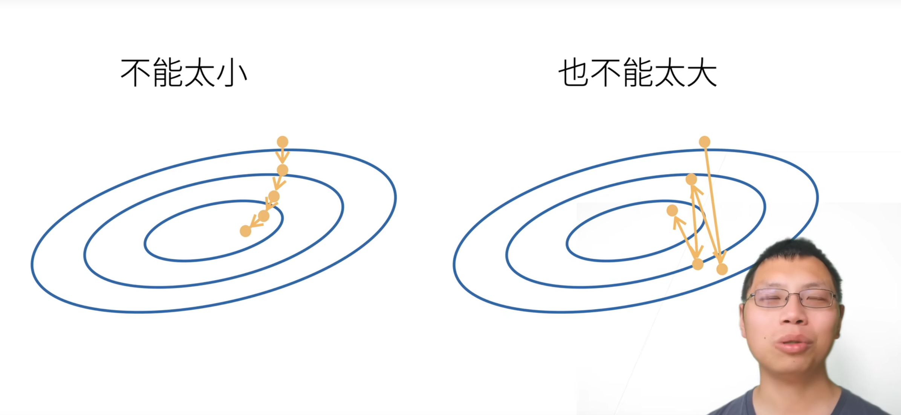

# 深度学习笔记

跟着李沐《动手学深度学习》(d2l.ai)，配合代码实践。

## 1.torch基础


### 1.1 reshape与view的区别


|操作|创建新的Tensor对象|共享Storage|修改b会不会影响a|限制|
|-----|-------|-----|-----|----|
|b = a|同一个对象，不创建|共享|有影响|无|
|b = a.view(...)|创建新的Tensor对象|共享|有影响|a必须contiguous内存连续|
| b = a.reshape(...)|创建新的Tensor对象|如果内存不连续就创建新的内存空间|不一定，看是否创建新的内存空间|无|
|b = a.clone()|创建新的Tensor对象|不共享|不影响|无|


## 2.线性回归基础

### 2.1线性回归数学原理

线性回归的标签y和特征值x的关系：

$$
y = w\_1 x\_1 + w\_2 x\_2 + \cdots + w\_n x\_n + b
$$


而线性回归模型所要做的就是**找到最佳的权重w和偏置b**

$$X = \begin{bmatrix}1 & x\_{11} & x\_{12} & \cdots & x\_{1d} \\
                     1 & x\_{21} & x\_{22} & \cdots & x\_{2d} \\
                     \vdots &\vdots  &\vdots  &\ddots &\vdots \\
                     1 & x\_{n1} & x\_{n2} & \cdots & x\_{nd}
      \end{bmatrix}$$

  $$\theta = \begin{bmatrix}
          b\\
		  w\_1\\
		  w\_2\\
		  \vdots\\
		  w\_d
          \end{bmatrix}$$

  $$X\theta = Y\_{pre} = \begin{bmatrix}
          y\_1\\
		  y\_2\\
		  \vdots\\
		  y\_d
           \end{bmatrix}$$

  损失函数：

  $$loss(\theta) = \frac{1}{2} \begin{Vmatrix} X\theta - Y\_{true} \end{Vmatrix}^2 = \frac{1}{2} \begin{Vmatrix}
  Y\_{pre} - Y\_{true} \end{Vmatrix}^2 = \frac{1}{2} (X\theta - Y\_{true})^T (X\theta - Y\_{true})$$

  $$= \frac{1}{2}[(X\theta)^T - Y\_{true}^T](X\theta - Y\_{true}) = \frac{1}{2}[(X\theta)^TX\theta - (X\theta)^T
  Y\_{true} - Y\_{true}^TX\theta+Y\_{true}^TY\_{true}]$$

  $$=\frac{1}{2}[\theta^TX^TX\theta - 2Y\_{true}^TX\theta + Y\_{true}^TY\_{true}]$$

  其中$(X\theta)^T Y\_{true}$ 和 $Y\_{true}^TX\theta$都是标量，所以他们的转置等于自己。

  根据矩阵求导法则:

  $$\frac{\partial (X^TAX)}{\partial X} = (A+A^T)X$$

  $$\frac{\partial(a^TX)}{\partial X} = a$$

  所以:

  $$\frac{\partial loss}{\partial\theta} = \nabla\_{\theta} loss(\theta) = \frac{1}{2}[2X^TX\theta - 2X^TY\_{true}] =
  X^TX\theta - X^TY\_{true}$$

  为了求出loss的最小值，我们就必须找到梯度为0的w和b，也就是$\theta$。

  令 $\nabla\_{\theta} loss(\theta) = 0 = X^TX\theta - X^TY\_{true}$ => $\theta = (X^TX)^{-1}X^TY\_{true}$

  所以最优解$\theta = (X^TX)^{-1}X^TY$

  只有线性回归才有通解，并且只有当$X^TX$可逆时，才能直接求出$\theta$。

### 2.2 学习率对loss的影响

梯度下降需要消耗大量的算力，所以学习率太大和太小都会浪费算力。



### 2.3手写线性回归

**Python语法扩展（yield）**

- `return`在函数结束时返回一个结果。
- `yield` 函数运行到`yield`时，返回一个值，然后函数挂起，知道下一次用`next()`调用或者`for`迭代。

```python
def count_up_to(n):
    i = 0
    while i < n:
        yield i   # 每调用一次 next()，就返回当前的 i，并暂停
        i += 1

# 使用生成器
gen = count_up_to(3)
print(next(gen))  # 输出 0
print(next(gen))  # 输出 1
print(next(gen))  # 输出 2
# print(next(gen))  # 触发 StopIteration

# 更常见的用法：直接 for 循环
for num in count_up_to(3):
    print(num)    # 打印 0 1 2
```

**手写线性回归**

```python
import random
import torch

import os
os.environ["KMP_DUPLICATE_LIB_OK"] = "TRUE"

#创建随机数据
def create_data(w, b, num_examples):
    
    #生成符合正态分布的x，0是均值，1是方差，（num_examples, len(w)）行列。
    x = torch.normal(0, 1, (num_examples, len(w)))
    
    y = x@w + b
    #加入噪音
    y += torch.normal(0, 0.01, y.shape)

    return x, y.reshape((-1, 1))

#批量抽取数据进行梯度下降
def data_iter(batch_size, feature, label):

    num_example = len(feature)
    #生成0到num_example的索引列表
    index = list(range(num_example))
    #用shuffle函数将index打乱，以达到随机抽样的效果
    random.shuffle(index)
    #i是每次抽样的第一个下标
    for i in range(0, num_example, batch_size):
        batch_index = index[i: min(i + batch_size, num_example)]
        #返回feature和label
        yield feature[batch_index], label[batch_index]

#定义模型
def linear_model(x, w, b):
    return x @ w + b

def squared_loss(y_pre, y_true):
    #用平方误差，为了防止两个y的维度不同，我们进行reshape调整
    return 0.5 * (y_pre - y_true.reshape(y_pre.shape))**2

def sgd(params, lr, batch_size):

    with torch.no_grad():
        for param in params:
            #梯度下降
            param -= lr * param.grad / batch_size
            #计算完一轮之后要将grad清零
            param.grad.zero_()


if __name__ == '__main__':

    #创建数据
    example = 1000
    w_true = torch.tensor([2, -3.4])
    b_true = 4.2

    feature, label = create_data(w_true, b_true, example)
    #数据创建成功
    #=========================================================

    #初始化权重和偏置
    #requires_grad = True表示该参数需要进行梯度下降
    w = torch.normal(0, 0.01, size = (2, 1), requires_grad = True)
    b = torch.zeros(1, requires_grad = True)
    print(w, b)

    #=========================================================
    #开始训练
    lr = 0.03
    num_epochs = 3
    batch_size = 10
    net = linear_model
    loss = squared_loss
    #第一层循环，对全部数据扫一遍，一共扫三遍
    for epoch in range(num_epochs):
        #每次拿出batch_size的x和y
        for x, y in data_iter(batch_size, feature, label):
            #计算小批量损失
            l = loss(net(x, w, b), y)
            #计算得到的l是一个[batch_size, 1]的向量
            #我们需要进行求和才是每个样本预测值和真实值的差距
            #用backward()计算梯度
            l.sum().backward()
            #计算完梯度之后才能访问grad这个属性
            if epoch == 0:
                print("grad->", w.grad)
            sgd([w, b], lr, batch_size)
            if epoch == 0:
                print("w->", w)
        #出来这个for循环之后表示已经扫完一遍数据了
        #表示一下内容不需要计算梯度
        with torch.no_grad():
            train_l = loss(net(feature, w, b), label)
            print(f'epoch: {epoch + 1}, loss: {train_l.sum()/example}')

"""
第一次数据：
epoch: 1, loss: 0.040368854999542236
epoch: 2, loss: 0.00015070709923747927
epoch: 3, loss: 5.0547547289170325e-05
tensor([[ 1.9995],
        [-3.3997]], requires_grad=True) tensor([4.2006], requires_grad=True)
第二次数据：
epoch: 1, loss: 0.043382592499256134
epoch: 2, loss: 0.00017751296400092542
epoch: 3, loss: 5.148643322172575e-05
tensor([[ 2.0008],
        [-3.3987]], requires_grad=True) tensor([4.1997], requires_grad=True)
第三次数据：
epoch: 1, loss: 0.04251382499933243
epoch: 2, loss: 0.00017745311197359115
epoch: 3, loss: 5.071829218650237e-05
tensor([[ 1.9993],
        [-3.3996]], requires_grad=True) tensor([4.1995], requires_grad=True)
"""
```

