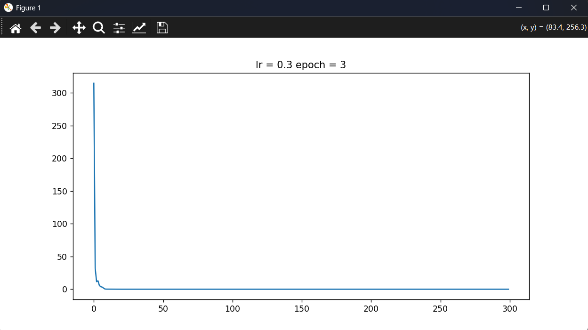
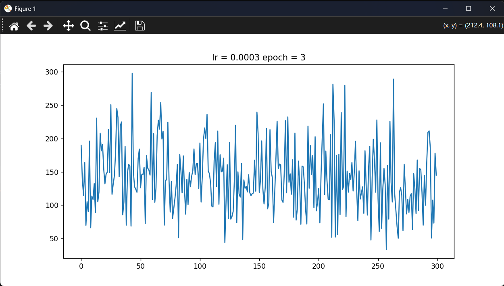
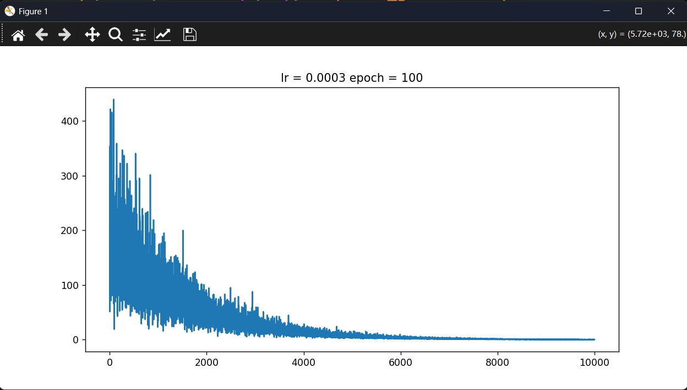
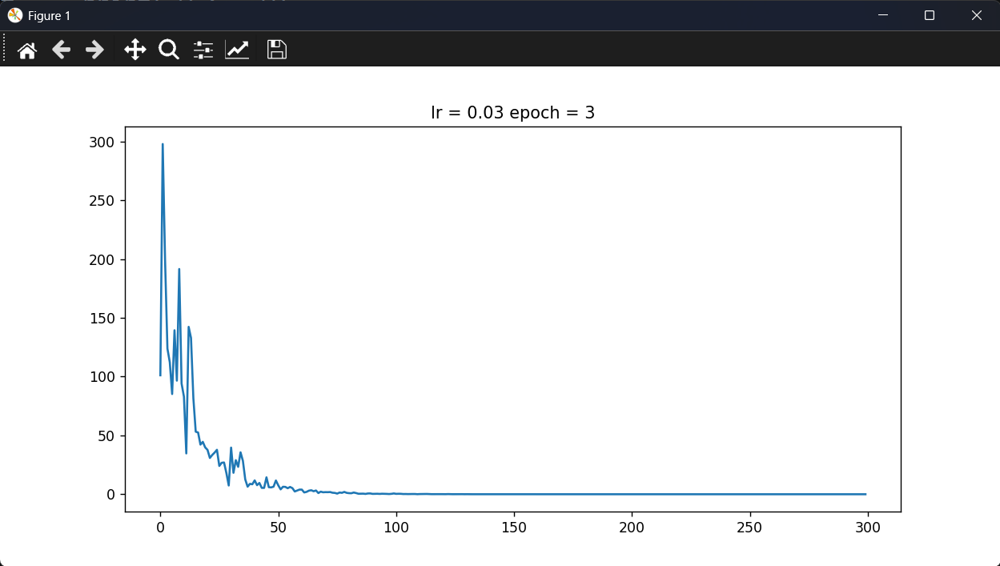
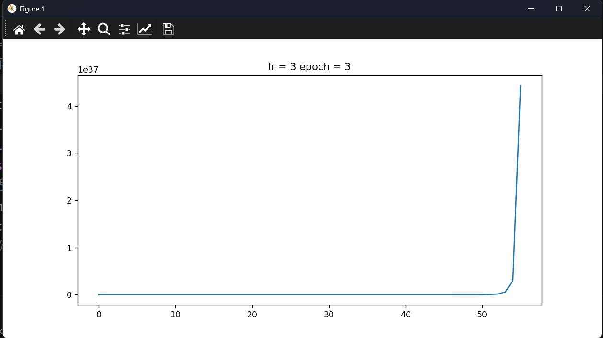
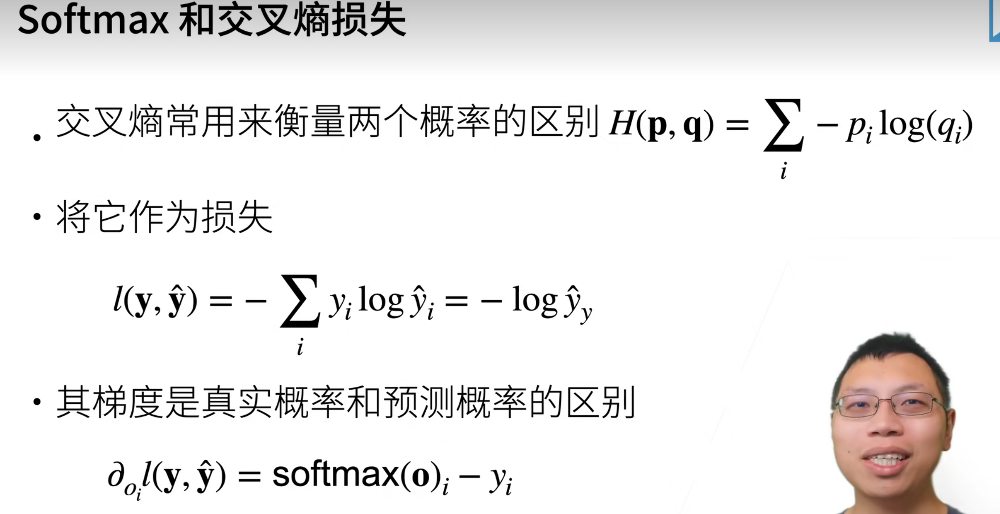
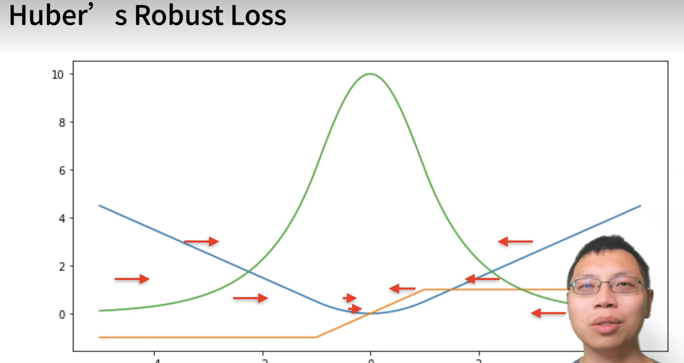

# 深度学习笔记

跟着李沐《动手学深度学习》(d2l.ai)，配合代码实践。

## 1.torch基础


### 1.1 reshape与view的区别


|操作|创建新的Tensor对象|共享Storage|修改b会不会影响a|限制|
|-----|-------|-----|-----|----|
|b = a|同一个对象，不创建|共享|有影响|无|
|b = a.view(...)|创建新的Tensor对象|共享|有影响|a必须contiguous内存连续|
| b = a.reshape(...)|创建新的Tensor对象|如果内存不连续就创建新的内存空间|不一定，看是否创建新的内存空间|无|
|b = a.clone()|创建新的Tensor对象|不共享|不影响|无|


## 2.线性回归基础

### 2.1线性回归数学原理

线性回归的标签y和特征值x的关系：

$$
y = w\_1 x\_1 + w\_2 x\_2 + \cdots + w\_n x\_n + b
$$


而线性回归模型所要做的就是**找到最佳的权重w和偏置b**

$$
X = \begin{bmatrix}1 & x_{11} & x_{12} & \cdots & x_{1d} \\
				   1 & x_{21} & x_{22} & \cdots & x_{2d} \\
				   \vdots &\vdots  &\vdots  &\ddots &\vdots \\
				   1 & x_{n1} & x_{n2} & \cdots & x_{nd}
	\end{bmatrix}
	
\\
\\
\theta = \begin{bmatrix}
		b\\w_1\\w_2\\\vdots\\w_d
		 \end{bmatrix}
\\
\\
X\theta = Y_{pre} = \begin{bmatrix}
		y_1\\y_2\\\vdots\\y_d
		 \end{bmatrix}
\\
\\
损失函数：
loss(\theta) = \frac{1}{2} \begin{Vmatrix} X\theta - Y_{true} \end{Vmatrix}^2 \\= \frac{1}{2} \begin{Vmatrix} Y_{pre} - Y_{true} \end{Vmatrix}^2\\ = \frac{1}{2} (X\theta - Y_{true})^T (X\theta - Y_{true})
\\
= \frac{1}{2}[(X\theta)^T - Y_{true}^T](X\theta - Y_{true})\\ = \frac{1}{2}[(X\theta)^TX\theta - (X\theta)^T Y_{true} - Y_{true}^TX\theta + Y_{true}^TY_{true}]
\\=\frac{1}{2}[\theta^TX^TX\theta - 2Y_{true}^TX\theta + Y_{true}^TY_{true}]\\其中(X\theta)^T Y_{true} 和 Y_{true}^TX\theta都是标量，所以他们的转置等于自己。\\
根据矩阵求导法则:\frac{\partial (X^TAX)}{\partial X} = (A+A^T)X\\\frac{\partial(a^TX)}{\partial X} = a
\\
所以:\frac{\partial loss}{\partial\theta} = \nabla_{\theta} loss(\theta) = \frac{1}{2}[2X^TX\theta - 2X^TY_{true}] = X^TX\theta - X^TY_{true}
\\
为了求出loss的最小值，我们就必须找到梯度为0的w和b，也就是\theta
\\
令 \nabla_{\theta} loss(\theta) = 0 = X^TX\theta - X^TY_{true} => \theta = (X^TX)^{-1}X^TY_{true}
\\
所以最优解\theta = (X^TX)^{-1}X^TY
\\只有线性回归才有通解，并且只有当X^TX可逆时，才能直接求出\theta
$$


### 2.2 学习率对loss的影响

梯度下降需要消耗大量的算力，所以学习率太大和太小都会浪费算力。


### 2.3手写线性回归

**Python语法扩展（yield）**

- `return`在函数结束时返回一个结果。
- `yield` 函数运行到`yield`时，返回一个值，然后函数挂起，知道下一次用`next()`调用或者`for`迭代。

```python
def count_up_to(n):
    i = 0
    while i < n:
        yield i   # 每调用一次 next()，就返回当前的 i，并暂停
        i += 1

# 使用生成器
gen = count_up_to(3)
print(next(gen))  # 输出 0
print(next(gen))  # 输出 1
print(next(gen))  # 输出 2
# print(next(gen))  # 触发 StopIteration

# 更常见的用法：直接 for 循环
for num in count_up_to(3):
    print(num)    # 打印 0 1 2
```

**手写线性回归**

```python
import random
import torch

import os
os.environ["KMP_DUPLICATE_LIB_OK"] = "TRUE"

#创建随机数据
def create_data(w, b, num_examples):
    
    #生成符合正态分布的x，0是均值，1是方差，（num_examples, len(w)）行列。
    x = torch.normal(0, 1, (num_examples, len(w)))
    
    y = x@w + b
    #加入噪音
    y += torch.normal(0, 0.01, y.shape)

    return x, y.reshape((-1, 1))

#批量抽取数据进行梯度下降
def data_iter(batch_size, feature, label):

    num_example = len(feature)
    #生成0到num_example的索引列表
    index = list(range(num_example))
    #用shuffle函数将index打乱，以达到随机抽样的效果
    random.shuffle(index)
    #i是每次抽样的第一个下标
    for i in range(0, num_example, batch_size):
        batch_index = index[i: min(i + batch_size, num_example)]
        #返回feature和label
        yield feature[batch_index], label[batch_index]

#定义模型
def linear_model(x, w, b):
    return x @ w + b

def squared_loss(y_pre, y_true):
    #用平方误差，为了防止两个y的维度不同，我们进行reshape调整
    return 0.5 * (y_pre - y_true.reshape(y_pre.shape))**2

def sgd(params, lr, batch_size):

    with torch.no_grad():
        for param in params:
            #梯度下降
            param -= lr * param.grad / batch_size
            #计算完一轮之后要将grad清零
            param.grad.zero_()


if __name__ == '__main__':

    #创建数据
    example = 1000
    w_true = torch.tensor([2, -3.4])
    b_true = 4.2

    feature, label = create_data(w_true, b_true, example)
    #数据创建成功
    #=========================================================

    #初始化权重和偏置
    #requires_grad = True表示该参数需要进行梯度下降
    w = torch.normal(0, 0.01, size = (2, 1), requires_grad = True)
    b = torch.zeros(1, requires_grad = True)
    print(w, b)

    #=========================================================
    #开始训练
    lr = 0.03
    num_epochs = 3
    batch_size = 10
    net = linear_model
    loss = squared_loss
    #第一层循环，对全部数据扫一遍，一共扫三遍
    for epoch in range(num_epochs):
        #每次拿出batch_size的x和y
        for x, y in data_iter(batch_size, feature, label):
            #计算小批量损失
            l = loss(net(x, w, b), y)
            #计算得到的l是一个[batch_size, 1]的向量
            #我们需要进行求和才是每个样本预测值和真实值的差距
            #用backward()计算梯度
            l.sum().backward()
            #计算完梯度之后才能访问grad这个属性
            if epoch == 0:
                print("grad->", w.grad)
            sgd([w, b], lr, batch_size)
            if epoch == 0:
                print("w->", w)
        #出来这个for循环之后表示已经扫完一遍数据了
        #表示一下内容不需要计算梯度
        with torch.no_grad():
            train_l = loss(net(feature, w, b), label)
            print(f'epoch: {epoch + 1}, loss: {train_l.sum()/example}')

"""
第一次数据：
epoch: 1, loss: 0.040368854999542236
epoch: 2, loss: 0.00015070709923747927
epoch: 3, loss: 5.0547547289170325e-05
tensor([[ 1.9995],
        [-3.3997]], requires_grad=True) tensor([4.2006], requires_grad=True)
第二次数据：
epoch: 1, loss: 0.043382592499256134
epoch: 2, loss: 0.00017751296400092542
epoch: 3, loss: 5.148643322172575e-05
tensor([[ 2.0008],
        [-3.3987]], requires_grad=True) tensor([4.1997], requires_grad=True)
第三次数据：
epoch: 1, loss: 0.04251382499933243
epoch: 2, loss: 0.00017745311197359115
epoch: 3, loss: 5.071829218650237e-05
tensor([[ 1.9993],
        [-3.3996]], requires_grad=True) tensor([4.1995], requires_grad=True)
"""
```

### 2.4 学习率lr和epoch的关系

该模型对应的数据最合适的lr和epoch应该是lr = 0.3、epoch = 3。如图：



我们对参数lr进行调整，将其调整为lr = 0.0003、epoch = 3。如图：



>由于学习率lr过低，epoch也低，导致学习不充分，也就是欠拟合，loss一直降不下来。

我们将参数epoch提升到100。如图：



>此时虽然学习率低，但是epoch上来了，也就是扫描了100遍该训练数据，也能强行把loss降下来。

通常工程中的参数很难找到理想的，一般情况下都是这种情况：



>loss有升有降，但loss最终能下降到可接受范围。

学习率过小会导致欠拟合，学习率过大则会造成梯度爆炸：



>此时loss已经是nan了，梯度爆炸了，学习率过大，导致权重变化过快。

**总结：**
1. 当学习率过小的时候，loss降不下来，提升学习次数（epochs），有可能可以降下来，但是推荐调整参数。
2. 当学习率过大的时候，会出现梯度爆炸，loss=nan，请立刻调整学习率。

### 2.5 用torch实现线性回归

```python
class model(nn.Module):
    #定义单层神经网络

    def __init__(self, *args, **kwargs):
        super().__init__(*args, **kwargs)
        #一层线性回归网络层
        self.layout1 = nn.Linear(in_features = 2, out_features = 1)
    
    def forward(self, x):

        x = self.layout1(x)
        #经过线性计算之后直接返回值
        return x
if __name__ == '__main__':
    plt.figure(figsize = (10, 5))
    #初始化样本数量
    example = 1000
    #初始化真实的w和b
    w_true = torch.tensor([[2.], [-3.4]]) # 2*1
    b_true = torch.tensor(1.0)
    #随机生成样本
    x = torch.normal(0, 3, (example, 2))# example*2
    #y_true的值
    y_true =  x @ w_true + b_true + torch.normal(0, 0.01, (example, 1))
    #把feature和label组合成dataset！！！！！
    data = TensorDataset(x, y_true)#Dataset可以把feature和label组合起来，格式类似于DataFrame但是在深度学习中比DataFrame更加方便
    #初始化参数
    lr = 0.003
    epochs = 3
    batch_size = 10
    net = model()
    #输出初始化的w和b
    print(net.layout1.weight, ' ', net.layout1.bias)
    #定义损失函数
    loss = nn.MSELoss()
    #定义优化器，用来优化参数的，梯度下降
    opt = optim.SGD(net.parameters(), lr = lr)
    loss_num = []
    for epoch in range(epochs):
        data_loader = DataLoader(data, batch_size, shuffle = True)
        loss_sum = 0
        for x, y_true in data_loader:
            #用神经网络进行预测
            y_pre = net(x)
            #计算损失
            l = loss(y_pre, y_true)
            # print(f'loss = {l}')
            loss_num.append(l.item())
            loss_sum += l
            #清除之前的梯度
            opt.zero_grad()
            #进行反向传播，计算梯度
            l.backward()
            #更具bachward计算出的梯度更新参数
            opt.step()  
        l = loss(net(x), y_true)
        print(f'epoch: {epoch + 1} ==> loss: {loss_sum / 100}')
    print(net.layout1.weight, ' ', net.layout1.bias)
    sns.lineplot(x = range(300), y = loss_num)
    plt.show()
```


## 3.Softmax回归

### 3.1Softmax数学原理

二分类交叉熵公式：
$$
\text{BCE}(y, \hat{y}) = -\left[ y \log(\hat{y}) + (1 - y) \log(1 - \hat{y}) \right]
$$

多分类交叉熵公式：
$$
\text{CE}(y, \hat{y}) = -\sum_{i=1}^{C} y_i \log(\hat{y}_i)
$$

- $ y_i  \in \begin{Bmatrix} 0, 1 \end{Bmatrix}$：one-hut真是标签，只有第i维为1，其余都为0，表示该样本分类为i类。
- $\hat{y}$：表示模型预测样本为第i类的概率大小，会被归一化。所有的$\hat{y}$相加等于1。
- 公式：只有 $y_i$ 这一项不为零，所以公式的数值等于 $-y_i \log(\hat{y}_i)$ ，此时 $\hat{y}$ 越大，损失值越小，所以模型会尽可能地让 $\hat{y}$ 变大，从而提升了区分度。



**容易误解：** 交叉熵损失通常不能用于梯度下降，因为它不具有参数，但是它可以指导前面的全连接层（隐藏层）进行梯度下降。


### 3.2 损失函数

3个常用损失函数：
1. $l(y, y') = \frac{1}{2}(y - y')^2$：均方损失，当权重距离真实权重很远的时候，梯度会比较大，可以加速学习，但同时也不稳定。
2. $l(y, y') = |y - y'|$：绝对损失，不管权重距离真实权重有多远，梯度都是一个常数，学习速度可能没那么快，但是很稳定。当权重距离真实权重很近的时候，因为原点不可导，容易导致稳定性变差。
3. $l(y, y') = \begin{cases} 
|y - y'| - \frac{1}{2} & \text{if } |y - y'| > 1 \\
\frac{1}{2}(y - y')^2 & \text{otherwise}
\end{cases}$：Robust Loss，结合了两者的优点，是梯度下降整体变稳定。



**RobustLoss比较常用**


### 3.3 前向传播和反向传播

前向传播 (Forward Propagation)
第一层：

*   **线性变换与激活**：
    $$ z_1 = w_1 x + b_1 = 3 \times 2 + 1 = 7 $$
    $$ a_1 = f(z_1) = 7 \times 2 + 1 = 15 $$

第二层（假设全连接层）：
*   **线性变换**：
    $$ z_2 = W_2 a_1 + b_2 = 3 \times 15 + 1 = 46 $$
*   **激活**：
    $$ a_2 = f(z_2) = 3 \times 46 + 1 = 139 $$

**损失计算**：
$$ L = (y - a_2)^2 = 2435 $$

---

反向传播 (Backward Propagation)

方向流：`首先输出层 -> dL/d... -> 更新参数`

输出层到损失函数的梯度推导
设损失为均方误差，则有：
$$ \hat{y} = a_2 $$
$$ \frac{dL}{da_2} = 2(y - a_2) $$
$$ \text{代入数值： } 2 \times (80 - 139) = -118 $$

全连接层链式法则 (Chain Rule)
笔记右下角的推导逻辑展示了链式法则在各层的应用：

**输出层函数导数（需根据激活函数选择）：**
*   **如果是 Sigmoid 函数**：
    $$ \frac{da_2}{dz_2} = a_2(1-a_2) $$
*   **如果是线性函数（如 \(y=a_2\)）**：
    $$ \frac{da_2}{dz_2} = 1 \quad (\text{即当 } y=a_2 \text{ 时}) $$

第二层权重梯度计算
根据链式法则：
$$ \frac{dL}{dw_2} = \frac{dL}{dz_2} \cdot a_1 $$
图中具体的数值逻辑（假设 \(\frac{dL}{dz_2} = 26\)）：
$$ grad = \frac{dL}{dw_2} = \frac{dL}{dz_2} \cdot \frac{dz_2}{dw_2} = \frac{dL}{dz_2} \cdot a_1 $$
$$ \text{代入数值： } 26 \times 15 = 390 $$

 第一层权重梯度计算
继续利用链式法则向上一层传播：
$$ \frac{dL}{dw_1} = \frac{dL}{dz_1} \cdot x $$
图中具体的数值逻辑（假设 \(\frac{dL}{dz_1} = 52\)）：
$$ \text{代入数值： } 52 \times 2 = 104 $$

---

 参数更新
图中底部注明了计算出的梯度用于**更新参数**，完成向后传播 → 向前传播的闭环迭代：

*   \( \frac{dL}{dw_1} \rightarrow \text{用于更新参数} \)
*   \( \frac{dL}{dw_2} \rightarrow \text{用于更新参数} \)


## 4.正则化方法

1. 损失函数添加正则项（范数惩罚），通常使用L1和L2正则项。
- $\min \ell(\mathbf{w}, b) + \frac{\lambda}{2} \|\mathbf{w}\|^2$
- $\min \ell(\mathbf{w}, b) + \lambda \|\mathbf{w}\|_1$
2. Dropout正则化。
- 放弃全连接层的某些神经元，以达到正则化的效果。（放弃掉的神经元梯度为0，权重无法更新，和范数惩罚效果差不多）
- 没被放弃的神经元要进行相应的扩大，为了使整体的期望不变。
$$
x'_i = \begin{cases} 
0 & \text{with probability } p \\
\frac{x_i}{1-p} & \text{otherwise}
\end{cases}
$$
>被放弃的直接变成0，没被放弃的，除1-p。整体数值权重不变。

## 5.数据稳定性


### 5.1引发梯度爆炸和梯度消失的原因

$$
\frac{\partial \ell}{\partial \mathbf{W}^t} = \frac{\partial \ell}{\partial \mathbf{h}^d} \frac{\partial \mathbf{h}^d}{\partial \mathbf{h}^{d-1}} \cdots \frac{\partial \mathbf{h}^{t+1}}{\partial \mathbf{h}^t} \frac{\partial \mathbf{h}^t}{\partial \mathbf{W}^t}
$$

>反向传播时，要用链式法则，也就是后面的权重的梯度会不断地连乘前面的权重，如果前面的权重大部分大于1的话，由于网络层数可能很深，当这么多层的权重乘在一起容易使后面的梯度变得异常大甚至无法用数据容器装载（溢出）。如果前面的权重都小于1并且比较小，则容易导致梯度消失，也就是梯度很小，几乎起不到学习的效果。

例如：

我们设有一个三层的网络结构：
- 第一层：$h_1 = w_1x$
- 第二层：$h_2 = w_2x$
- 第三层：$\hat{y} = w_3 \cdot h_2$

**前向传播过程省略**

反向传播：

链式法则：
$$
\frac{\partial L}{\partial w_1} = \frac{\partial L}{\partial \hat{y}} \cdot \frac{\partial \hat{y}}{\partial h_2} \cdot \frac{\partial h_2}{\partial h_1} \cdot \frac{\partial h_1}{\partial w_1}
$$


- $\frac{\partial L}{\partial \hat{y}} = \hat{y} - y = 24$
- $\frac{\partial \hat{y}}{\partial h_2} = w_3 = 4$
- $\frac{\partial h_2}{\partial h_1} = w_2 = 3$
- $\frac{\partial h_1}{\partial w_1} = x = 1$


这些都是链式法则要连乘的内容，这些是后面这些层的权重，而且权重都>1。

**第一层的梯度会变成：**
$$
\frac{\partial L}{\partial w_1} = 24 \times 4 \times 3 \times 1 = 288
$$

>变成288了，这里只是3层，如果是100层的话，梯度很容易爆炸，当然，如果权重都特别小，也会造成梯度消失。


### 5.2激活函数对反向传播的影响


|**激活函数**|**对梯度影响**|**主要原因**|
|---------|----------|-----------|
|RuLU|如果权重初始化不到位，容易引发**梯度爆炸**，但是缓解了**梯度消失**。|正半轴导数为1，梯度完全由权重乘积决定；权重>1时连乘导致爆炸。|
|Leaky ReLU / PReLU|比ReLU更稳定，轻微缓解爆炸风险。|负半轴有微小斜率（如0.01），避免神经元死亡，但正半轴仍为1，爆炸风险仍存|
|Sigmoid|容易造成**梯度消失**，几乎不会**梯度爆炸**。|导数最大值仅0.25，且大部分区域导数接近0；连乘后梯度指数级衰减。|
|Tanh|容易**梯度消失**，极少爆炸。|导数最大值1（在0处），但两端饱和趋近0；连乘后梯度仍会消失（除非权重非常大且输入一直在0附近）。|
|Softmax（通常用于输出层）|本身不直接引起消失/爆炸，但配合交叉熵时梯度稳定|梯度形式为$p_i - y_i$，范围在[-1,1]，不受深层连乘影响。|


**知识扩展：激活函数和参数初始化函数的搭配**
|函数|适用场景|
|-|-|
|xavier_uniform_ / xavier_normal_|配合 sigmoid/tanh|
|kaiming_uniform_ / kaiming_normal_|配合 ReLU|
|normal_|简单的正态分布初始化|


### 5.3梯度消失和梯度爆炸所带来的问题

**梯度消失带来的问题：**

- 梯度值会变成0，因为机器存储数据的精度有限，所以梯度太小了会变成0
>对16位浮点数尤其严重

-  梯度太小对训练没有进展
-  梯度太小仅仅对距离输出层进的全连接层训练有效果，因为越往前，梯度变得越小。

**梯度爆炸带来的问题：**

- 值会超出值域
>对于16位浮点数尤其严重

- 对学习率异常敏感
>如果学习率太大->大参数值->更大的梯度
>如果学习率太小->学习没有进展

### 5.4**如何让训练变得更加稳定**


1. 将乘法变成加法，避免连乘
>ResNet和LSTM

2. 归一化
>梯度归一化，梯度裁剪

3. 选择合理的激活函数和合理的参数初始化


**补充知识ont-hut编码：**


>补充知识：one-hut热编码，用于将数据中的离散值变成bool值。例如：
>原始列：颜色 = 红色、蓝色、绿色
>one-hot之后：
>颜色_红	颜色_绿	颜色_蓝
>     0 		        1		    0           --------->表示绿色
>  1	             0		    0	       --------->表示红色
>  0	             0            1           --------->表示蓝色
>  

>要将DataFrame转化为Tensor，不能直接转化，要先把DataFrame转化为Numpy数组，因为DataFrame有行id和列名等Tensor所没有的东西，Tensor只表示数组，没有列名和行号之类的，而Numpy数组就是只有数值。用DataFrame.values可以转化为Numpy数组。

增加维度之后对算力要求有没有提升？

|情况|影响|建议|
|----|----|----|
|离散值很小（<50）|基本可以忽略|直接用one-hot|
|离散值多（50~几百）|有点吃力|可以考虑用embedding，把一个高维向量压缩成稠密的低维向量|
|离散值极多（>几千）|显著拖慢|必须用embedding或做特征工程|

```python
train_data = pd.get_dummies(train_data, dummy_na = True)
test_data = pd.get_dummies(test_data, dummy_na = True)
#dummy_na = True表示将空值区分开
#因为 dummy_na=True 给每个原始列都生成了一个 _nan 列，如果原始数据中该特征没有缺失值，那个 _nan 列就全是 False，转成 float 后自然全是 0.0。
```


**补充Torch小知识：**

```python
# 将特征和标签按样本对齐，打包在一起
dataset = TensorDataset(X, y)
# 你可以在此设定批大小(batch_size)、是否打乱(shuffle)等
data_loader = DataLoader(dataset, batch_size=2, shuffle=True)

#激活函数的调用时从torch中调用，而不是torch.nn中调用。
```

>TensorDataset(X, y)将tensorX和y组合起来，组合成类似于DataFrame但是又比DataFrame更适合深度学习的数据结构，其中X是特征，y是标签。
>DataLoader用来加载数据，按批次送入网络中学习。


## 6.Kaggle房价预测实例


