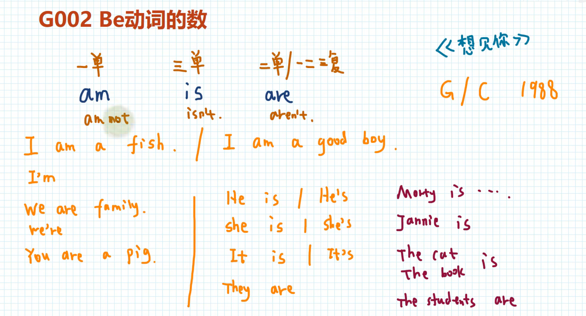
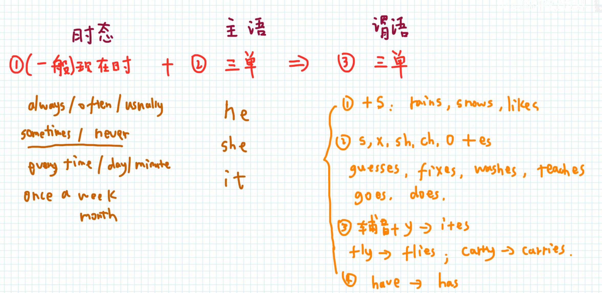
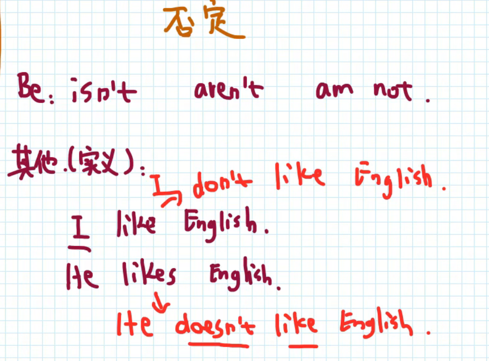
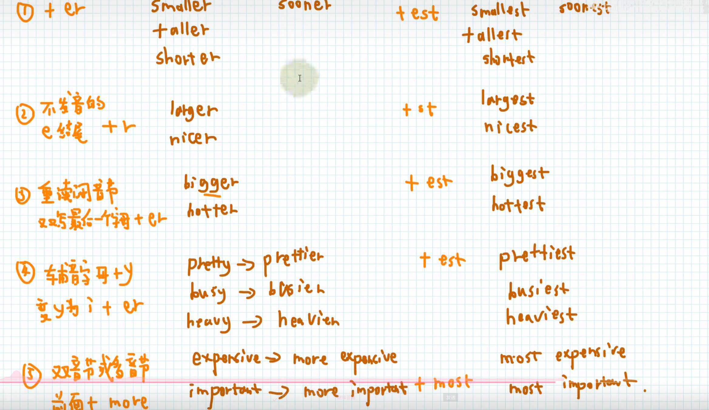
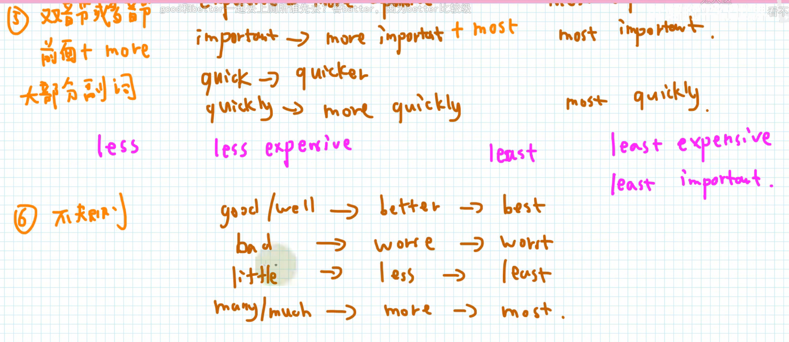

# English语法零基础


## 1. 零基础语法

### 1.1 名词的数

**元音字母：A、E、I、O、U**

**辅音字母：除元音字母以外的所有字母。**

```
名词
├── 可数名词
│   ├── 单数：coat, dress, job, hat
│   └── 复数
│       ├── 规则变化
│       │   ├── ① 一般情况 +s：coats, jobs, hats
│       │   ├── ② 以 s, x, ch, sh 结尾 +es：dresses, boxes, watches (例: dish → dishes)
│       │   ├── ③ 辅音字母 + y → ies：city → cities; baby → babies
│       │   │   └── (对比: 元音+y直接加s) boy → boys; play → plays
│       │   ├── ④ 以 o 结尾
│       │   │   ├── 有(生命/特例) +es：potato → potatoes; tomato → tomatoes
│       │   │   └── 无(生命/一般) +s：photo → photos; zoo → zoos
│       │   └──  以 f, fe 结尾 → ves：wife → wives; leaf → leaves
│       │
│       └── 不规则变化
│           ├── ① 词形改变：man → men; child → children; foot → feet
│           └── ② 单复数同形：deer → deer; fish → fish/fishes
│
└── 不可数名词：air; water ...
```


### 1.2 Be动词的数




1. am：第一人称单数。否定：I am not ...
2. is：第三人称单数。否定：isn't
3. are：第二人称单数，第一、二、三人称复数。否定：aren't


### 1.3 动词的数

**一般现在时**就是有规律的事情。
例如：
- always/often/usnally 通常、总是，这些都包含规律。
- sometimes/never 有时、绝不，这些也有规律。
- every time/day/minute 每一次、每一天。
- once a week/month 一周一次、一月一次。



**动词的否定**




### 1.4 动词的时态

**Be动词的过去式**

- am、is：was
- are：were


### 1.5 形容词比较级








 


