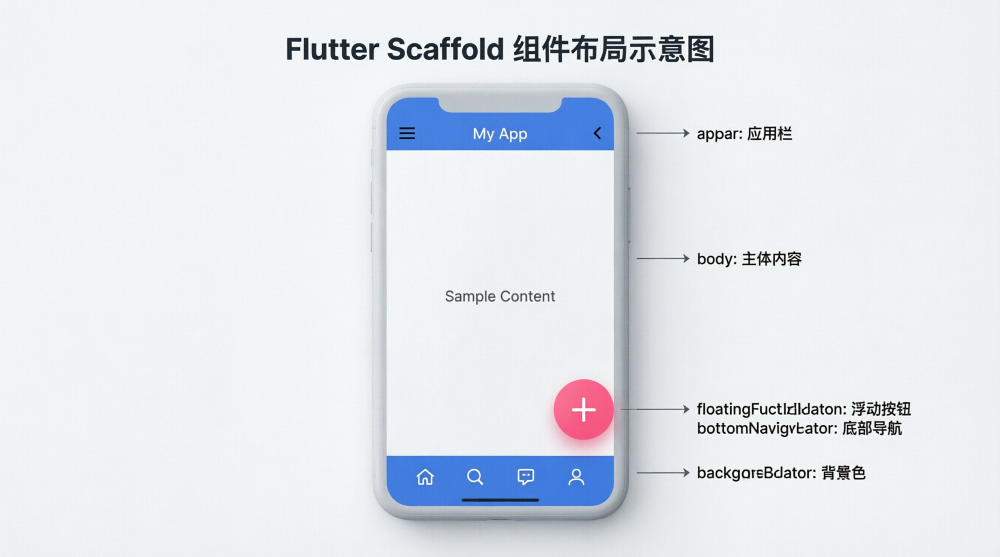
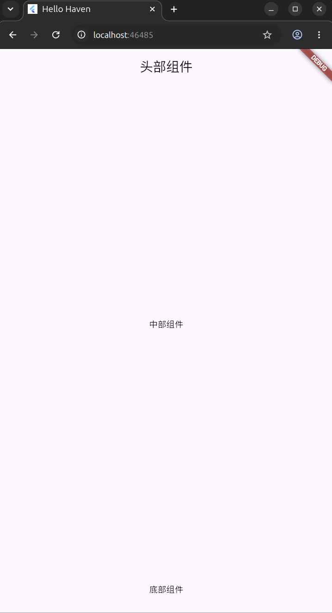
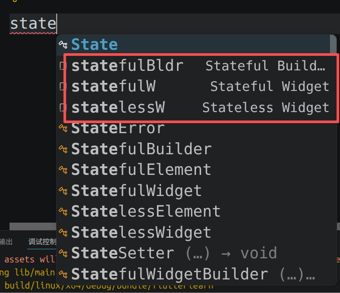
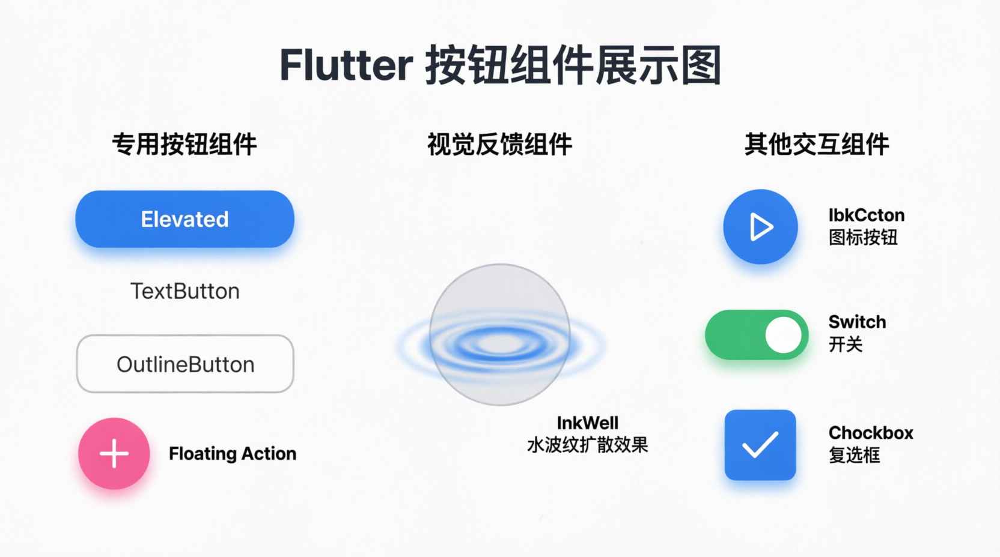
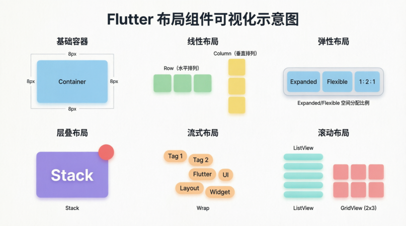
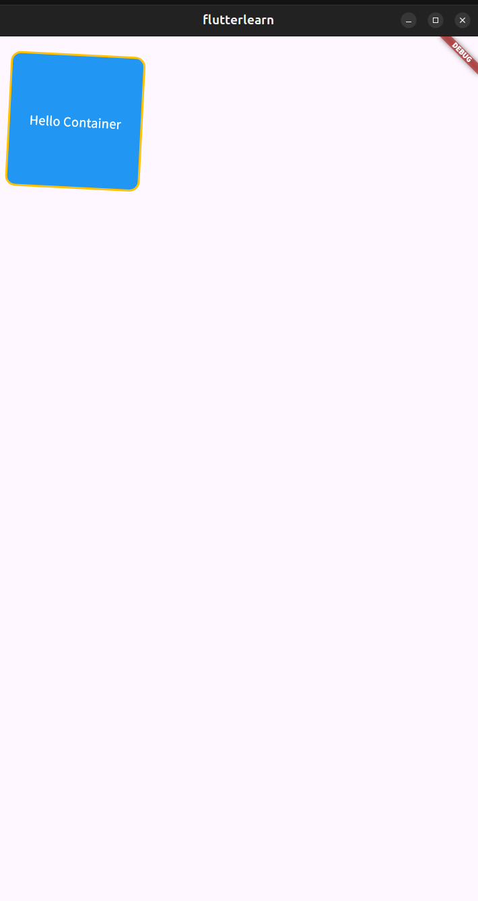

# Flutter Learn Notes

## 1. 基础数据类型

### 1.1 var 可变变量

```dart
void main(){
  // var表示可变变量，所以age可以被修改，但是第一次复制之后，数据的类型无法再进行修改
  var age = 20;
  print(age);
  age = 21;
  print(age);
}
```

### 1.2 const 不可变变量（编译时确定值）

```dart
void main(){
  const pi = 3.14;
  print(pi);
  // 此时将会报错，因为pi无法被更改
  pi = 2;
  print(pi)
}

```

**注意：**

**不能把var赋值给const**
```dart
void main(){
  var a = 3.14159
  // 此时a是var，如果把a赋值给b的话，b是不可变的而a是可变的，会冲突
  const b = a
}
```


### 1.3 final 不可变变量（运行时确定值）


**final和const一样都是不可变的变量，但是final是在运行时确定值**

### 1.4 final和const的对比

**const在编译时，必须有具体的值，但是final在编译时可以没有具体的值，而是运行后再赋值。**

```dart
void main(){
  // DateTime.now()并不是一个值，而是一个会返回时间的函数，所以此时time并没有具体的值，但是final向编译器保证，以后会有一个不可更改的值给我。
  final time = DateTime.now();
  print(time);
  // 同理，此时c_time也没有具体的值，所以编译器不会让c_time通过编译
  const c_time = DateTime.now();
  print(c_time);
}
```

| 特性 | `const` | `final` |
|------|---------|---------|
| 赋值时机 | 编译时必须有值 | 运行时首次赋值 |
| 能否调用函数赋值 | ❌ 不能 `const x = someFunc()` | ✅ 可以 `final x = someFunc()` |
| 能否修改 | ❌ 不可变 | ❌ 不可变（与 const 相同） |
| 编译器行为 | 值写死进产物，类似 C 的 `#define` | 运行时分配内存，只赋值一次 |
| 适用场景 | 已知常量：`pi = 3.14`、颜色、字符串字面量 | 运行时才能确定的值：时间、用户输入、函数返回值 |
| 能否修饰对象 | ✅ 对象及内部全部不可变 | ✅ 对象本身不可变，但内部可以变 |
| 编译时计算 | ✅ `1 + 2`、`"a" + "b"` 都行 | N/A（运行时才赋值，不参与编译） |
| 内存 | 同一个 `const` 值全局只有一份 | 每个 `final` 变量独立分配内存 |


### 1.5 String 类型

1. String 是可变字符串变量
```dart
void main(){
  String str = "Hello World";
  print(str);
  // String 是可变字符串变量
  str = "Hello Flutter";
  print(str);
}
```
2. String 支持模板字符串

```dart
void main(){
  var time = 10;
  // 输出我要在10点吃早餐，类似于pythonf"{}"
  String text = "我要在${time}点吃早餐";
  print(text);
}
```

### 1.6 数字类型

1. num：是int和double的父类，事先不确定类型是整数还是小数的时候可以使用。
2. int：存储整数。
3. double：存储小数。

| 类型 | 表示 | 示例 | 说明 |
|------|------|------|------|
| `int` | 整数 | `1`, `-5`, `0`, `999999` | 不能存小数 |
| `double` | 浮点数 | `3.14`, `-0.5`, `1.0` | `double d = 1;` 自动转 `1.0` |
| `num` | 整数或浮点数都行 | `1` 也行，`3.14` 也行 | 不确定类型时用 |


```dart
int a = 1;          // ✅
int b = 3.14;       // ❌ 整数不能存小数

double c = 3.14;    // ✅
double d = 1;       // ✅ Dart 自动转成 1.0

num e = 1;          // ✅ num 能装 int
num f = 3.14;       // ✅ num 也能装 double

// 不确定用户输入整数还是小数时用 num
void printHalf(num value) {
  print(value / 2);
}
printHalf(10);    // 5.0
printHalf(3.5);   // 1.75
```


**数值之间的赋值关系**

1. double和int之间不能直接赋值，可以转化为相同类型之后再赋值。

```dart
void main(){
  int friend_count = 3;
  double app_count = 1.5;
  // 不能直接相互赋值，会报错
  friend_count = app_count;
  // 可以先转化数值再赋值，toInt()向下取整
  friend_count = app_count.toInt();
  print(friend_count);
}
```

2. num不能直接给double赋值。

```dart
void main(){
  num a = 1;
  double b = 1;
  // 此时会报错，num可以是整数也可以是浮点数，所以num不能直接赋值给double
  b = a;
  print(b);
}
```
3. int和double可以直接赋值给num。

```dart
void main(){
  num a = 1;
  double b = 1;
  int c = 1;
  // int和double可以直接赋值给num
  a = b;
  a = c;
  print(a);
}
```


### 1.7 布尔类型

**和其他语言的布尔类型一样**

```dart
void main(){
  bool flag = true;
  // 输出“当前状态true”
  print("当前状态是${flag}");
}
```

## 2. 复杂数据类型

### 2.1 列表List

#### 2.1.1 List的基础用法

**和Python的list几乎一样**

```dart
void main(){
  List students = ["张三", "李四", "王五"];
  // 输出：
  // [张三, 李四, 王五]
  print(students);
}
```

#### 2.1.2 List的方法

- add(内容)：在尾部添加元素。
- addAll(List)：在尾部添加一个列表List。
- remove(内容)：删除满足内容的第一个。
- removeLast()：删除最后一个元素。
- removeRange(start, end)：删除从start到end的所有元素。(和python一样，包含start，不包含end)

```dart
void main(){
  List students = ["张三", "李四", "王五"];
  List other = ["刘六", "你好", "再见"];
  // 输出：
  // [张三, 李四, 王五]
  print(students);
  students.add("刘六");
  // 输出： 
  // [张三, 李四, 王五, 刘六]
  print(students);
  students.addAll(other);
  // 输出： 
  // [张三, 李四, 王五, 刘六, 刘六, 你好, 再见]
  print(students);
  students.remove("刘六");
  // 只会删除匹配的第一个元素，所以只会删除一个“刘六”
  // 输出：
  // [张三, 李四, 王五, 刘六, 你好, 再见]
  print(students);
  students.removeLast();
  // 输出：
  // [张三, 李四, 王五, 刘六, 你好]
  print(students);
  students.removeRange(0, 2);
  // 删除0到2，不包含2。
  // 输出：
  // [王五, 刘六, 你好]
  print(students);
}
```
```text
输出：
[张三, 李四, 王五]
[张三, 李四, 王五, 刘六]
[张三, 李四, 王五, 刘六, 刘六, 你好, 再见]
[张三, 李四, 王五, 刘六, 你好, 再见]
[张三, 李四, 王五, 刘六, 你好]
[王五, 刘六, 你好]
```


#### 2.1.3 List的进阶方法和常用属性

**进阶方法**
- 循环```forEach((item){});```
```dart
void main(){
  List students = ["张三", "李四", "王五"];
  // 其中forEach(函数)，其中item是列表中的每一个元素；
  students.forEach((item){
    // 函数内容
    print("大家好，我是${item}!");

  });
}
```

```text
输出：
  大家好，我是张三!
  大家好，我是李四!
  大家好，我是王五!
```


- 是否都满足条件 ```every((item){return 布尔值});```

```dart
void main(){
  List students = ["张三", "李四", "王五"];
  // 查看是否所有的元素都以“张”开头
  print(students.every((item){
    // item原本是dynamic数据类型，要先转化为String，然后再用startsWith("张")来进行匹配
    return item.toString().startsWith("张");
  }));
}
```

```text
输出：
  false
```

- 筛选出满足条件的数据 ```where((item){return 布尔值});```

```dart
void main(){
  List students = ["张三", "李四", "王五"];
  // 查看是否所有的元素都以“三”结束
  print(students.where((item){
    // 同理
    return item.toString().endsWith("三");
    // where返回的是Iterable类型，类似于List，但是我们还是要进行转化，将Iterable转化为List。
  }).toList());
}
```
```text
输出：
  张三
```


**注意：**
1. 其中item是dynamic数据类型，因为List并不知道自己的元素是什么类型，所以统一用dynamic类型表示。类似于final，编译时先保证“我是一个类型，只是现在不知道”。
2. Iterable是List、Map、Set的父类，是一个可迭代对象。

| 特性 | `Iterable` | `List` | `Set` | `Map.keys/values` |
|-|-|-|-|-|
| 按下标 `[0]` | ❌ | ✅ | ❌ | ❌ |
| `forEach`、`map`、`where` | ✅ | ✅ | ✅ | ✅ |
| `length` | ✅ | ✅ | ✅ | ✅ |
| 有序 | 看子类 | ✅ | ❌ | ❌ |
| 可重复元素 | 看子类 | ✅ | ❌ | ✅ |
| 懒计算 | ✅ | ❌ | ❌ | ❌ |


**常用属性**
- ```List.length()```返回列表长度。
- ```List.last()```返回列表最后一个元素。
- ```List.first()```返回列表第一个元素。
- ```List.isEmpty()```列表是否为空。

```dart
void main(){
  List students = ["张三", "李四", "王五"];
  print(students.length);
  print(students.first);
  print(students.last);
  print(students.isEmpty);
}
```
```text
输出：
  3
  张三
  王五
  false
```

### 2.2 字典Map

**对应Python中的dict数据类型**

#### 2.2.1 Map声明

```dart
void main(){
  Map trans = {"Hello": "你好", "World": "世界", "Lunch": "午饭"};

  // 输出整个Map
  print(trans);

  // 通过Key找到对应的Value
  print(trans["Lunch"]);

  // 根据key更改Map的元素
  trans["World"] = "砸瓦鲁多";
  print(trans["World"]);
}
```
```text
输出：
  {Hello: 你好, World: 世界, Lunch: 午饭}
  午饭
  砸瓦鲁多
```
#### 2.2.2 Map常用方法

- `forEach()`：循环

```dart
void main(){
  Map trans = {"Hello": "你好", "World": "世界", "Lunch": "午饭"};

  trans.forEach((key, value) {
    
    print("Key = ${key}, Value = ${value}");

  });
}
```
```text
输出：
  Key = Hello, Value = 你好
  Key = World, Value = 世界
  Key = Lunch, Value = 午饭
```

- `addAll()`：添加一个Map
- `containsKey()`：是否包含某个Key
- `remove()`：删除某个Key
- `clear()`：清空

```dart
void main(){
  Map trans = {"Hello": "你好", "World": "世界", "Lunch": "午饭"};

  // 是否包含某个Key
  print(trans.containsKey("Hello"));
  // 删除某个Key
  print(trans.remove("Hello"));
  // 清空字典
  trans.clear();
  print(trans);
}
```
```text
输出：
  true
  你好
  {}
```

### 2. dynamic类型

- 定义：Dart语言中，dynamic用来声明动态类型。
- 特点：允许变量运行时**自由改变**类型，同时**绕过编译时的静态检查。**

**dynamic类型的数据可以被赋值成任何数据类型，并且绕过静态编译检查**
```dart
void main(){
  dynamic a = "";
  a = 1;
  print(a);
  a = 1.4;
  print(a);
  a = [1, 2];
  print(a);
}
```
```text
输出：
  1
  1.4
  [1, 2]
```

#### 2.1 dynamic与var的对比

|维度|dynamic|var|
|-|-|-|
|机制|运行时可以改变类型，无编译检查，方法和属性直接调用|更加初始值进行类型推断，确定类型后不可更改，有编译检查，仅推断的类型的属性和方法可用|

## 3. 空安全机制

- 定义：在Dart语言中，通过编译静态检查将运行时空指针提前暴露。
- 特点：将空指针异常从运行时提前到编译时，减少线上崩溃。
- 常用空安全操作符：

|操作符|符号|作用|
|-|-|-|
|可空类型|?|声明可空变量|
|安全访问|?.|对象为null时，跳过操作，返回null|
|非空断言|!.|开发者保证变量非空（否则运行时崩溃）|
|空合并|??|左侧为null时返回右侧默认值|

```dart
void main(){
  // 此时会报错，因为编译器认为String的类型不可以为null。
  String name = null;
  // 此时不会报错，因为String?的类型可以为空。
  String? name = null;
  // ?.表示让编译器自己检测是不是为空，如果为空就不返回length属性
  print(name?.length);
  name = "HavenLynx";
  // !.表示开发者确定name不可能为空，所以直接跳过编译器检查，并且运行时直接执行length
  print(name!.length);
  name = null;
  // ??表示如果??左侧不为空则返回左侧，如果??左侧为空，则返回右侧。此时应该返回右侧。
  String real_name = name ?? "HavenLynx2006";
  print(real_name);
}
```
```text
输出：
  null
  9
  HavenLynx2006
```

## 4. 运算符

### 4.1 算术运算符

|运算符|作用|
|-|-|
|+|加|
|-|减|
|*|乘|
|/|除|
|~/|整除|
|%|取余数|

### 4.2 比较运算符和逻辑运算符

| 运算符 | 作用 |
| :--- | :--- |
| `==` | 判断两个值是否相等 |
| `!=` | 判断两个值是否不等 |
| `>` | 判断左侧值是否大于右侧值 |
| `>=` | 判断左侧值是否大于等于右侧值 |
| `<` | 判断左侧值是否小于右侧值 |
| `<=` | 判断左侧值是否小于等于右侧值 |

## 5. 分支结构

**语法和C/C++完全一致，所以笔记大部分内容省略此处**


### 5.1 三元运算符

- 特点：简易的分支结构

```dart
void main(){
  int score = 59;
  print(score >= 60 ? "及格" : "不及格");
}
```
```text
输出：
  不及格
```
## 6. 函数定义

### 6.1 函数常规定义

```dart
void main(){
  print(add(1, 2, 3));
  voidfunc();
  print(dynamicfunc(1.0, 2.0, 3.0));
}

int add(int a, int b, int c){
  return a + b + c;
}

void voidfunc(){
  print("没有返回类型的函数调用");
  return;
}

dynamic dynamicfunc(dynamic a, dynamic b, dynamic c){
  return a + b + c;
}
```
```text
输出：
  6
  没有返回类型的函数调用
  6.0
```

### 6.2 函数选填参数

**！！！！可选参数必须在必填参数的后面！！！！**

```dart
void main(){
  String s = "Hello";
  s = combine(s, " World");
  print(s);
  s = combine(s, " and ", "Hello ", "Flutter");
  print(s);
  // 不可以填超过4个以上参数，因为[]中的参数只是可选填，并不是像python中的可以无限填，但是可以填少于4个的参数。
  s = combine(s, " Finally", " Hello", " HavenLynx");
  print(s);
}

String combine(String s, [String? a, String? b, String? c]){
  // return s + a + b会报错，因为a和b有可能为空，不能这样写
  // 我们要用空合并写法
  return s + (a ?? "") + (b ?? "") + (c ?? "");
}
```
```text
输出：
  Hello World
  Hello World and Hello Flutter
  Hello World and Hello Flutter Finally Hello HavenLynx
```

### 6.3 函数可选命名参数

```dart
void main(){
  String s = "Hello ";
  print(combine(s, name : "HavenLynx", englishscore: 90.0));
}

String combine(String s, {String? name, double? mathscore, double? englishscore}){
  return s + (name ?? " 同学") + "，你的英语成绩是：" + englishscore.toString(); 
}
```
```text
输出：
  ello HavenLynx，你的英语成绩是：90.0
```


### 6.4 匿名函数声明


#### 6.4.1 Function关键字声明匿名函数


```dart
void main(){
  
  Function f1 = (){
    print("f1调用");
  };
  f1();
  OnTest(f1);
  
}

void OnTest(Function f){
  f();
  return;
}
```
```text
输出：
  1调用
  1调用
```
#### 6.4.2 箭头函数

**类似于Python的Lambda表达式**

```dart
void main(){
  // => 直接执行要返回的值，不需要return关键字，和Python的Lambda表达式类似
  // Lambda a, b : a + b
  int add(int a, int b) => a + b;

  print(add(1, 2));
}
```
```text
输出：
  3
```

## 7. 面向对象

### 7.1 对象的创建和初始化

#### 7.1.1 默认构造函数初始化

```dart
void main(){
  Person p = Person(name: "HavenLynx", age: 20, sex: "male");
  p.stady();
  print("name = ${p.name}");
  print("age = ${p.age}");
  print("sex = ${p.sex}");
}


class Person{
  String name = "";
  int age = 18;
  String sex = "male";
  Person({String? name, int? age, String? sex}){
    this.name = (name ?? this.name);
    this.age = (age ?? this.age);
    this.sex = (sex ?? this.sex);
  }
  void stady(){
    print("${this.name}正在学习！");
    return;
  }
}
```
```text
输出：
  HavenLynx正在学习！
  name = HavenLynx
  age = 20
  sex = male
```

#### 7.1.2 命名构造函数初始化


```dart
void main(){
  Person p1 = Person(name: "HavenLynx", age: 20, sex: "male");
  p1.stady();
  print("name = ${p1.name}");
  print("age = ${p1.age}");
  print("sex = ${p1.sex}");
  Person p2 = Person.CreatePerson(name: "HavenLynx2006", age: 20, sex: "male");
  p2.stady();
  print("name = ${p2.name}");
  print("age = ${p2.age}");
  print("sex = ${p2.sex}");
}


class Person{
  String name = "";
  int age = 18;
  String sex = "male";
  Person({String? name, int? age, String? sex}){
    this.name = (name ?? this.name);
    this.age = (age ?? this.age);
    this.sex = (sex ?? this.sex);
  }
  Person.CreatePerson({String? name, int? age, String? sex}){
    this.name = (name ?? this.name);
    this.age = (age ?? this.age);
    this.sex = (sex ?? this.sex);
  }
  void stady(){
    print("${this.name}正在学习！");
    return;
  }
}
```
```text
输出：
  HavenLynx正在学习！
  name = HavenLynx
  age = 20
  sex = male
  HavenLynx2006正在学习！
  name = HavenLynx2006
  age = 20
  sex = male
```

#### 7.1.3 语法糖写法（更简洁）

```dart
// 默认构造函数
Person({String? name, int? age, String? sex}){
    this.name = (name ?? this.name);
    this.age = (age ?? this.age);
    this.sex = (sex ?? this.sex);
  }

// 命名构造函数
Person.CreatePerson({String? name, int? age, String? sex}){
    this.name = (name ?? this.name);
    this.age = (age ?? this.age);
    this.sex = (sex ?? this.sex);
  }
```

可以简写成
```dart
// 默认构造函数
Person({this.name, this.age, this.sex});
// 命名构造函数
Person.CreatePerson(this.name, this.age, this.sex);
```
### 7.2 对象属性的公有和私有

**dart的私有属性在同一个dart文件中和公有属性没什么区别，别的类可以访问和修改，但是如果不在同一个dart文件中，类的私有属性就不可被其他类访问和修改。**

| 特性 | Dart `_` 私有 |
|------|-------------|
| 语法 | 名称前加 `_`，如 `int _age;` |
| 作用范围 | **文件/库级别**（同一个 `.dart` 文件内全部可见） |
| 跨文件访问 | ❌ 编译器强制报错 |
| 同文件不同类访问 | ✅ 允许 |
| 同文件顶层函数直接修改 | ✅ 允许 |
| 访问控制机制 | 编译器静态检查 |
| 能否绕过 | ❌ 无法绕过（无反射/名称改写） |


### 7.3 继承

**Dart中只有单继承，只能继承一个父类**

**子类不会自动继承父类的构造函数**

#### 7.3.1 继承基础语法

```dart
void main(){
  // 把参数传给Child
  Child c = Child(name: "HavenLynx", age: 20);
  c.study();
}


class Parent{
  String? name;
  int? age;
  Parent({this.name, this.age});

  void study(){
    print("父类-${this.name}在学习！");
    return;
  }
}

class Child extends Parent{
  // 调用super()然后将Child接收到的参数传入父类的构造函数。
  Child({String? name, int? age}) : super(name: name, age: age);

}
```
```text
输出：
  父类-HavenLynx在学习！
```

#### 7.3.2 重写父类函数


```dart
class Child extends Parent{
  // 调用super()然后将Child接收到的参数传入父类的构造函数。
  Child({String? name, int? age}) : super(name: name, age: age);
  
  @override
  void study(){
    print("子类-${this.name}在学习！");
    return;
  }
```
```text
输出：
  类-HavenLynx在学习！
```

### 7.4 多态

```dart
void main()
{
  PayBase wx = WxPay();
  wx.pay();
  PayBase ali = AliPay();
  ali.pay();
  return;
}


class PayBase
{
  void pay()
  {
    print("PayBase!");
    return;
  }
}

class WxPay extends PayBase
{
  @override
  void pay()
  {
    print("WxPay!");
    return;
  }
}

class AliPay extends PayBase
{
  @override
  void pay()
  {
    print("AliPay!");
    return;
  }
}

```
```text
输出：
  WxPay!
  AliPay!
```

### 7.5 抽象类和接口实现

- `abstract class name`：创建一个抽象类，只有函数，没有具体的实现。
- `class child implements parent`：专门继承抽象类的关键字。


```dart
abstract class PayBase
{
  // 只声明，不实现，这是抽象类
  void pay();
}

class WxPay implements PayBase
{
  @override
  void pay()
  {
    print("WxPay!");
    return;
  }
}

class AliPay implements PayBase
{
  @override
  void pay()
  {
    print("AliPay!");
    return;
  }
}
```
```text
输出：
  WxPay!
  AliPay!
```


### 7.6 混入(mixin)

**混入：**
- 定义：dart允许在不使用传统继承的情况下，向类中添加新功能。
- 方式：使用mixin关键字定义一个对象。
- 方式：使用with关键字将定义的对象混入当前对象。

>也就是说，用mixin关键字定义一个对象，然后这个对象的函数可以通过with并入到其他对象中

```dart
void main()
{
  student s = student(name: "小明同学", age: 20);
  teacher t = teacher(name: "小张老师", age: 27);
  s.sing(s.name, s.age);
  t.sing(t.name, t.age);
  return;
}

// 用mixin关键字创建对象
mixin base
{
  void sing(String? name, int? age)
  {
    print("${name}在${age}岁时，喜欢唱歌！");
    return;
  }
}

// 用with关键字将base的功能并入student
class student with base
{
  String? name;
  int? age;
  student({this.name, this.age});
}

// 用with关键字将base的功能并入teacher
class teacher with base
{
  String? name;
  int? age;
  teacher({this.name, this.age});
}
```
```text
输出：
  小明同学在20岁时，喜欢唱歌！
  小张老师在27岁时，喜欢唱歌！
```


## 8. 泛型编程


### 8.1 可迭代数据结构的泛型

**和C/C++的差不多，只是更简洁了**

**List、Map**
```dart
void main()
{
  List<String>? s = [];
  s.add("Hello");
  s.add(" World!");
  // 此时会报错，因为List只能存储String类型的元素。
  s.add(1);
  print(s);
  return;
}
```
```dart
void main()
{
  Map<String, double>? m = {};
  // 同理，m只能存储(String: double)这样的键值对
}
```

### 8.2 函数中的泛型

```dart
void main()
{
  print(getValue(2));
  printList<String>(["Hello ", "World! ", "Hello ", "HavenLynx!"]);
  return;
}


T  getValue<T>(T value)
{
  return value;
}

void printList<T>(List<T> l)
{
  for(int i = 0; i < l.length; i++)
  {
    print(l[i]);
  }
  return;
}
```
```text
输出：
  2
  Hello 
  World! 
  Hello 
  HavenLynx!
```
## 9. 异步编程

### 9.1 事件循环

**介绍：** Dart是单线程语言，即同时只能做一件事，遇到耗时任务就会造成程序阻塞，此时需要异步编程。

**定义：** Dart语言采用单线程+事件循环的机制完成耗时任务的处理。

**事件循环：** 执行同步代码 ==> 执行微任务队列 ==> 执行事件队列 ==> 结束

**微任务队列：** `Future.microtask()`

**事件队列：** `Future`、`Future.delayed()`


### 9.2 Future

- 介绍：Future是一个类，代表一个异步操作的最终结果。
- 状态：Uncompleted(未完成等待状态)、Completed with a value(成功状态)、Completed with a error(失败状态)
- 创建：`Future((){})`

```dart
void main()
{
  // 创建Future对象，然后传入一个匿名函数。
  // 此时创建的Future对象f进入等待状态。
  Future f = Future((){
    // 正常运行不会抛出异常
    return "Hello";
    // 此时主动抛出异常
    // throw Exception()
  }); 

  // 执行f，将返回的value(Hello)进行输出。
  // 其中then表示接收成功状态。
  f.then((value){
    print(value);
    return;
  });

  // 执行f，如果出现异常。
  // 此时将抛出的错误error进行输出。
  f.catchError((error){
    print("出现错误${error}");
    return;
  });
}
```
```text
输出：
  Hello
```

### 9.3 Future的链式调用

**Future中上一个then的返回值会作为下一个then的value输入值。**

```dart
void main()
{
  Future first = Future(() => "Hello ");
  first
  // 第一个then返回的Hello到value中
  .then((value) => value + "World! ")
  // 第二个then返回的Hello World!作为value向下输入，以此类推
  .then((value) => value + "Hello ")
  .then((value) => value + "HavenLynx!")
  .then((value)
  {
    print(value);
    return;
  })
  .catchError((error)
  {
    print(error);
    return error;
  });
  
}
```
```text
输出：
  Hello World! Hello HavenLynx!
```

### 9.4 async和await关键字实现异步编程

- 介绍：除了通过then/catchError的方式，还可以通过async/await来实现异步编程。
- 特点：await总是等到后面的Future执行成功，才能执行下方逻辑，async必须配套await出现。
- 语法：
```text
  函数名() async 
  {
    try
    {
      await Future();
      // Future执行成功才执行的逻辑
    }
    catch(error)
    {
      // 如果执行失败需要执行的逻辑
    }
  }

```

1. `then`：链式回调，注册回调，不需要等待，类似于告诉编译器，这里的执行不需要等待。
2. `await`：必须等待后紧接着的Future对象执行完成。
3. `async`：和`await`配套出现，没有`async`就不能使用`await`。

| | `await` | `.then()` |
|------|---------|-----------|
| 行为 | 阻塞当前函数，等它完 | 注册回调，不阻塞 |
| 结果获取 | 直接赋值 `var x = await f;` | 回调参数 `f.then((x) {...})` |
| 后续代码 | 等完了自动继续 | 写在回调里面 |
| 推荐场景 | 写起来像同步代码，直观 | 简单串联、不需要中间变量 |


```dart
void main()
{
  
  test();
  
}


void test() async
{
  try
  {
    // 定义一个future类
    Future f = Future(() async
    {
      // 这个future必须等待await Future.delayed完成才可以执行下面的操作，模拟制作奶茶需要的5秒
      await Future.delayed(Duration(seconds: 5));
      return "珍珠奶茶";
    });
    // 此时调用f，启动f之后立刻执行下面的刷手机操作，因为这里没有await，不需要强制停下来等待。
    // then可以不用停下来等待Future执行完毕，但是await必须停下来等Future执行完毕。
    f.then((value)
    {
      print("终于拿到${value}了！！！");
    });

    // 做其他任务。
    for(int i = 1; i <= 5; i++)
    {
      print("刷${i}秒手机了！");
      await Future.delayed(Duration(seconds: 1));
    }

  }
  catch(error)
  {
    print(error);
  }
}
```
```text
输出：
  刷1秒手机了！
  刷2秒手机了！
  刷3秒手机了！
  刷4秒手机了！
  刷5秒手机了！
  终于拿到珍珠奶茶了！！！
```


**进阶知识**
| 概念 | 说明 | 示例 |
|------|------|------|
| `async` | 标记函数为异步函数，内部才能用 `await` | `Future<void> foo() async { ... }` |
| `await` | 等待一个 Future 完成，拿到结果，阻塞当前函数 | `String result = await future;` |
| `.then()` | 注册回调，Future 完成后自动调用，不阻塞 | `future.then((value) => print(value));` |
| `Future()` | 创建一个 Future，立即异步执行传入的函数 | `Future(() => heavyWork());` |
| `Future.delayed()` | 创建一个延迟执行的 Future | `Future.delayed(Duration(seconds: 2));` |
| `Future.wait()` | 等待多个 Future 全部完成 | `await Future.wait([f1, f2]);` |
| `Future.value()` | 创建一个已经完成（有值）的 Future | `Future.value(42);` |
| `Future.error()` | 创建一个已经失败（有错误）的 Future | `Future.error('出错了');` |
| `.catchError()` | 捕获链上任意一步的错误 | `future.then(...).catchError((e) => ...);` |
| `.whenComplete()` | 无论成功失败都执行（类似 finally） | `future.whenComplete(() => print('结束'));` |

| 对比 | `await` | `.then()` |
|------|---------|-----------|
| 行为 | 阻塞当前函数，等完成 | 注册回调，立即跳过 |
| 结果获取 | `var x = await f;` | `f.then((x) {...})` |
| 后续代码 | 写在 await 下面 | 写在 then 回调里面 |
| 并行能力 | 需要 Future.wait 配合 | 多个 then 各自独立 |

| 常见错误 | 原因 | 修正 |
|----------|------|------|
| `await` 了但函数提前返回 | 函数内部有 Future 没被 await | 确保所有子 Future 都被 await 或返回 |
| `async void` | void 的 async 函数无法被 await，错误也捕获不到 | 用 `Future<void>` 替代 `void` |
| `then` + `await` 混用导致顺序混乱 | `f.then(...)` 不阻塞，紧跟的 `await` 等的是别的东西 | 理清依赖关系，统一风格 |


## 10. Flutter项目搭建

### 10.1 Flutter项目结构

```text
FlutterLearn/                          # 项目根目录
│
├── lib/                                # 【核心】所有 Dart 源码放这里
│   └── main.dart                       #   应用入口，runApp() 在这
│
├── web/                                # Web 平台相关文件
│   ├── index.html                      #   HTML 宿主页面，Flutter 画布嵌入于此
│   ├── manifest.json                   #   PWA 清单（应用名、图标、主题色）
│   ├── favicon.png                     #   网站图标
│   └── icons/                          #   PWA 应用图标 (192x192, 512x512)
│
├── test/                               # 单元测试 / Widget 测试
│   └── widget_test.dart                #   默认生成的示例测试
│
├── pubspec.yaml                        # 【核心】项目配置：名称、依赖、资源、字体
├── pubspec.lock                        #   依赖版本锁定文件（自动生成，勿手动改）
├── analysis_options.yaml               #   Dart 静态分析规则配置（linter）
├── README.md                           #   项目说明
├── .gitignore                          #   Git 忽略规则
├── .metadata                           #   Flutter 工具链元数据（自动生成）
├── flutterlearn.iml                    #   IntelliJ/Android Studio 模块配置
│
├── .idea/                              # [IDE] JetBrains IDE 配置（运行配置、模块设置）
├── .dart_tool/                         # [工具] Dart 工具链缓存（包解析记录等）
└── build/                              # [构建] 编译产物（web 资源、native assets）
```

### 10.2 runApp和Widget

- `runApp()`：Flutter内置的一个函数，启动一个Flutter项目，从这里开始。
- `Widget`：表示控件、组件、部件，Flutter中万物皆Widget。

```dart
void main()
{
  runApp(const MyApp());
}
```
> 其中`MyApp()`是一个`Widget`对象。


### 10.3 组件

#### 10.3.1 Scaffload组件

| 属性 | 主要作用说明 |
| :--- | :--- |
| appBar | 页面顶部的应用栏，通常用于显示标题、导航按钮和操作菜单 |
| body | 页面的主要内容区域，可以放置任何其他组件，是页面的核心 |
| bottomNavigationBar | 底部导航栏，方便用户在不同核心功能页面间切换 |
| backgroungColor | 设置整个 Scaffold 的背景颜色 |
| floatingActionButton | 悬浮操作按钮，常用于触发页面的主要动作 |
| ... | 其他 |




**实例**

```dart
void main() {
  runApp(MaterialApp(
    title: "Hello Haven",
    //theme: ThemeData(scaffoldBackgroundColor: Colors.amber),
    home: Scaffold(
      appBar: AppBar(
        title: Container(
          child: Center(
            child: Text("头部组件"),
          ),
        )
      ),
      body: Container(
        child: Center(
          child: Text("中部组件")
        ),
      ),
      bottomNavigationBar: Container(
        height: 80, 
        child: Center(
          child: Text("底部组件")
        )
      )
    )
  ));
}

```
结果：



---

#### 10.3.2 自定义组件（有状态和无状态）

| 特性 | StatelessWidget(无状态) | StatefulWidget(有状态) |
| :--- | :--- | :--- |
| **核心特征** | 一旦创建，内部状态不可变 | 持有可在其生命周期内改变的状态 |
| **使用场景** | 静态内容展示，外观仅由配置参数决定 | 交互式组件，如计数器、可切换开关、表单输入框 |
| **生命周期** | 相对简单，主要是构建（build） | 更为复杂，包含状态创建、更新和销毁 |
| **代码结构** | 单个类 | 两个关联的类：Widget 本身和单独的 State 类 |

##### 无状态组件-StatelessWidget

- **定义**：创建一个新的类，**继承StatelessWidget类并实现build方法**
- **要点**：**build返回一个Widget**
- **场景**：纯**展示型**组件，没有用户**交互**操作


```dart
void main() {
  runApp(MainWidget());
}

// 静态自定义Widget要继承StatelessWidget。
class MainWidget extends StatelessWidget
{
  @override
  Widget build(BuildContext context) {
    // TODO: implement build
    return MaterialApp(
      title: "静态自定义组件", 
      home: Scaffold(
        appBar: AppBar(
          title: Container(
            child: Center(
              child: Text("头部组件")
            )
          )
        ),
        body: Container(
          child: Center(
            child: Text("中部组件")
          )
        ), 
        bottomNavigationBar: Container(
          height: 80, 
          child: Center(
            child: Text("底部组件")
          )
        )
      )
    );
  }
}
```


##### 有状态组件（StatefulWidget）

- **定义**： 有状态组件是构建**动态交互界面**的核心, 能够管理变化的内部状态, 当**状态改变**时, 组件会更新显示内容
- **实现1**：创建两个类, 第一个类继承**StatefulWidget**类, 主要接收和定义最终参数, 核心作用是创建**State对象**
- **实现2**：第二个类继承**State<第一个类名>**, 负责管理所有**可变的数据**和业务逻辑, 并实现**build**构建方法
- **要点**： **build**方法需要返回一个**Widget**


**注意一定要两个类**

```dart
void main() {
  runApp(MainWidget());
}

// 第一个类对外可访问，处理外部数据用的类
class MainWidget extends StatefulWidget
{
  @override
  State<StatefulWidget> createState() {
    
    return _MainWidget();
  }
  
}

// 第二个类外部不可访问，展示数据内容用的
class _MainWidget extends State<MainWidget>
{
  @override
  Widget build(BuildContext context) {
    return MaterialApp(
      title: "动态自定义组件", 
      home: Scaffold(
        appBar: AppBar(
          title: Container(
            child: Center(
              child: Text("头部组件")
            )
          )
        ),
        body: Container(
          child: Center(
            child: Text("中部组件")
          )
        ), 
        bottomNavigationBar: Container(
          height: 80, 
          child: Center(
            child: Text("底部组件")
          )
        )
      )
    );
  }
  
}
```

#### 10.3.3 快速创建组件




```dart
void main() {
  runApp(MainWidget());
}


class MainWidget extends StatefulWidget {
  const MainWidget({super.key});

  @override
  State<MainWidget> createState() => _MainWidgetState();
}

class _MainWidgetState extends State<MainWidget> {
  @override
  Widget build(BuildContext context) {
    return Container();
  }
}
```


#### 10.3.4 点击事件和按钮组件

- `GestureDetector()`：点击事件，用`GestureDetector()`包裹Widget可以让Widget可点击。例如：可以包裹`Text()`。
- 按钮控件：按钮控件天然可点击，不需要`GestureDetector()`包裹。

| 组件类别 | 核心组件 | 主要特点/使用场景 |
| :--- | :--- | :--- |
| 专用按钮组件 | ElevatedButton、TextButton、OutlineButton、FloatingActionButton | 内置点击动画和样式，通过onPressed参数处理点击逻辑 |
| 视觉反馈组件 | InkWell | 提供点击事件(onTap)，有MaterialDesign风格的水纹扩散效果 |
| 其他交互组件 | IconButton、Switch、Checkbox | 具有特定功能的交互式控件、点击事件(onPressed) |



---
#### 10.3.5 状态更新（setState）和组件位置关系（Row、Column）


`setState()`：可以在任何位置执行，直接重新执行`build()`函数进行重新渲染。

```dart
setState(()
{
  // 函数内容
});
```

```dart
void main() {
  runApp(MainWidget());
}

class MainWidget extends StatefulWidget {
  const MainWidget({super.key});

  @override
  State<MainWidget> createState() => _MainWidgetState();
}

class _MainWidgetState extends State<MainWidget> {
  // setState()会重新运行build()所以count不能放在build()中。
  int count = 0;
  @override
  Widget build(BuildContext context) {
    return MaterialApp(
      title: "状态刷新演示", 
      home: Scaffold(
        body: Container(
          child: Row(
            children: 
            [
              TextButton(onPressed: ()
            {
              setState(()
              {
                count -= 1;
                print(count);
              });
            }, 
            child: Text("减")), 
            Text(count.toString()),
            TextButton(onPressed: ()
            {
              setState(()
              {
                count += 1;
                print(count);
              });
            },
            child: Text("加"))
            ],
          )
        )
      )
    );
  }
}
```

#### 10.3.6 Container组件和其他组件


| 组件类别 | 核心组件 | 主要特点/使用场景 |
| :--- | :--- | :--- |
| **基础容器** | Container、Center、Align、Padding | 提供装饰、对齐、边距等基础样式和布局控制，是使用频率极高的组件 |
| **线性布局** | Row、Column | 在水平或垂直方向线性排列子组件，是构建界面的基础 |
| **弹性布局** | Flex, Expanded, Flexible | 按照比例分配剩余空间，实现自适应布局，常与 Row和 Column配合使用 |
| **层叠布局** | Stack, Positioned | 让子组件重叠堆叠，用于实现如图片上叠加文字、悬浮按钮等效果 |
| **流式布局** | Wrap, Flow | 当主轴空间不足时自动换行或换列，常用于标签、滤镜等动态宽高内容的排列 |
| **滚动布局** | ListView, GridView | 提供可滚动的列表或网格视图，高效展示大量数据 |



---


**Container基础容器**


- **定义**：**Container**是功能丰富的布局组件，是一个**多功能组合容器**
- **尺寸控制**：可通过**多种方式定义大小**，有明确优先级规则。
- **优先级**：明确宽高 > **constraints约束** > 父组件约束 > 自适应组件大小
- **装饰系统**：通过**decoration属性**实现视觉效果，但和**color属性互斥**
- **布局控制**：提供**内外边距**和**对齐方式**
- **可选变化**：支持绘制时进行**矩阵变换**，如**旋转**、**倾斜**、**平移**等


**Container常见参数**


| 属性类别 | 关键属性 | 作用说明 |
| :--- | :--- | :--- |
| 布局定位 | alignment | 控制其 child（子组件）在容器内部的对齐方式。<br>• 例如：Alignment.center（居中）、Alignment.topLeft（左上角） |
| 尺寸控制 | width/height/constraints | 设置容器的宽度和高度/为容器设置更复杂的尺寸约束（如最小/最大宽高） |
| 间距留白 | padding/margin | 按照比例分配剩余空间，实现自适应布局，常与 Row和 Column配合使用 |
| 装饰效果 | color/decoration | 为容器设置一个简单的背景颜色/为容器设置复杂的背景装饰 |
| 变换效果 | transform | 对容器及其内容进行矩阵变换 |
| 子组件 | child | 容器内包含的唯一直直接子组件 |

```dart
void main() {
  runApp(MainWidget());
}

class MainWidget extends StatelessWidget {
  const MainWidget({super.key});

  @override
  Widget build(BuildContext context) {
    return MaterialApp(
      title: "Container组件演示",
      // 主体
      home: Scaffold(
        // 主题
        body: Container(
          // 子组件的放置方式
          alignment: Alignment.center,
          // 外边界距离
          margin: EdgeInsets.all(20),
          // 旋转
          transform: Matrix4.rotationZ(0.05),
          // 高和宽
          width: 200,
          height: 200,
          // 个性化
          decoration: BoxDecoration(
            // 蓝色
            color: Colors.blue,
            // 圆角
            borderRadius: BorderRadiusGeometry.circular(15), 
            // 边界
            border: Border.all(
              color: Colors.amber, 
              width: 3
            )
          ),
          // 子组件
          child: Text("Hello Container", 
          // 子组件风格设置
          style: TextStyle(
            color: Colors.white
          ),)
        )
      )
    );
  }
}
```



---

#### 10.3.7 Center居中组件


```dart
void main() {
  runApp(MainWidget());
}

class MainWidget extends StatelessWidget {
  const MainWidget({super.key});

  @override
  Widget build(BuildContext context) {
    return MaterialApp(
      title: "Center组件演示", 
      home: Scaffold(
        appBar: AppBar(
          title: Center(
            child: Text("Center代码实例")
          )
        ),
        body: Center(
          child: Container(
            alignment: Alignment.center,
            height: 200,
            width: 200,
            decoration: BoxDecoration(
              color: Colors.blue
            ),
            child: Text("居中内容", style: TextStyle(
              color: Colors.white
            ))),
          )
        )
      );
  }
}
```

#### 10.3.8 Align组件


