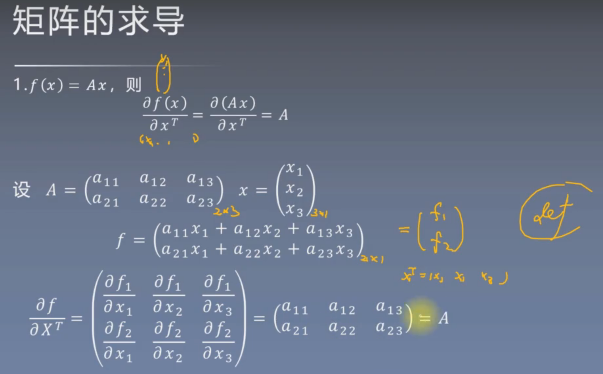
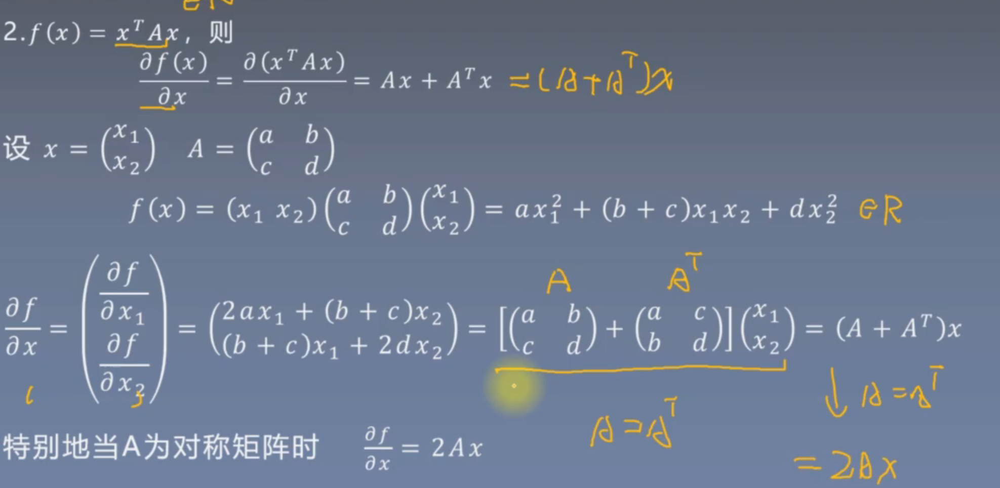

# 数学笔记

跟着3周数学补充计划，每天学完后的核心理解。

## 第一周：线性代数 + 矩阵求导

### 第1天 | 特征值与特征向量

- 特征向量就是坐标轴中经过矩阵A变换之后，方向不会改变的向量。
- 特征值就是矩阵A在对应的特征向量中，拉伸的程度。

### 第二天 | 特征分解与正定矩阵

- 正定矩阵A对素有的非零向量x，都有Ax > 0。
- 所有特征值 > 0 就是正定矩阵。
- Hessian正定就代表该点是极小值。

### 第三天 | 奇异值分解与SVD

- SVD公式：A = U∑V^t。
- ∑是个对角矩阵，对角线上的元素就是奇异值，它反映了矩阵A在各个维度的拉伸程度。
- 几何直觉：任意矩阵 = 旋转 + 拉伸 + 旋转

### 第四天 | SVD与伪逆矩阵

- SVD能做矩阵压缩，也就是特征降维。（取前K个最大的奇异值）
- 当矩阵不可逆的时候，我们可以对奇异值求倒数，来构建伪逆矩阵
- 伪逆矩阵可以近似的求矩阵A的逆过程。（矩阵对应的线性方程有解时）
- 伪逆矩阵还可以求L2范数最小的矩阵A的逆过程。（矩阵对应的线性方程无解）
- SVD可用于PCA降维

### 第五天 | 矩阵范数

- L1范数就是所有元素绝对值之和
- L2范数就是所有元素平方和的平方根
- 谱范数就是最大的奇异值
- L1的图像因为是尖锐的，所以有很大概率出现不重要的维度的权重被降为0，所以导致稀疏性

### 第六天 | 矩阵求导入门

- 梯度本身就是一个向量，因为在机器学习和深度学习中，权重是向量，标量对向量求导得到的梯度也是向量
- 雅可比矩阵：向量对向量求导得到的是矩阵

|求导结果|x是标量|x是向量|
|-|------|------|
|**y是标量**|标量|向量|
|**y是向量**|向量|矩阵|

$$
\frac{\partial Y}{\partial X} = \begin{bmatrix}
\frac{\partial y_1}{\partial X} \\ 
\frac{\partial y_2}{\partial X} \\ 
\vdots \\ 
\frac{\partial y_m}{\partial X}
\end{bmatrix} = \begin{bmatrix} \frac{\partial y_1}{\partial x_1} & \frac{\partial y_1}{\partial x_2} & \cdots & \frac{\partial y_1}{\partial x_n} \\ 
\frac{\partial y_2}{\partial x_1} & \frac{\partial y_2}{\partial x_2} & \cdots & \frac{\partial y_2}{\partial x_n} \\ 
\vdots & \vdots & \ddots & \vdots \\ 
\frac{\partial y_m}{\partial x_1} & \frac{\partial y_m}{\partial x_2} & \cdots & \frac{\partial y_m}{\partial x_n}
\end{bmatrix}
$$

$$
\frac{\partial (X^TAX)}{\partial X} = (A - A^T)X
\\
其中a是向量，A是矩阵
\\
\frac{\partial (a^tX)}{\partial X} = a
\\
\frac{\partial (AX)}{\partial X} = A
$$

### 第七天 | 休息

## 第二周：矩阵求导续 + 概率论升级

### 第八天 | 黑塞矩阵 + 链式法则

